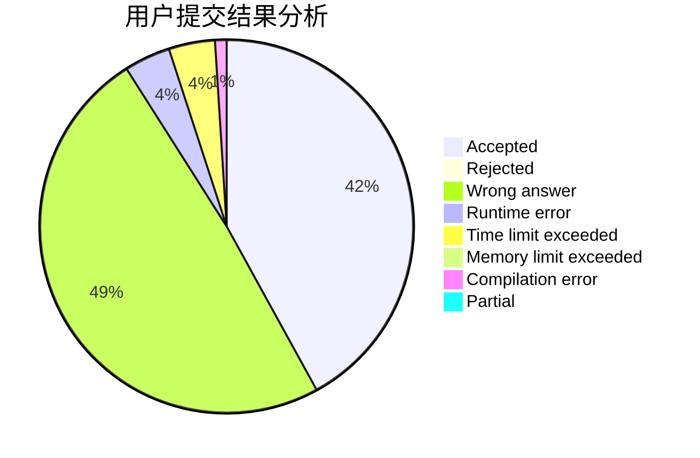
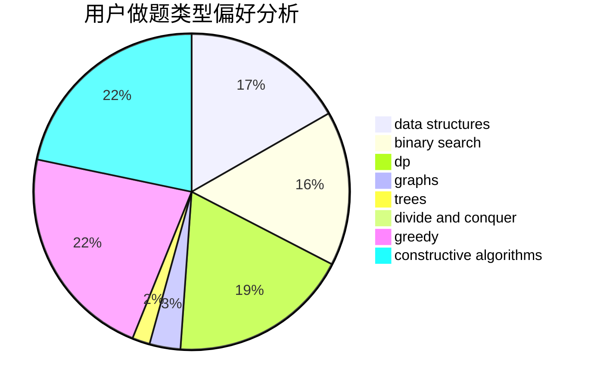
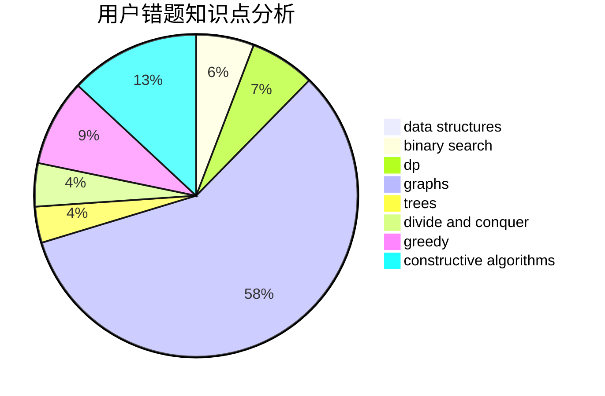

# JeovaSantusUnus

<!-- tabs:start -->

#### **用户提交结果分析**

#### **用户做题类型偏好分析**

#### **用户错题知识点分析**

<!-- tabs:end -->
# 推荐题目
[1194F](https://codeforces.com/contest/1194/problem/F)		combinatorics,
                        dp,
                        number theory,
                        probabilities,
                        two pointers		  
[1164K](https://codeforces.com/contest/1164/problem/K)		dsu,graphs,sortings,trees		  
[736A](https://codeforces.com/contest/736/problem/A)		dsu,graphs,sortings,trees		  
[652D](https://codeforces.com/contest/652/problem/D)		data structures,
                        sortings		  
[300B](https://codeforces.com/contest/300/problem/B)		brute force,
                        dfs and similar,
                        graphs		  
[1180C](https://codeforces.com/contest/1180/problem/C)		dsu,graphs,sortings,trees		  
[424B](https://codeforces.com/contest/424/problem/B)		binary search,
                        greedy,
                        implementation,
                        sortings		  
[947E](https://codeforces.com/contest/947/problem/E)		dsu,graphs,sortings,trees		  
[59B](https://codeforces.com/contest/59/problem/B)		implementation,
                        number theory		  
[1501F](https://codeforces.com/contest/1501/problem/F)		dsu,graphs,sortings,trees		  
