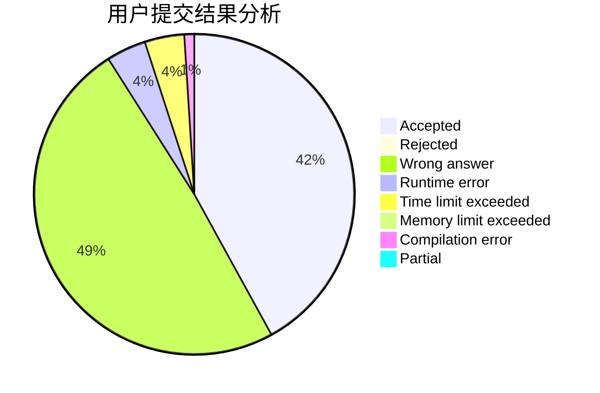
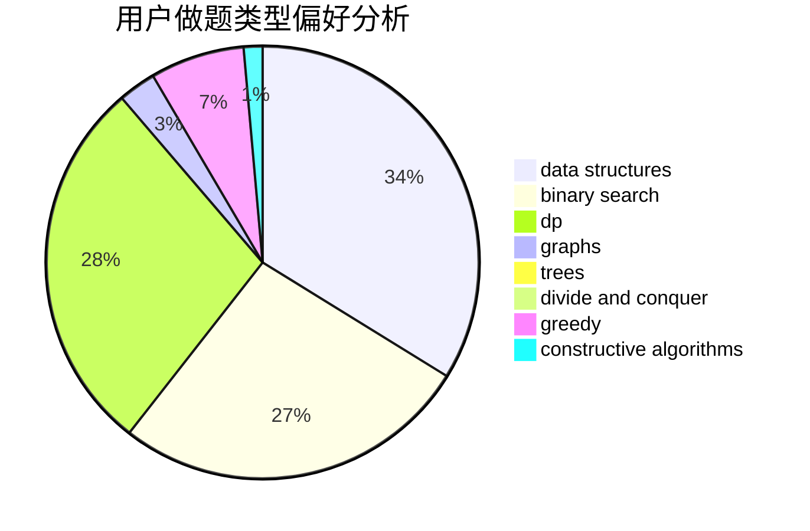

# JeovaSantusUnus

<!-- tabs:start -->

#### **用户提交结果分析**

#### **用户做题类型偏好分析**

#### **用户错题知识点分析**

<!-- tabs:end -->
# 推荐题目
[1189D1](https://codeforces.com/contest/1189D/problem/1)		dsu,graphs,sortings,trees		  
[1162D](https://codeforces.com/contest/1162/problem/D)		dsu,graphs,sortings,trees		  
[718E](https://codeforces.com/contest/718/problem/E)		bitmasks,
                        graphs		  
[625E](https://codeforces.com/contest/625/problem/E)		data structures,
                        greedy		  
[286A](https://codeforces.com/contest/286/problem/A)		constructive algorithms,
                        math		  
[1178D](https://codeforces.com/contest/1178/problem/D)		constructive algorithms,
                        greedy,
                        math,
                        number theory		  
[396C](https://codeforces.com/contest/396/problem/C)		data structures,
                        graphs,
                        trees		  
[924B](https://codeforces.com/contest/924/problem/B)		binary search,
                        greedy,
                        two pointers		  
[578E](https://codeforces.com/contest/578/problem/E)		constructive algorithms,
                        greedy		  
[1493F](https://codeforces.com/contest/1493/problem/F)		bitmasks,
                        interactive,
                        number theory		  
