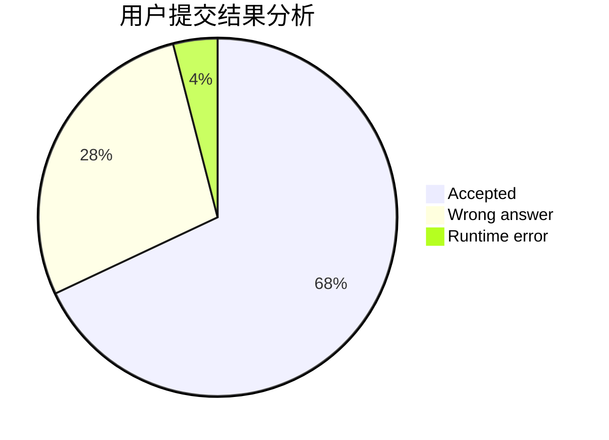
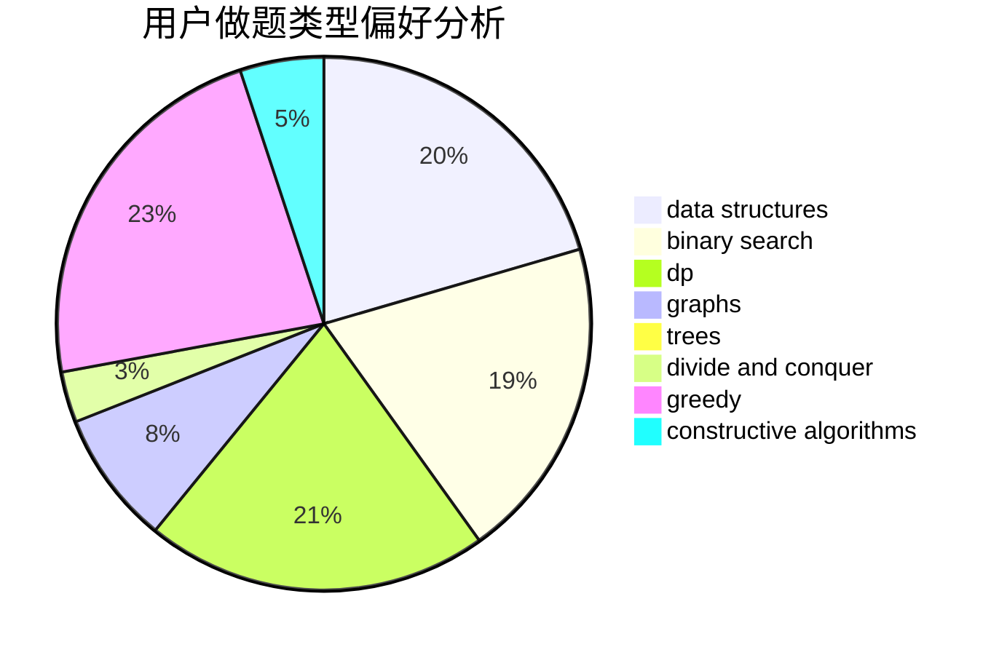
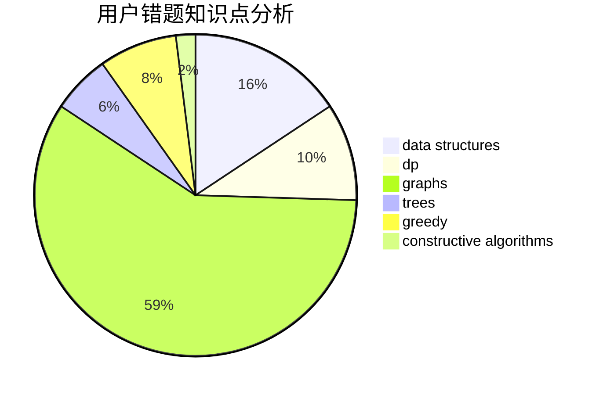

# 300eq
<!-- tabs:start -->
#### **用户提交结果分析**

#### **用户做题类型偏好分析**

#### **用户错题知识点分析**

<!-- tabs:end -->
# 推荐题目
[Slime and Hats](http://codeforces.com/problemset/problem/1349/E)		constructive algorithms,
                        dp,
                        greedy		  
[Pairs of Numbers](http://codeforces.com/problemset/problem/134/B)		brute force,
                        dfs and similar,
                        math,
                        number theory		  
[Getting Deals Done](http://codeforces.com/problemset/problem/1070/E)		binary search,
                        data structures		  
[Au Pont Rouge](http://codeforces.com/problemset/problem/1310/C)		binary search,
                        dp,
                        strings		  
[Sum of Round Numbers](https://codeforces.com/contest/1347/problem/C)		implementation,
                        math		  
[Hills](http://codeforces.com/problemset/problem/1012/C)		dp		  
[Messy](https://codeforces.com/contest/1262/problem/C)		constructive algorithms		  
[Petya and Square](http://codeforces.com/problemset/problem/112/B)		implementation,
                        math		  
[Orac and Game of Life](https://codeforces.com/contest/1350/problem/E)		dfs and similar,
                        graphs,
                        implementation,
                        shortest paths		  
[Neko and Aki's Prank](http://codeforces.com/problemset/problem/1152/D)		dp,
                        greedy,
                        trees		  
<!-- tabs:start -->
#### **data structures**
[Getting Deals Done](http://codeforces.com/problemset/problem/1070/E)		binary search,
                        data structures		  
[Constructing the Array](http://codeforces.com/problemset/problem/1353/D)		constructive algorithms,
                        data structures,
                        sortings		  
[Phoenix and Memory](http://codeforces.com/problemset/problem/1348/F)		data structures,
                        dfs and similar,
                        graphs,
                        greedy		  
[Skier](http://codeforces.com/problemset/problem/1351/C)		data structures,
                        implementation		  
[Orac and LCM](http://codeforces.com/problemset/problem/1349/A)		data structures,
                        math,
                        number theory		  
[Unstable String Sort](http://codeforces.com/problemset/problem/1213/F)		data structures,
                        dfs and similar,
                        dsu,
                        graphs,
                        greedy,
                        implementation,
                        strings		  
[Phoenix and Beauty](http://codeforces.com/problemset/problem/1348/B)		constructive algorithms,
                        data structures,
                        greedy,
                        sortings		  
[Maximum width](http://codeforces.com/problemset/problem/1492/C)		binary search,
                        data structures,
                        dp,
                        greedy,
                        two pointers		  
[Old Floppy Drive](http://codeforces.com/problemset/problem/1490/G)		binary search,
                        data structures,
                        math		  
[Odd Mineral Resource](http://codeforces.com/problemset/problem/1479/D)		binary search,
                        bitmasks,
                        brute force,
                        data structures,
                        probabilities,
                        trees		  
#### **binary search**
[Getting Deals Done](http://codeforces.com/problemset/problem/1070/E)		binary search,
                        data structures		  
[Au Pont Rouge](http://codeforces.com/problemset/problem/1310/C)		binary search,
                        dp,
                        strings		  
[Phoenix and Science](http://codeforces.com/problemset/problem/1348/D)		binary search,
                        constructive algorithms,
                        greedy,
                        implementation,
                        math		  
[K-th Not Divisible by n](http://codeforces.com/problemset/problem/1352/C)		binary search,
                        math		  
[Maximum width](http://codeforces.com/problemset/problem/1492/C)		binary search,
                        data structures,
                        dp,
                        greedy,
                        two pointers		  
[Pairs](http://codeforces.com/problemset/problem/1463/D)		binary search,
                        constructive algorithms,
                        greedy,
                        two pointers		  
[Old Floppy Drive](http://codeforces.com/problemset/problem/1490/G)		binary search,
                        data structures,
                        math		  
[Odd Mineral Resource](http://codeforces.com/problemset/problem/1479/D)		binary search,
                        bitmasks,
                        brute force,
                        data structures,
                        probabilities,
                        trees		  
[Complicated Computations](http://codeforces.com/problemset/problem/1436/E)		binary search,
                        data structures,
                        two pointers		  
[Divide and Summarize](http://codeforces.com/problemset/problem/1461/D)		binary search,
                        brute force,
                        data structures,
                        divide and conquer,
                        implementation,
                        sortings		  
#### **dp**
[Slime and Hats](http://codeforces.com/problemset/problem/1349/E)		constructive algorithms,
                        dp,
                        greedy		  
[Au Pont Rouge](http://codeforces.com/problemset/problem/1310/C)		binary search,
                        dp,
                        strings		  
[Hills](http://codeforces.com/problemset/problem/1012/C)		dp		  
[Neko and Aki's Prank](http://codeforces.com/problemset/problem/1152/D)		dp,
                        greedy,
                        trees		  
[Phoenix and Berries](http://codeforces.com/problemset/problem/1348/E)		brute force,
                        dp,
                        greedy,
                        math		  
[Slime and Sequences (Hard Version)](http://codeforces.com/problemset/problem/1349/F2)		dp,
                        fft,
                        math		  
[Sonya and Informatics](http://codeforces.com/problemset/problem/1151/F)		combinatorics,
                        dp,
                        matrices,
                        probabilities		  
[Orac and Models](http://codeforces.com/problemset/problem/1350/B)		dp,
                        math,
                        number theory		  
[Slime and Sequences (Easy Version)](http://codeforces.com/problemset/problem/1349/F1)		dp,
                        fft,
                        math		  
[Maximum width](http://codeforces.com/problemset/problem/1492/C)		binary search,
                        data structures,
                        dp,
                        greedy,
                        two pointers		  
#### **graph**
[Orac and Game of Life](https://codeforces.com/contest/1350/problem/E)		dfs and similar,
                        graphs,
                        implementation,
                        shortest paths		  
[Ehab's Last Theorem](http://codeforces.com/problemset/problem/1325/F)		constructive algorithms,
                        dfs and similar,
                        graphs,
                        greedy		  
[Phoenix and Memory](http://codeforces.com/problemset/problem/1348/F)		data structures,
                        dfs and similar,
                        graphs,
                        greedy		  
[Spanning Tree with Maximum Degree](http://codeforces.com/problemset/problem/1133/F1)		graphs		  
[Unstable String Sort](http://codeforces.com/problemset/problem/1213/F)		data structures,
                        dfs and similar,
                        dsu,
                        graphs,
                        greedy,
                        implementation,
                        strings		  
[Minimum Ties](http://codeforces.com/problemset/problem/1487/C)		brute force,
                        constructive algorithms,
                        dfs and similar,
                        graphs,
                        greedy,
                        implementation,
                        math		  
[Chef Monocarp](http://codeforces.com/problemset/problem/1437/C)		dp,
                        flows,
                        graph matchings,
                        greedy,
                        math,
                        sortings		  
[Strange Housing](http://codeforces.com/problemset/problem/1470/D)		constructive algorithms,
                        dfs and similar,
                        graph matchings,
                        graphs,
                        greedy		  
[Longest Simple Cycle](http://codeforces.com/problemset/problem/1476/C)		dp,
                        graphs,
                        greedy		  
[Shortest and Longest LIS](http://codeforces.com/problemset/problem/1304/D)		constructive algorithms,
                        graphs,
                        greedy,
                        two pointers		  
#### **trees**
[Neko and Aki's Prank](http://codeforces.com/problemset/problem/1152/D)		dp,
                        greedy,
                        trees		  
[Odd Mineral Resource](http://codeforces.com/problemset/problem/1479/D)		binary search,
                        bitmasks,
                        brute force,
                        data structures,
                        probabilities,
                        trees		  
[Yet Another Card Deck](http://codeforces.com/problemset/problem/1511/C)		brute force,
                        data structures,
                        implementation,
                        trees		  
[Diameter Cuts](http://codeforces.com/problemset/problem/1499/F)		combinatorics,
                        dfs and similar,
                        dp,
                        trees		  
[Fib-tree](http://codeforces.com/problemset/problem/1491/E)		brute force,
                        dfs and similar,
                        divide and conquer,
                        number theory,
                        trees		  
[13th Labour of Heracles](http://codeforces.com/problemset/problem/1466/D)		data structures,
                        greedy,
                        sortings,
                        trees		  
[BFS Trees](http://codeforces.com/problemset/problem/1495/D)		combinatorics,
                        dfs and similar,
                        graphs,
                        math,
                        shortest paths,
                        trees		  
[Sum of Prefix Sums](http://codeforces.com/problemset/problem/1303/G)		data structures,
                        divide and conquer,
                        geometry,
                        trees		  
[Number of Simple Paths](http://codeforces.com/problemset/problem/1454/E)		combinatorics,
                        dfs and similar,
                        graphs,
                        trees		  
[Dogeforces](http://codeforces.com/problemset/problem/1494/D)		constructive algorithms,
                        data structures,
                        dfs and similar,
                        divide and conquer,
                        dsu,
                        greedy,
                        sortings,
                        trees		  
#### **divide and conquer**
[Divide and Summarize](http://codeforces.com/problemset/problem/1461/D)		binary search,
                        brute force,
                        data structures,
                        divide and conquer,
                        implementation,
                        sortings		  
[Song of the Sirens](http://codeforces.com/problemset/problem/1466/G)		combinatorics,
                        divide and conquer,
                        hashing,
                        math,
                        string suffix structures,
                        strings		  
[Permutation Transformation](http://codeforces.com/problemset/problem/1490/D)		dfs and similar,
                        divide and conquer,
                        implementation		  
[Skyline Photo](https://codeforces.com/contest/1483/problem/C)		data structures,
                        divide and conquer,
                        dp		  
[Fib-tree](http://codeforces.com/problemset/problem/1491/E)		brute force,
                        dfs and similar,
                        divide and conquer,
                        number theory,
                        trees		  
[Sum of Prefix Sums](http://codeforces.com/problemset/problem/1303/G)		data structures,
                        divide and conquer,
                        geometry,
                        trees		  
[Dogeforces](http://codeforces.com/problemset/problem/1494/D)		constructive algorithms,
                        data structures,
                        dfs and similar,
                        divide and conquer,
                        dsu,
                        greedy,
                        sortings,
                        trees		  
[Logistical Questions](http://codeforces.com/problemset/problem/566/C)		dfs and similar,
                        divide and conquer,
                        trees		  
[Fruit Sequences](http://codeforces.com/problemset/problem/1428/F)		binary search,
                        data structures,
                        divide and conquer,
                        dp,
                        two pointers		  
[Dr. Evil Underscores](http://codeforces.com/problemset/problem/1285/D)		bitmasks,
                        brute force,
                        dfs and similar,
                        divide and conquer,
                        dp,
                        greedy,
                        strings,
                        trees		  
#### **greedy**
[Slime and Hats](http://codeforces.com/problemset/problem/1349/E)		constructive algorithms,
                        dp,
                        greedy		  
[Neko and Aki's Prank](http://codeforces.com/problemset/problem/1152/D)		dp,
                        greedy,
                        trees		  
[Math](http://codeforces.com/problemset/problem/1062/B)		greedy,
                        math,
                        number theory		  
[Phoenix and Berries](http://codeforces.com/problemset/problem/1348/E)		brute force,
                        dp,
                        greedy,
                        math		  
[Phoenix and Distribution](http://codeforces.com/problemset/problem/1348/C)		constructive algorithms,
                        greedy,
                        sortings,
                        strings		  
[Orac and Medians](https://codeforces.com/contest/1350/problem/D)		constructive algorithms,
                        greedy,
                        math		  
[Ehab's Last Theorem](http://codeforces.com/problemset/problem/1325/F)		constructive algorithms,
                        dfs and similar,
                        graphs,
                        greedy		  
[The Light Square](http://codeforces.com/problemset/problem/1218/I)		2-sat,
                        dfs and similar,
                        greedy		  
[Phoenix and Memory](http://codeforces.com/problemset/problem/1348/F)		data structures,
                        dfs and similar,
                        graphs,
                        greedy		  
[Phoenix and Science](http://codeforces.com/problemset/problem/1348/D)		binary search,
                        constructive algorithms,
                        greedy,
                        implementation,
                        math		  
#### **constructive algorithms**
[Slime and Hats](http://codeforces.com/problemset/problem/1349/E)		constructive algorithms,
                        dp,
                        greedy		  
[Messy](https://codeforces.com/contest/1262/problem/C)		constructive algorithms		  
[K-th Path](http://codeforces.com/problemset/problem/1196/F)		brute force,
                        constructive algorithms,
                        shortest paths,
                        sortings		  
[Phoenix and Distribution](http://codeforces.com/problemset/problem/1348/C)		constructive algorithms,
                        greedy,
                        sortings,
                        strings		  
[Constructing the Array](http://codeforces.com/problemset/problem/1353/D)		constructive algorithms,
                        data structures,
                        sortings		  
[Orac and Medians](https://codeforces.com/contest/1350/problem/D)		constructive algorithms,
                        greedy,
                        math		  
[Ehab's Last Theorem](http://codeforces.com/problemset/problem/1325/F)		constructive algorithms,
                        dfs and similar,
                        graphs,
                        greedy		  
[Same Parity Summands](http://codeforces.com/problemset/problem/1352/B)		constructive algorithms,
                        math		  
[Special Permutation](https://codeforces.com/contest/1347/problem/E)		constructive algorithms,
                        probabilities		  
[Phoenix and Science](http://codeforces.com/problemset/problem/1348/D)		binary search,
                        constructive algorithms,
                        greedy,
                        implementation,
                        math		  
#### **sortings**
[K-th Path](http://codeforces.com/problemset/problem/1196/F)		brute force,
                        constructive algorithms,
                        shortest paths,
                        sortings		  
[Phoenix and Distribution](http://codeforces.com/problemset/problem/1348/C)		constructive algorithms,
                        greedy,
                        sortings,
                        strings		  
[Constructing the Array](http://codeforces.com/problemset/problem/1353/D)		constructive algorithms,
                        data structures,
                        sortings		  
[Phoenix and Beauty](http://codeforces.com/problemset/problem/1348/B)		constructive algorithms,
                        data structures,
                        greedy,
                        sortings		  
[Two Arrays And Swaps](http://codeforces.com/problemset/problem/1353/B)		greedy,
                        sortings		  
[Diamond Miner](https://codeforces.com/contest/1496/problem/C)		geometry,
                        greedy,
                        math,
                        sortings		  
[Meximization](http://codeforces.com/problemset/problem/1497/A)		brute force,
                        data structures,
                        greedy,
                        sortings		  
[Avoiding Zero](http://codeforces.com/problemset/problem/1427/A)		math,
                        sortings		  
[Divide and Summarize](http://codeforces.com/problemset/problem/1461/D)		binary search,
                        brute force,
                        data structures,
                        divide and conquer,
                        implementation,
                        sortings		  
[Chef Monocarp](http://codeforces.com/problemset/problem/1437/C)		dp,
                        flows,
                        graph matchings,
                        greedy,
                        math,
                        sortings		  
<!-- tabs:end -->
