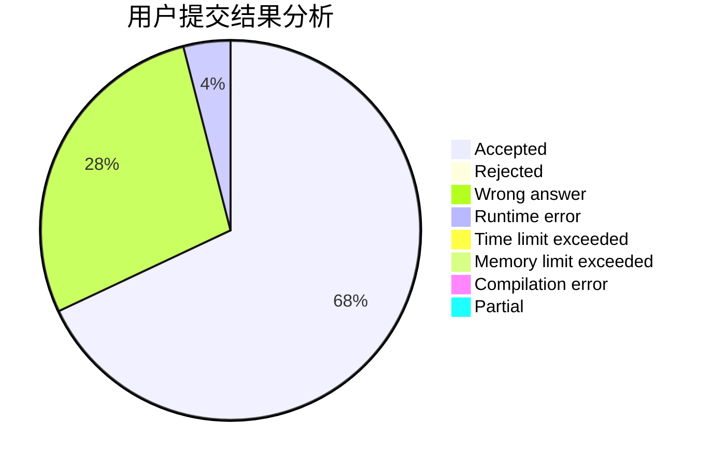
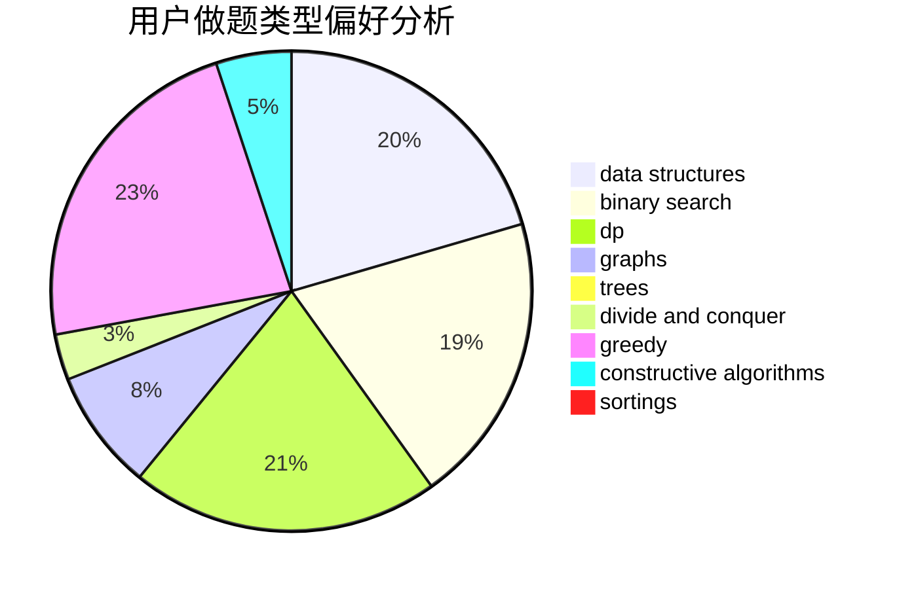
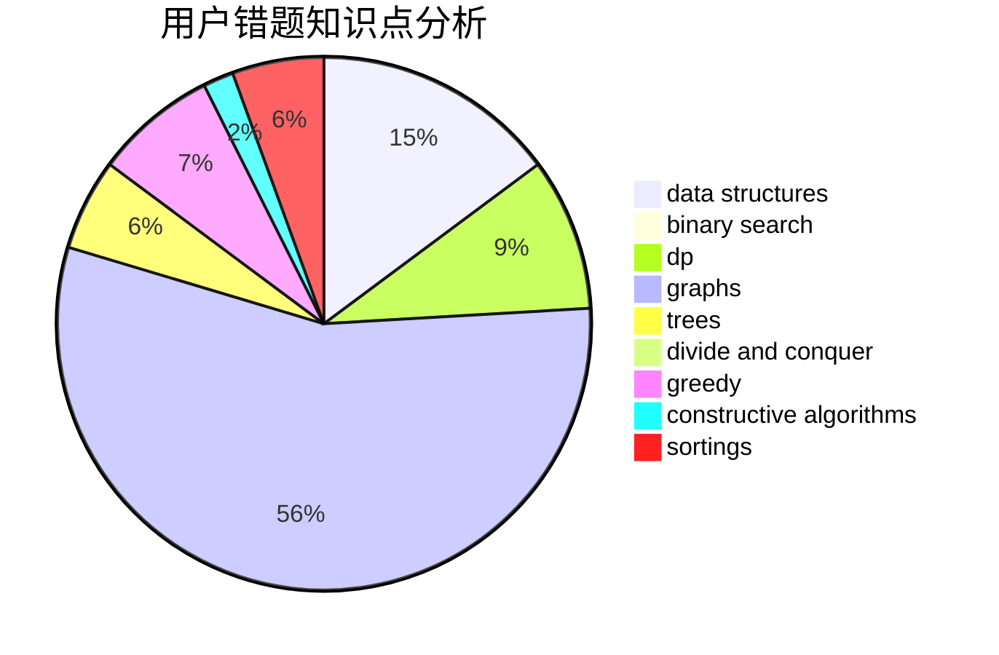

# 300eq
<!-- tabs:start -->
#### **用户提交结果分析**

#### **用户做题类型偏好分析**

#### **用户错题知识点分析**

<!-- tabs:end -->
# 推荐题目
[1349E](http://codeforces.com/problemset/problem/1349/E)		constructive algorithms,
                        dp,
                        greedy		  
[134B](http://codeforces.com/problemset/problem/134/B)		brute force,
                        dfs and similar,
                        math,
                        number theory		  
[1070E](http://codeforces.com/problemset/problem/1070/E)		binary search,
                        data structures		  
[1310C](http://codeforces.com/problemset/problem/1310/C)		binary search,
                        dp,
                        strings		  
[1347C](https://codeforces.com/contest/1347/problem/C)		implementation,
                        math		  
[1012C](http://codeforces.com/problemset/problem/1012/C)		dp		  
[1262C](https://codeforces.com/contest/1262/problem/C)		constructive algorithms		  
[112B](http://codeforces.com/problemset/problem/112/B)		implementation,
                        math		  
[1350E](https://codeforces.com/contest/1350/problem/E)		dfs and similar,
                        graphs,
                        implementation,
                        shortest paths		  
[1152D](http://codeforces.com/problemset/problem/1152/D)		dp,
                        greedy,
                        trees		  
<!-- tabs:start -->
#### **data structures**
[1070E](http://codeforces.com/problemset/problem/1070/E)		binary search,
                        data structures		  
[1353D](http://codeforces.com/problemset/problem/1353/D)		constructive algorithms,
                        data structures,
                        sortings		  
[1348F](http://codeforces.com/problemset/problem/1348/F)		data structures,
                        dfs and similar,
                        graphs,
                        greedy		  
[1351C](http://codeforces.com/problemset/problem/1351/C)		data structures,
                        implementation		  
[1349A](http://codeforces.com/problemset/problem/1349/A)		data structures,
                        math,
                        number theory		  
[1350C](https://codeforces.com/contest/1350/problem/C)		data structures,
                        math,
                        number theory		  
[1213F](http://codeforces.com/problemset/problem/1213/F)		data structures,
                        dfs and similar,
                        dsu,
                        graphs,
                        greedy,
                        implementation,
                        strings		  
[1348B](http://codeforces.com/problemset/problem/1348/B)		constructive algorithms,
                        data structures,
                        greedy,
                        sortings		  
[1492C](http://codeforces.com/problemset/problem/1492/C)		binary search,
                        data structures,
                        dp,
                        greedy,
                        two pointers		  
[1490G](http://codeforces.com/problemset/problem/1490/G)		binary search,
                        data structures,
                        math		  
#### **binary search**
[1070E](http://codeforces.com/problemset/problem/1070/E)		binary search,
                        data structures		  
[1310C](http://codeforces.com/problemset/problem/1310/C)		binary search,
                        dp,
                        strings		  
[1348D](http://codeforces.com/problemset/problem/1348/D)		binary search,
                        constructive algorithms,
                        greedy,
                        implementation,
                        math		  
[1352C](http://codeforces.com/problemset/problem/1352/C)		binary search,
                        math		  
[1492C](http://codeforces.com/problemset/problem/1492/C)		binary search,
                        data structures,
                        dp,
                        greedy,
                        two pointers		  
[1463D](http://codeforces.com/problemset/problem/1463/D)		binary search,
                        constructive algorithms,
                        greedy,
                        two pointers		  
[1490G](http://codeforces.com/problemset/problem/1490/G)		binary search,
                        data structures,
                        math		  
[1479D](http://codeforces.com/problemset/problem/1479/D)		binary search,
                        bitmasks,
                        brute force,
                        data structures,
                        probabilities,
                        trees		  
[1436E](http://codeforces.com/problemset/problem/1436/E)		binary search,
                        data structures,
                        two pointers		  
[1461D](http://codeforces.com/problemset/problem/1461/D)		binary search,
                        brute force,
                        data structures,
                        divide and conquer,
                        implementation,
                        sortings		  
#### **dp**
[1349E](http://codeforces.com/problemset/problem/1349/E)		constructive algorithms,
                        dp,
                        greedy		  
[1310C](http://codeforces.com/problemset/problem/1310/C)		binary search,
                        dp,
                        strings		  
[1012C](http://codeforces.com/problemset/problem/1012/C)		dp		  
[1152D](http://codeforces.com/problemset/problem/1152/D)		dp,
                        greedy,
                        trees		  
[1348E](http://codeforces.com/problemset/problem/1348/E)		brute force,
                        dp,
                        greedy,
                        math		  
[1349F2](http://codeforces.com/problemset/problem/1349/F2)		dp,
                        fft,
                        math		  
[1151F](http://codeforces.com/problemset/problem/1151/F)		combinatorics,
                        dp,
                        matrices,
                        probabilities		  
[1350B](http://codeforces.com/problemset/problem/1350/B)		dp,
                        math,
                        number theory		  
[1349F1](http://codeforces.com/problemset/problem/1349/F1)		dp,
                        fft,
                        math		  
[1492C](http://codeforces.com/problemset/problem/1492/C)		binary search,
                        data structures,
                        dp,
                        greedy,
                        two pointers		  
#### **graph**
[1350E](https://codeforces.com/contest/1350/problem/E)		dfs and similar,
                        graphs,
                        implementation,
                        shortest paths		  
[1349C](http://codeforces.com/problemset/problem/1349/C)		dfs and similar,
                        graphs,
                        implementation,
                        shortest paths		  
[1325F](http://codeforces.com/problemset/problem/1325/F)		constructive algorithms,
                        dfs and similar,
                        graphs,
                        greedy		  
[1348F](http://codeforces.com/problemset/problem/1348/F)		data structures,
                        dfs and similar,
                        graphs,
                        greedy		  
[1133F1](http://codeforces.com/problemset/problem/1133/F1)		graphs		  
[1213F](http://codeforces.com/problemset/problem/1213/F)		data structures,
                        dfs and similar,
                        dsu,
                        graphs,
                        greedy,
                        implementation,
                        strings		  
[1487C](http://codeforces.com/problemset/problem/1487/C)		brute force,
                        constructive algorithms,
                        dfs and similar,
                        graphs,
                        greedy,
                        implementation,
                        math		  
[1437C](http://codeforces.com/problemset/problem/1437/C)		dp,
                        flows,
                        graph matchings,
                        greedy,
                        math,
                        sortings		  
[1470D](http://codeforces.com/problemset/problem/1470/D)		constructive algorithms,
                        dfs and similar,
                        graph matchings,
                        graphs,
                        greedy		  
[1476C](http://codeforces.com/problemset/problem/1476/C)		dp,
                        graphs,
                        greedy		  
#### **trees**
[1152D](http://codeforces.com/problemset/problem/1152/D)		dp,
                        greedy,
                        trees		  
[1479D](http://codeforces.com/problemset/problem/1479/D)		binary search,
                        bitmasks,
                        brute force,
                        data structures,
                        probabilities,
                        trees		  
[1511C](http://codeforces.com/problemset/problem/1511/C)		brute force,
                        data structures,
                        implementation,
                        trees		  
[1499F](http://codeforces.com/problemset/problem/1499/F)		combinatorics,
                        dfs and similar,
                        dp,
                        trees		  
[1491E](http://codeforces.com/problemset/problem/1491/E)		brute force,
                        dfs and similar,
                        divide and conquer,
                        number theory,
                        trees		  
[1466D](http://codeforces.com/problemset/problem/1466/D)		data structures,
                        greedy,
                        sortings,
                        trees		  
[1495D](http://codeforces.com/problemset/problem/1495/D)		combinatorics,
                        dfs and similar,
                        graphs,
                        math,
                        shortest paths,
                        trees		  
[1303G](http://codeforces.com/problemset/problem/1303/G)		data structures,
                        divide and conquer,
                        geometry,
                        trees		  
[1454E](http://codeforces.com/problemset/problem/1454/E)		combinatorics,
                        dfs and similar,
                        graphs,
                        trees		  
[1494D](http://codeforces.com/problemset/problem/1494/D)		constructive algorithms,
                        data structures,
                        dfs and similar,
                        divide and conquer,
                        dsu,
                        greedy,
                        sortings,
                        trees		  
#### **divide and conquer**
[1461D](http://codeforces.com/problemset/problem/1461/D)		binary search,
                        brute force,
                        data structures,
                        divide and conquer,
                        implementation,
                        sortings		  
[1466G](http://codeforces.com/problemset/problem/1466/G)		combinatorics,
                        divide and conquer,
                        hashing,
                        math,
                        string suffix structures,
                        strings		  
[1490D](http://codeforces.com/problemset/problem/1490/D)		dfs and similar,
                        divide and conquer,
                        implementation		  
[1483C](https://codeforces.com/contest/1483/problem/C)		data structures,
                        divide and conquer,
                        dp		  
[1491E](http://codeforces.com/problemset/problem/1491/E)		brute force,
                        dfs and similar,
                        divide and conquer,
                        number theory,
                        trees		  
[1303G](http://codeforces.com/problemset/problem/1303/G)		data structures,
                        divide and conquer,
                        geometry,
                        trees		  
[1494D](http://codeforces.com/problemset/problem/1494/D)		constructive algorithms,
                        data structures,
                        dfs and similar,
                        divide and conquer,
                        dsu,
                        greedy,
                        sortings,
                        trees		  
[1482E](http://codeforces.com/problemset/problem/1482/E)		data structures,
                        divide and conquer,
                        dp		  
[566C](http://codeforces.com/problemset/problem/566/C)		dfs and similar,
                        divide and conquer,
                        trees		  
[1428F](http://codeforces.com/problemset/problem/1428/F)		binary search,
                        data structures,
                        divide and conquer,
                        dp,
                        two pointers		  
#### **greedy**
[1349E](http://codeforces.com/problemset/problem/1349/E)		constructive algorithms,
                        dp,
                        greedy		  
[1152D](http://codeforces.com/problemset/problem/1152/D)		dp,
                        greedy,
                        trees		  
[1062B](http://codeforces.com/problemset/problem/1062/B)		greedy,
                        math,
                        number theory		  
[1348E](http://codeforces.com/problemset/problem/1348/E)		brute force,
                        dp,
                        greedy,
                        math		  
[1348C](http://codeforces.com/problemset/problem/1348/C)		constructive algorithms,
                        greedy,
                        sortings,
                        strings		  
[1350D](https://codeforces.com/contest/1350/problem/D)		constructive algorithms,
                        greedy,
                        math		  
[1325F](http://codeforces.com/problemset/problem/1325/F)		constructive algorithms,
                        dfs and similar,
                        graphs,
                        greedy		  
[1218I](http://codeforces.com/problemset/problem/1218/I)		2-sat,
                        dfs and similar,
                        greedy		  
[1348F](http://codeforces.com/problemset/problem/1348/F)		data structures,
                        dfs and similar,
                        graphs,
                        greedy		  
[1348D](http://codeforces.com/problemset/problem/1348/D)		binary search,
                        constructive algorithms,
                        greedy,
                        implementation,
                        math		  
#### **constructive algorithms**
[1349E](http://codeforces.com/problemset/problem/1349/E)		constructive algorithms,
                        dp,
                        greedy		  
[1262C](https://codeforces.com/contest/1262/problem/C)		constructive algorithms		  
[1196F](http://codeforces.com/problemset/problem/1196/F)		brute force,
                        constructive algorithms,
                        shortest paths,
                        sortings		  
[1348C](http://codeforces.com/problemset/problem/1348/C)		constructive algorithms,
                        greedy,
                        sortings,
                        strings		  
[1353D](http://codeforces.com/problemset/problem/1353/D)		constructive algorithms,
                        data structures,
                        sortings		  
[1350D](https://codeforces.com/contest/1350/problem/D)		constructive algorithms,
                        greedy,
                        math		  
[1325F](http://codeforces.com/problemset/problem/1325/F)		constructive algorithms,
                        dfs and similar,
                        graphs,
                        greedy		  
[1352B](http://codeforces.com/problemset/problem/1352/B)		constructive algorithms,
                        math		  
[1347E](https://codeforces.com/contest/1347/problem/E)		constructive algorithms,
                        probabilities		  
[1348D](http://codeforces.com/problemset/problem/1348/D)		binary search,
                        constructive algorithms,
                        greedy,
                        implementation,
                        math		  
#### **sortings**
[1196F](http://codeforces.com/problemset/problem/1196/F)		brute force,
                        constructive algorithms,
                        shortest paths,
                        sortings		  
[1348C](http://codeforces.com/problemset/problem/1348/C)		constructive algorithms,
                        greedy,
                        sortings,
                        strings		  
[1353D](http://codeforces.com/problemset/problem/1353/D)		constructive algorithms,
                        data structures,
                        sortings		  
[1348B](http://codeforces.com/problemset/problem/1348/B)		constructive algorithms,
                        data structures,
                        greedy,
                        sortings		  
[1353B](http://codeforces.com/problemset/problem/1353/B)		greedy,
                        sortings		  
[1496C](https://codeforces.com/contest/1496/problem/C)		geometry,
                        greedy,
                        math,
                        sortings		  
[1495A](http://codeforces.com/problemset/problem/1495/A)		geometry,
                        greedy,
                        math,
                        sortings		  
[1497A](http://codeforces.com/problemset/problem/1497/A)		brute force,
                        data structures,
                        greedy,
                        sortings		  
[1427A](http://codeforces.com/problemset/problem/1427/A)		math,
                        sortings		  
[1461D](http://codeforces.com/problemset/problem/1461/D)		binary search,
                        brute force,
                        data structures,
                        divide and conquer,
                        implementation,
                        sortings		  
<!-- tabs:end -->
