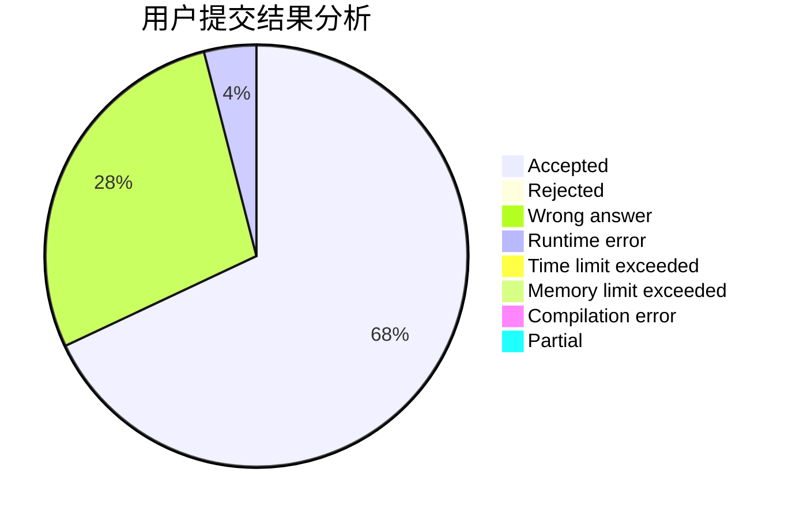
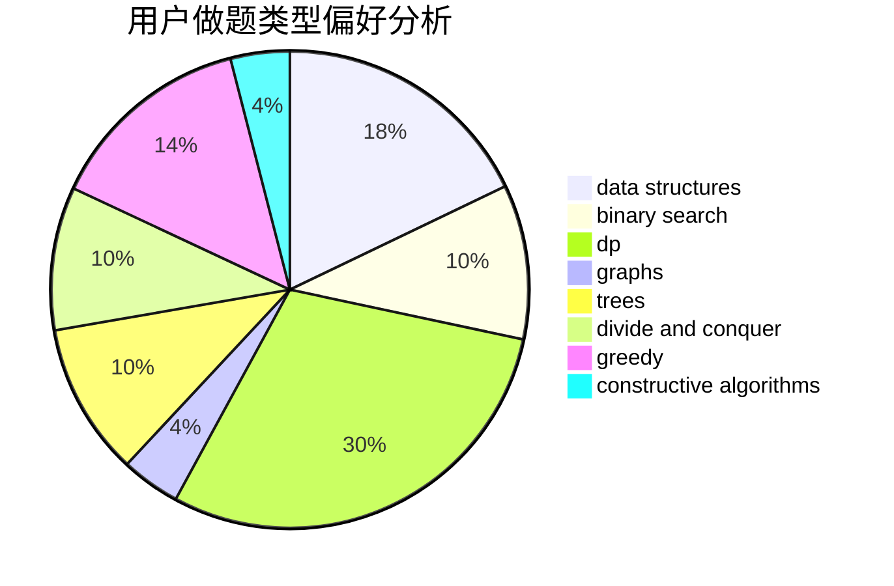
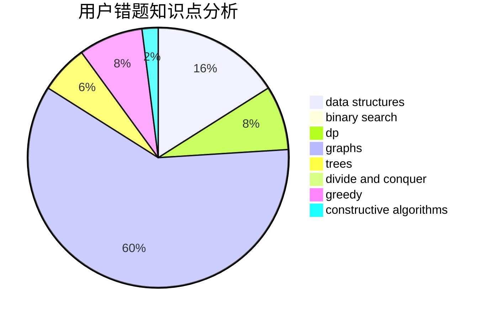

# 300eq

<!-- tabs:start -->

#### **用户提交结果分析**

#### **用户做题类型偏好分析**

#### **用户错题知识点分析**

<!-- tabs:end -->
# 推荐题目
[1070H](https://codeforces.com/contest/1070/problem/H)		brute force,
                        implementation		  
[13563](https://codeforces.com/contest/1356/problem/3)		dsu,graphs,sortings,trees		  
[13573](https://codeforces.com/contest/1357/problem/3)		dsu,graphs,sortings,trees		  
[13561](https://codeforces.com/contest/1356/problem/1)		dsu,graphs,sortings,trees		  
[13571](https://codeforces.com/contest/1357/problem/1)		dsu,graphs,sortings,trees		  
[1316F](https://codeforces.com/contest/1316/problem/F)		data structures,
                        divide and conquer,
                        probabilities		  
[1358F](https://codeforces.com/contest/1358/problem/F)		binary search,
                        constructive algorithms,
                        greedy,
                        implementation		  
[1013A](https://codeforces.com/contest/1013/problem/A)		math		  
[13562](https://codeforces.com/contest/1356/problem/2)		dsu,graphs,sortings,trees		  
[13577](https://codeforces.com/contest/1357/problem/7)		dsu,graphs,sortings,trees		  
