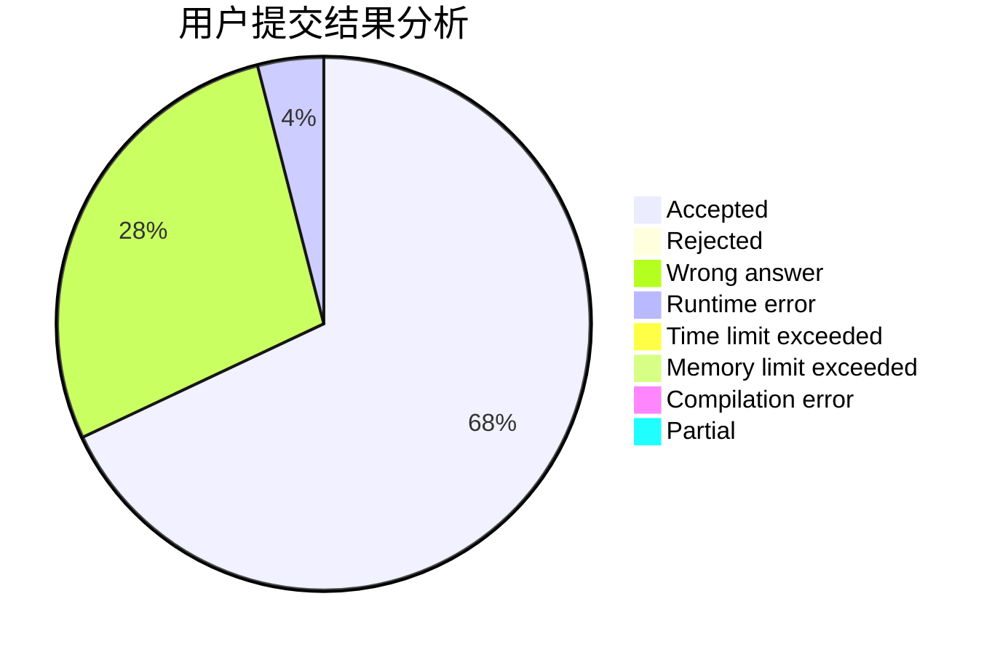
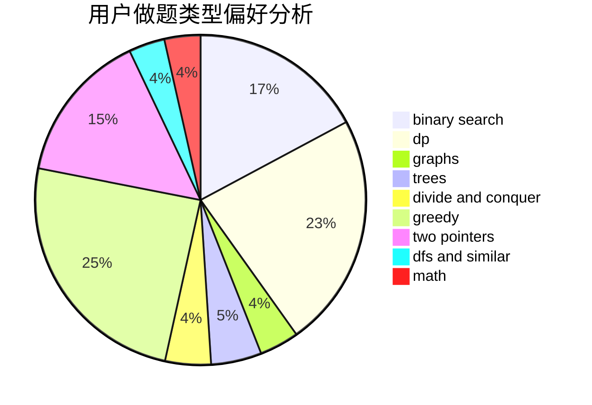

# 300eq

<!-- tabs:start -->

#### **用户提交结果分析**

#### **用户做题类型偏好分析**

<!-- tabs:end -->
# 推荐题目
[1070H](https://codeforces.com/contest/1070/problem/H)
[13563](https://codeforces.com/contest/1356/problem/3)
[13573](https://codeforces.com/contest/1357/problem/3)
[13561](https://codeforces.com/contest/1356/problem/1)
[13571](https://codeforces.com/contest/1357/problem/1)
[1316F](https://codeforces.com/contest/1316/problem/F)
[1358F](https://codeforces.com/contest/1358/problem/F)
[1013A](https://codeforces.com/contest/1013/problem/A)
[13562](https://codeforces.com/contest/1356/problem/2)
[13577](https://codeforces.com/contest/1357/problem/7)
