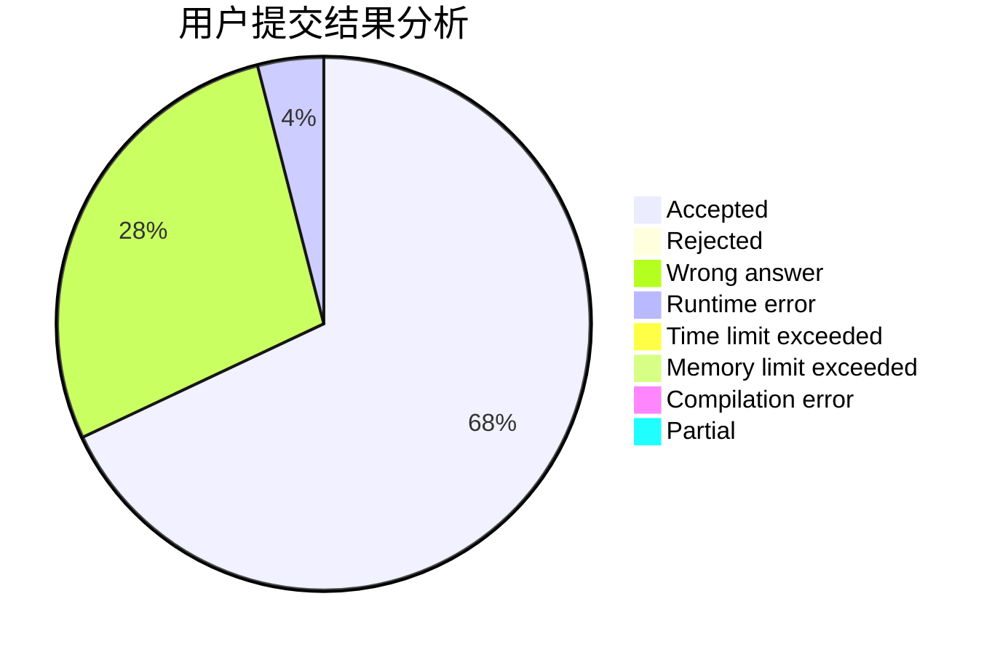
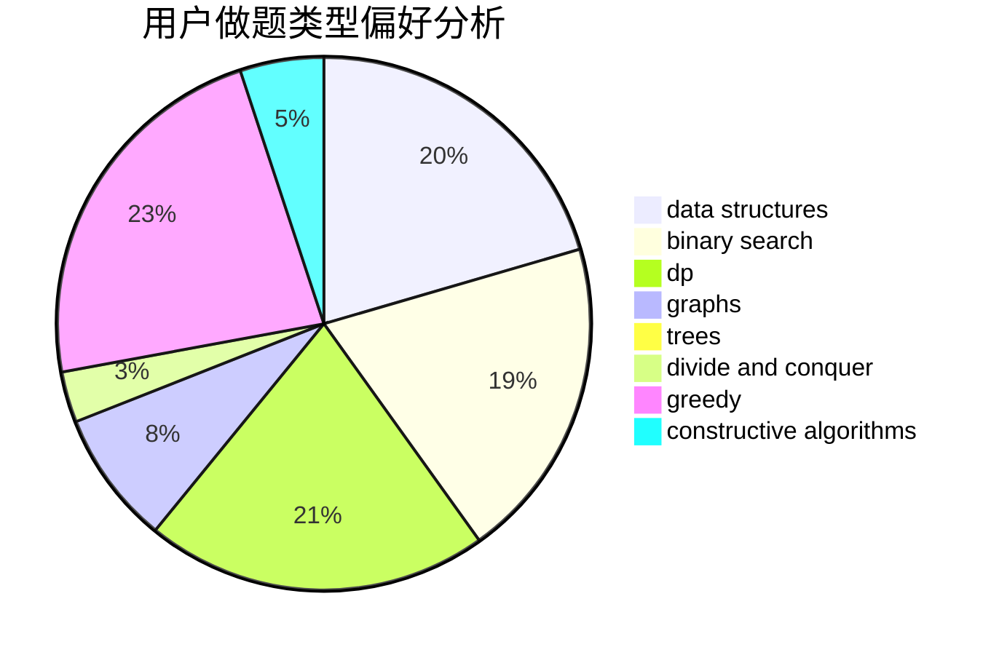
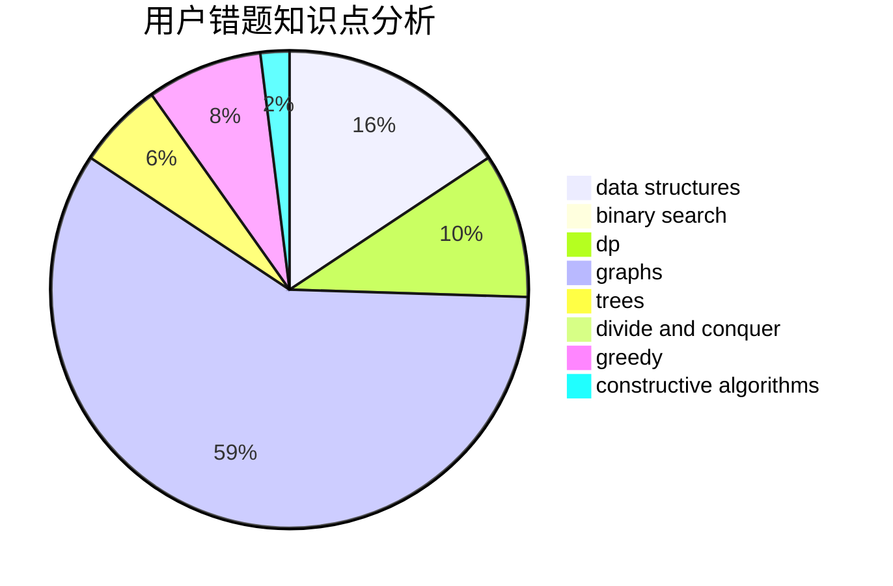

# 300eq

<!-- tabs:start -->

#### **用户提交结果分析**

#### **用户做题类型偏好分析**

#### **用户错题知识点分析**

<!-- tabs:end -->
# 推荐题目
[1070E](https://codeforces.com/contest/1070/problem/E)		binary search,
                        data structures		  
[1349E](https://codeforces.com/contest/1349/problem/E)		constructive algorithms,
                        dp,
                        greedy		  
[134B](https://codeforces.com/contest/134/problem/B)		brute force,
                        dfs and similar,
                        math,
                        number theory		  
[1349C](https://codeforces.com/contest/1349/problem/C)		dfs and similar,
                        graphs,
                        implementation,
                        shortest paths		  
[1349F1](https://codeforces.com/contest/1349F/problem/1)		dp,
                        fft,
                        math		  
[1310C](https://codeforces.com/contest/1310/problem/C)		binary search,
                        dp,
                        strings		  
[1352B](https://codeforces.com/contest/1352/problem/B)		constructive algorithms,
                        math		  
[1012C](https://codeforces.com/contest/1012/problem/C)		dp		  
[1349D](https://codeforces.com/contest/1349/problem/D)		math,
                        probabilities		  
[1350D](https://codeforces.com/contest/1350/problem/D)		dsu,graphs,sortings,trees		  
