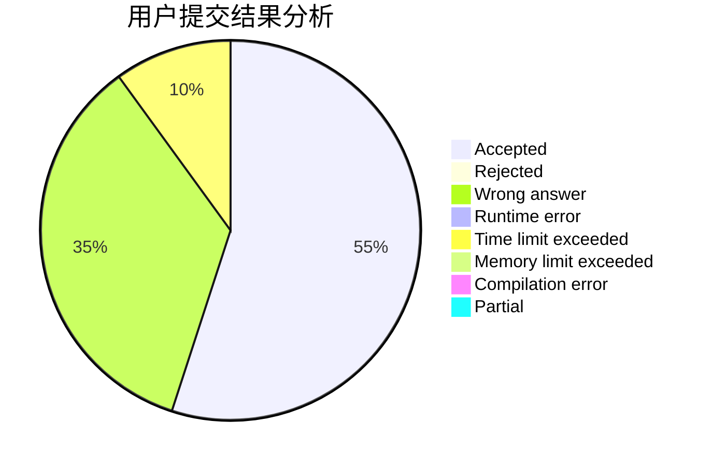
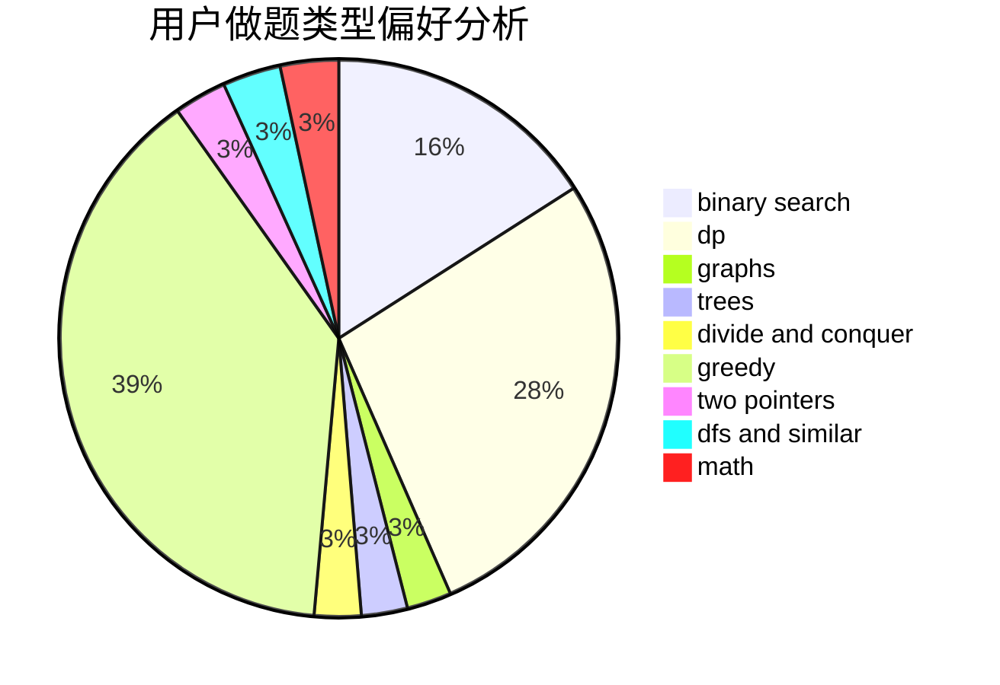

# JerryDream

<!-- tabs:start -->

#### **用户提交结果分析**

#### **用户做题类型偏好分析**

<!-- tabs:end -->
# 推荐题目
[1442D](https://codeforces.com/contest/1442/problem/D)
[1272A](https://codeforces.com/contest/1272/problem/A)
[351E](https://codeforces.com/contest/351/problem/E)
[28B](https://codeforces.com/contest/28/problem/B)
[1028G](https://codeforces.com/contest/1028/problem/G)
[828C](https://codeforces.com/contest/828/problem/C)
[577A](https://codeforces.com/contest/577/problem/A)
[1413D](https://codeforces.com/contest/1413/problem/D)
[246A](https://codeforces.com/contest/246/problem/A)
[418E](https://codeforces.com/contest/418/problem/E)
