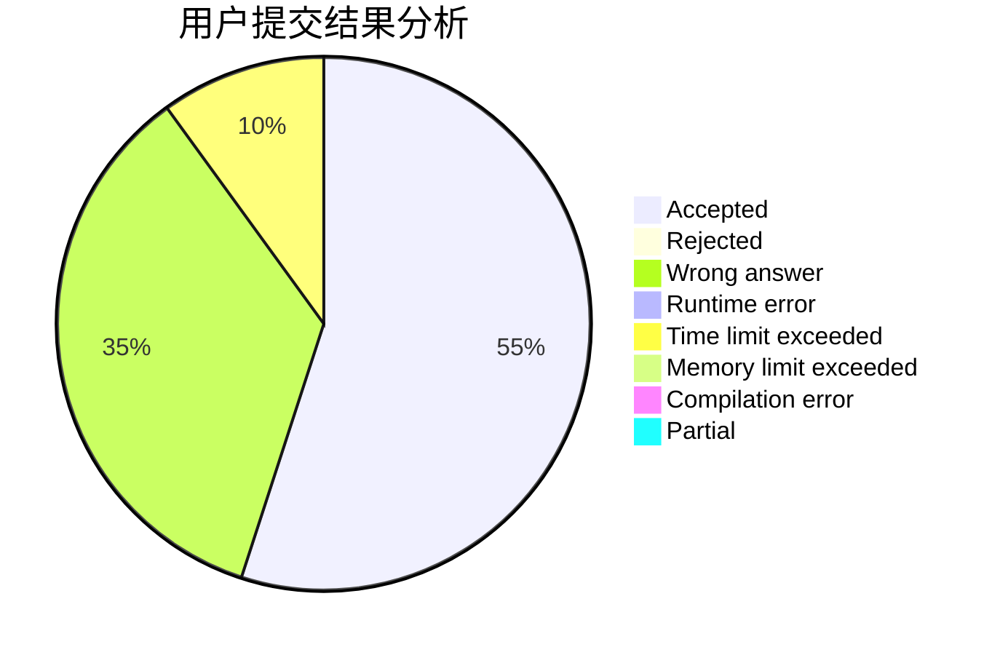
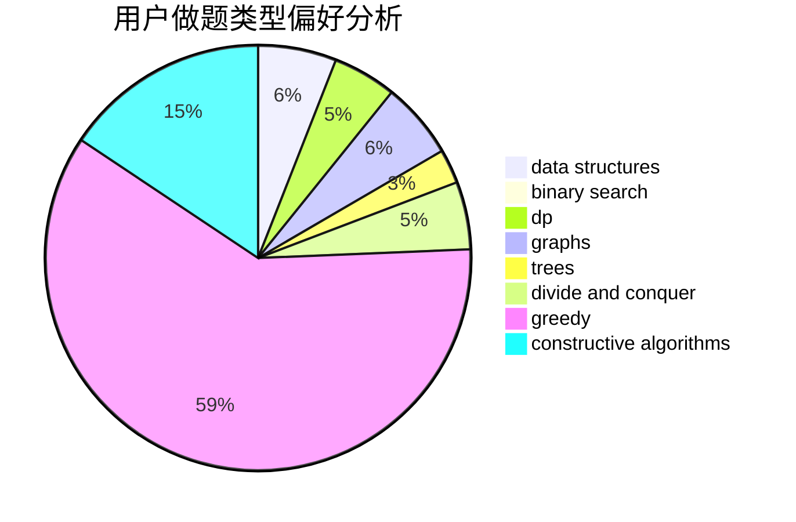
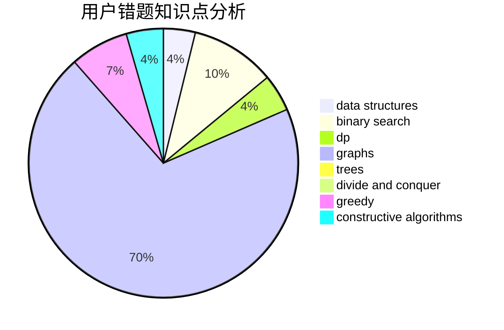

# JerryDream
<!-- tabs:start -->
#### **用户提交结果分析**

#### **用户做题类型偏好分析**

#### **用户错题知识点分析**

<!-- tabs:end -->
# 推荐题目
[XOR-ranges](http://codeforces.com/problemset/problem/1456/E)		dp,
                        greedy		  
[The Last Hole!](http://codeforces.com/problemset/problem/274/C)		brute force,
                        geometry		  
[Minimum Value Rectangle](http://codeforces.com/problemset/problem/1027/C)		greedy		  
[Roads](http://codeforces.com/problemset/problem/1402/B)		*special problem,
                        geometry,
                        sortings		  
[Almost Same Distance](http://codeforces.com/problemset/problem/1266/F)		dfs and similar,
                        graphs		  
[Do you want a date?](https://codeforces.com/contest/810/problem/C)		implementation,
                        math,
                        sortings		  
[Binary String Minimizing](https://codeforces.com/contest/1432/problem/E)		greedy		  
[Ciel and Robot](http://codeforces.com/problemset/problem/321/A)		binary search,
                        implementation,
                        math		  
[Thanos Sort](http://codeforces.com/problemset/problem/1145/A)		implementation		  
[Rectangles](http://codeforces.com/problemset/problem/1028/C)		geometry,
                        implementation,
                        sortings		  
<!-- tabs:start -->
#### **data structures**
[Greedy Subsequences](http://codeforces.com/problemset/problem/1132/G)		data structures,
                        dp,
                        trees		  
[GukiZ and GukiZiana](http://codeforces.com/problemset/problem/551/E)		binary search,
                        data structures,
                        implementation		  
[Noble Knight's Path](http://codeforces.com/problemset/problem/226/E)		data structures,
                        trees		  
[Riverside Curio](http://codeforces.com/problemset/problem/924/C)		data structures,
                        dp,
                        greedy		  
[Three Blocks Palindrome (hard version)](http://codeforces.com/problemset/problem/1335/E2)		brute force,
                        data structures,
                        dp,
                        two pointers		  
[Culture Code](http://codeforces.com/problemset/problem/1197/E)		binary search,
                        combinatorics,
                        data structures,
                        dp,
                        shortest paths,
                        sortings		  
[Delivery Club](http://codeforces.com/problemset/problem/875/E)		binary search,
                        data structures,
                        dp		  
[Nezzar and Tournaments](http://codeforces.com/problemset/problem/1477/E)		data structures,
                        greedy		  
[Longest Increasing Subsequence](http://codeforces.com/problemset/problem/568/E)		data structures,
                        dp		  
[13th Labour of Heracles](http://codeforces.com/problemset/problem/1466/D)		data structures,
                        greedy,
                        sortings,
                        trees		  
#### **binary search**
[Ciel and Robot](http://codeforces.com/problemset/problem/321/A)		binary search,
                        implementation,
                        math		  
[GukiZ and GukiZiana](http://codeforces.com/problemset/problem/551/E)		binary search,
                        data structures,
                        implementation		  
[Culture Code](http://codeforces.com/problemset/problem/1197/E)		binary search,
                        combinatorics,
                        data structures,
                        dp,
                        shortest paths,
                        sortings		  
[Delivery Club](http://codeforces.com/problemset/problem/875/E)		binary search,
                        data structures,
                        dp		  
[Summer Earnings](http://codeforces.com/problemset/problem/333/E)		binary search,
                        bitmasks,
                        brute force,
                        geometry,
                        sortings		  
[Paired Payment](http://codeforces.com/problemset/problem/1486/E)		binary search,
                        brute force,
                        constructive algorithms,
                        dp,
                        flows,
                        graphs,
                        shortest paths		  
[Maximum width](http://codeforces.com/problemset/problem/1492/C)		binary search,
                        data structures,
                        dp,
                        greedy,
                        two pointers		  
[Pairs](http://codeforces.com/problemset/problem/1463/D)		binary search,
                        constructive algorithms,
                        greedy,
                        two pointers		  
[Old Floppy Drive](http://codeforces.com/problemset/problem/1490/G)		binary search,
                        data structures,
                        math		  
[Odd Mineral Resource](http://codeforces.com/problemset/problem/1479/D)		binary search,
                        bitmasks,
                        brute force,
                        data structures,
                        probabilities,
                        trees		  
#### **dp**
[XOR-ranges](http://codeforces.com/problemset/problem/1456/E)		dp,
                        greedy		  
[Greedy Subsequences](http://codeforces.com/problemset/problem/1132/G)		data structures,
                        dp,
                        trees		  
[Divisibility by Eight](http://codeforces.com/problemset/problem/550/C)		brute force,
                        dp,
                        math		  
[Riverside Curio](http://codeforces.com/problemset/problem/924/C)		data structures,
                        dp,
                        greedy		  
[Three Blocks Palindrome (hard version)](http://codeforces.com/problemset/problem/1335/E2)		brute force,
                        data structures,
                        dp,
                        two pointers		  
[Culture Code](http://codeforces.com/problemset/problem/1197/E)		binary search,
                        combinatorics,
                        data structures,
                        dp,
                        shortest paths,
                        sortings		  
[Delivery Club](http://codeforces.com/problemset/problem/875/E)		binary search,
                        data structures,
                        dp		  
[Valid Sets](http://codeforces.com/problemset/problem/486/D)		dfs and similar,
                        dp,
                        math,
                        trees		  
[Longest Increasing Subsequence](http://codeforces.com/problemset/problem/568/E)		data structures,
                        dp		  
[Paired Payment](http://codeforces.com/problemset/problem/1486/E)		binary search,
                        brute force,
                        constructive algorithms,
                        dp,
                        flows,
                        graphs,
                        shortest paths		  
#### **graph**
[Almost Same Distance](http://codeforces.com/problemset/problem/1266/F)		dfs and similar,
                        graphs		  
[Orac and Game of Life](https://codeforces.com/contest/1350/problem/E)		dfs and similar,
                        graphs,
                        implementation,
                        shortest paths		  
[Party](http://codeforces.com/problemset/problem/575/C)		bitmasks,
                        brute force,
                        graph matchings		  
[Hide and Seek](http://codeforces.com/problemset/problem/1147/A)		graphs		  
[Paired Payment](http://codeforces.com/problemset/problem/1486/E)		binary search,
                        brute force,
                        constructive algorithms,
                        dp,
                        flows,
                        graphs,
                        shortest paths		  
[Kingdom and its Cities](http://codeforces.com/problemset/problem/613/D)		dfs and similar,
                        divide and conquer,
                        dp,
                        graphs,
                        sortings,
                        trees		  
[Minimum Ties](http://codeforces.com/problemset/problem/1487/C)		brute force,
                        constructive algorithms,
                        dfs and similar,
                        graphs,
                        greedy,
                        implementation,
                        math		  
[Chef Monocarp](http://codeforces.com/problemset/problem/1437/C)		dp,
                        flows,
                        graph matchings,
                        greedy,
                        math,
                        sortings		  
[Strange Housing](http://codeforces.com/problemset/problem/1470/D)		constructive algorithms,
                        dfs and similar,
                        graph matchings,
                        graphs,
                        greedy		  
[Longest Simple Cycle](http://codeforces.com/problemset/problem/1476/C)		dp,
                        graphs,
                        greedy		  
#### **trees**
[Greedy Subsequences](http://codeforces.com/problemset/problem/1132/G)		data structures,
                        dp,
                        trees		  
[Madness](http://codeforces.com/problemset/problem/822/F)		constructive algorithms,
                        dfs and similar,
                        trees		  
[Noble Knight's Path](http://codeforces.com/problemset/problem/226/E)		data structures,
                        trees		  
[Valid Sets](http://codeforces.com/problemset/problem/486/D)		dfs and similar,
                        dp,
                        math,
                        trees		  
[13th Labour of Heracles](http://codeforces.com/problemset/problem/1466/D)		data structures,
                        greedy,
                        sortings,
                        trees		  
[Kingdom and its Cities](http://codeforces.com/problemset/problem/613/D)		dfs and similar,
                        divide and conquer,
                        dp,
                        graphs,
                        sortings,
                        trees		  
[Odd Mineral Resource](http://codeforces.com/problemset/problem/1479/D)		binary search,
                        bitmasks,
                        brute force,
                        data structures,
                        probabilities,
                        trees		  
[Yet Another Card Deck](http://codeforces.com/problemset/problem/1511/C)		brute force,
                        data structures,
                        implementation,
                        trees		  
[Diameter Cuts](http://codeforces.com/problemset/problem/1499/F)		combinatorics,
                        dfs and similar,
                        dp,
                        trees		  
[Fib-tree](http://codeforces.com/problemset/problem/1491/E)		brute force,
                        dfs and similar,
                        divide and conquer,
                        number theory,
                        trees		  
#### **divide and conquer**
[Kingdom and its Cities](http://codeforces.com/problemset/problem/613/D)		dfs and similar,
                        divide and conquer,
                        dp,
                        graphs,
                        sortings,
                        trees		  
[Divide and Summarize](http://codeforces.com/problemset/problem/1461/D)		binary search,
                        brute force,
                        data structures,
                        divide and conquer,
                        implementation,
                        sortings		  
[Song of the Sirens](http://codeforces.com/problemset/problem/1466/G)		combinatorics,
                        divide and conquer,
                        hashing,
                        math,
                        string suffix structures,
                        strings		  
[Permutation Transformation](http://codeforces.com/problemset/problem/1490/D)		dfs and similar,
                        divide and conquer,
                        implementation		  
[Skyline Photo](https://codeforces.com/contest/1483/problem/C)		data structures,
                        divide and conquer,
                        dp		  
[Fib-tree](http://codeforces.com/problemset/problem/1491/E)		brute force,
                        dfs and similar,
                        divide and conquer,
                        number theory,
                        trees		  
[Sum of Prefix Sums](http://codeforces.com/problemset/problem/1303/G)		data structures,
                        divide and conquer,
                        geometry,
                        trees		  
[Dogeforces](http://codeforces.com/problemset/problem/1494/D)		constructive algorithms,
                        data structures,
                        dfs and similar,
                        divide and conquer,
                        dsu,
                        greedy,
                        sortings,
                        trees		  
[Logistical Questions](http://codeforces.com/problemset/problem/566/C)		dfs and similar,
                        divide and conquer,
                        trees		  
[Fruit Sequences](http://codeforces.com/problemset/problem/1428/F)		binary search,
                        data structures,
                        divide and conquer,
                        dp,
                        two pointers		  
#### **greedy**
[XOR-ranges](http://codeforces.com/problemset/problem/1456/E)		dp,
                        greedy		  
[Minimum Value Rectangle](http://codeforces.com/problemset/problem/1027/C)		greedy		  
[Binary String Minimizing](https://codeforces.com/contest/1432/problem/E)		greedy		  
[Ivan and Powers of Two](http://codeforces.com/problemset/problem/305/C)		greedy,
                        implementation		  
[Distributing Parts](https://codeforces.com/contest/497/problem/C)		greedy,
                        sortings		  
[Riverside Curio](http://codeforces.com/problemset/problem/924/C)		data structures,
                        dp,
                        greedy		  
[Running Over The Bridges](http://codeforces.com/problemset/problem/730/D)		greedy,
                        implementation,
                        math		  
[Nezzar and Tournaments](http://codeforces.com/problemset/problem/1477/E)		data structures,
                        greedy		  
[13th Labour of Heracles](http://codeforces.com/problemset/problem/1466/D)		data structures,
                        greedy,
                        sortings,
                        trees		  
[Array Walk](http://codeforces.com/problemset/problem/1389/B)		brute force,
                        dp,
                        greedy		  
#### **constructive algorithms**
[Ehab and another another xor problem](http://codeforces.com/problemset/problem/1088/D)		bitmasks,
                        constructive algorithms,
                        implementation,
                        interactive		  
[Madness](http://codeforces.com/problemset/problem/822/F)		constructive algorithms,
                        dfs and similar,
                        trees		  
[Strange town](http://codeforces.com/problemset/problem/42/D)		constructive algorithms,
                        math		  
[Balanced Reversals](http://codeforces.com/problemset/problem/1237/H)		constructive algorithms		  
[Paired Payment](http://codeforces.com/problemset/problem/1486/E)		binary search,
                        brute force,
                        constructive algorithms,
                        dp,
                        flows,
                        graphs,
                        shortest paths		  
[Beautiful String](http://codeforces.com/problemset/problem/1265/A)		constructive algorithms,
                        greedy		  
[Anti-knapsack](http://codeforces.com/problemset/problem/1493/A)		constructive algorithms,
                        greedy		  
[Pairs](http://codeforces.com/problemset/problem/1463/D)		binary search,
                        constructive algorithms,
                        greedy,
                        two pointers		  
[XOR-gun](https://codeforces.com/contest/1456/problem/B)		bitmasks,
                        brute force,
                        constructive algorithms		  
[Genius's Gambit](http://codeforces.com/problemset/problem/1492/D)		bitmasks,
                        constructive algorithms,
                        greedy,
                        math		  
#### **sortings**
[Roads](http://codeforces.com/problemset/problem/1402/B)		*special problem,
                        geometry,
                        sortings		  
[Do you want a date?](https://codeforces.com/contest/810/problem/C)		implementation,
                        math,
                        sortings		  
[Rectangles](http://codeforces.com/problemset/problem/1028/C)		geometry,
                        implementation,
                        sortings		  
[Distributing Parts](https://codeforces.com/contest/497/problem/C)		greedy,
                        sortings		  
[Culture Code](http://codeforces.com/problemset/problem/1197/E)		binary search,
                        combinatorics,
                        data structures,
                        dp,
                        shortest paths,
                        sortings		  
[Summer Earnings](http://codeforces.com/problemset/problem/333/E)		binary search,
                        bitmasks,
                        brute force,
                        geometry,
                        sortings		  
[13th Labour of Heracles](http://codeforces.com/problemset/problem/1466/D)		data structures,
                        greedy,
                        sortings,
                        trees		  
[Kingdom and its Cities](http://codeforces.com/problemset/problem/613/D)		dfs and similar,
                        divide and conquer,
                        dp,
                        graphs,
                        sortings,
                        trees		  
[Diamond Miner](https://codeforces.com/contest/1496/problem/C)		geometry,
                        greedy,
                        math,
                        sortings		  
[Meximization](http://codeforces.com/problemset/problem/1497/A)		brute force,
                        data structures,
                        greedy,
                        sortings		  
<!-- tabs:end -->
