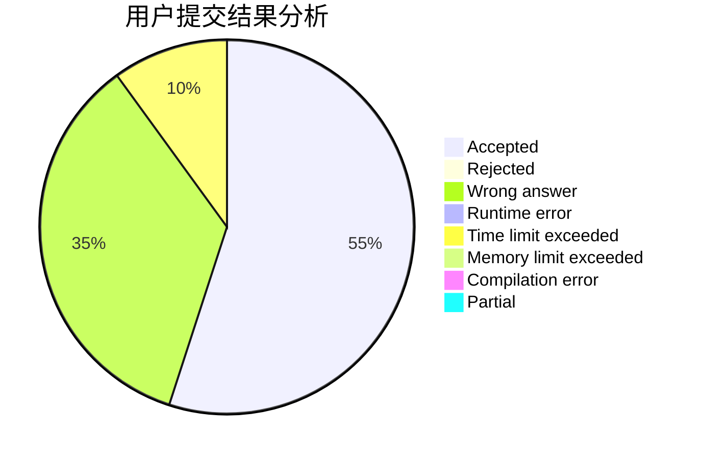
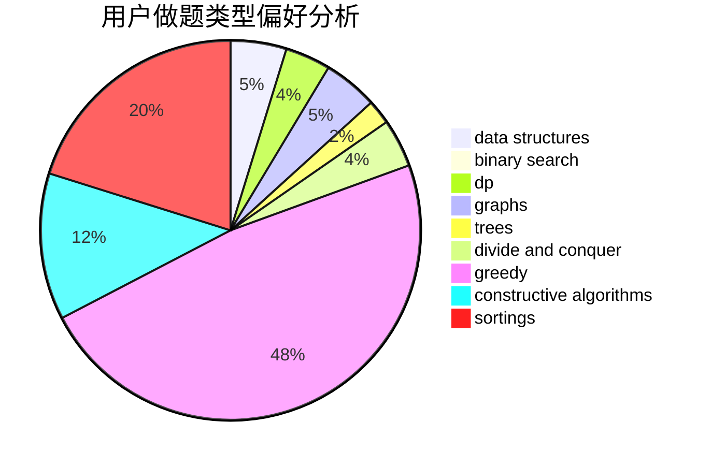
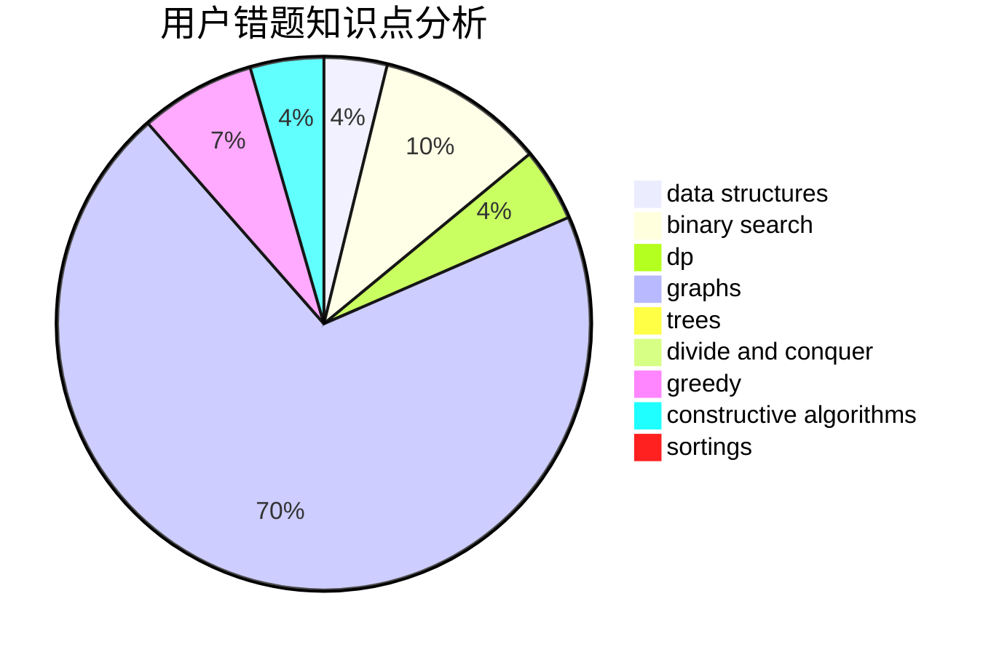

# JerryDream
<!-- tabs:start -->
#### **用户提交结果分析**

#### **用户做题类型偏好分析**

#### **用户错题知识点分析**

<!-- tabs:end -->
# 推荐题目
[1456E](http://codeforces.com/problemset/problem/1456/E)		dp,
                        greedy		  
[274C](http://codeforces.com/problemset/problem/274/C)		brute force,
                        geometry		  
[1027C](http://codeforces.com/problemset/problem/1027/C)		greedy		  
[1402B](http://codeforces.com/problemset/problem/1402/B)		*special problem,
                        geometry,
                        sortings		  
[1266F](http://codeforces.com/problemset/problem/1266/F)		dfs and similar,
                        graphs		  
[810C](https://codeforces.com/contest/810/problem/C)		implementation,
                        math,
                        sortings		  
[1432E](https://codeforces.com/contest/1432/problem/E)		greedy		  
[321A](http://codeforces.com/problemset/problem/321/A)		binary search,
                        implementation,
                        math		  
[1145A](http://codeforces.com/problemset/problem/1145/A)		implementation		  
[1028C](http://codeforces.com/problemset/problem/1028/C)		geometry,
                        implementation,
                        sortings		  
<!-- tabs:start -->
#### **data structures**
[1132G](http://codeforces.com/problemset/problem/1132/G)		data structures,
                        dp,
                        trees		  
[551E](http://codeforces.com/problemset/problem/551/E)		binary search,
                        data structures,
                        implementation		  
[226E](http://codeforces.com/problemset/problem/226/E)		data structures,
                        trees		  
[924C](http://codeforces.com/problemset/problem/924/C)		data structures,
                        dp,
                        greedy		  
[1335E2](http://codeforces.com/problemset/problem/1335/E2)		brute force,
                        data structures,
                        dp,
                        two pointers		  
[1197E](http://codeforces.com/problemset/problem/1197/E)		binary search,
                        combinatorics,
                        data structures,
                        dp,
                        shortest paths,
                        sortings		  
[875E](http://codeforces.com/problemset/problem/875/E)		binary search,
                        data structures,
                        dp		  
[1477E](http://codeforces.com/problemset/problem/1477/E)		data structures,
                        greedy		  
[568E](http://codeforces.com/problemset/problem/568/E)		data structures,
                        dp		  
[1466D](http://codeforces.com/problemset/problem/1466/D)		data structures,
                        greedy,
                        sortings,
                        trees		  
#### **binary search**
[321A](http://codeforces.com/problemset/problem/321/A)		binary search,
                        implementation,
                        math		  
[551E](http://codeforces.com/problemset/problem/551/E)		binary search,
                        data structures,
                        implementation		  
[1197E](http://codeforces.com/problemset/problem/1197/E)		binary search,
                        combinatorics,
                        data structures,
                        dp,
                        shortest paths,
                        sortings		  
[875E](http://codeforces.com/problemset/problem/875/E)		binary search,
                        data structures,
                        dp		  
[333E](http://codeforces.com/problemset/problem/333/E)		binary search,
                        bitmasks,
                        brute force,
                        geometry,
                        sortings		  
[1486E](http://codeforces.com/problemset/problem/1486/E)		binary search,
                        brute force,
                        constructive algorithms,
                        dp,
                        flows,
                        graphs,
                        shortest paths		  
[1492C](http://codeforces.com/problemset/problem/1492/C)		binary search,
                        data structures,
                        dp,
                        greedy,
                        two pointers		  
[1463D](http://codeforces.com/problemset/problem/1463/D)		binary search,
                        constructive algorithms,
                        greedy,
                        two pointers		  
[1490G](http://codeforces.com/problemset/problem/1490/G)		binary search,
                        data structures,
                        math		  
[1479D](http://codeforces.com/problemset/problem/1479/D)		binary search,
                        bitmasks,
                        brute force,
                        data structures,
                        probabilities,
                        trees		  
#### **dp**
[1456E](http://codeforces.com/problemset/problem/1456/E)		dp,
                        greedy		  
[1132G](http://codeforces.com/problemset/problem/1132/G)		data structures,
                        dp,
                        trees		  
[550C](http://codeforces.com/problemset/problem/550/C)		brute force,
                        dp,
                        math		  
[924C](http://codeforces.com/problemset/problem/924/C)		data structures,
                        dp,
                        greedy		  
[1335E2](http://codeforces.com/problemset/problem/1335/E2)		brute force,
                        data structures,
                        dp,
                        two pointers		  
[1197E](http://codeforces.com/problemset/problem/1197/E)		binary search,
                        combinatorics,
                        data structures,
                        dp,
                        shortest paths,
                        sortings		  
[875E](http://codeforces.com/problemset/problem/875/E)		binary search,
                        data structures,
                        dp		  
[486D](http://codeforces.com/problemset/problem/486/D)		dfs and similar,
                        dp,
                        math,
                        trees		  
[568E](http://codeforces.com/problemset/problem/568/E)		data structures,
                        dp		  
[1486E](http://codeforces.com/problemset/problem/1486/E)		binary search,
                        brute force,
                        constructive algorithms,
                        dp,
                        flows,
                        graphs,
                        shortest paths		  
#### **graph**
[1266F](http://codeforces.com/problemset/problem/1266/F)		dfs and similar,
                        graphs		  
[1350E](https://codeforces.com/contest/1350/problem/E)		dfs and similar,
                        graphs,
                        implementation,
                        shortest paths		  
[575C](http://codeforces.com/problemset/problem/575/C)		bitmasks,
                        brute force,
                        graph matchings		  
[1147A](http://codeforces.com/problemset/problem/1147/A)		graphs		  
[1486E](http://codeforces.com/problemset/problem/1486/E)		binary search,
                        brute force,
                        constructive algorithms,
                        dp,
                        flows,
                        graphs,
                        shortest paths		  
[613D](http://codeforces.com/problemset/problem/613/D)		dfs and similar,
                        divide and conquer,
                        dp,
                        graphs,
                        sortings,
                        trees		  
[1487C](http://codeforces.com/problemset/problem/1487/C)		brute force,
                        constructive algorithms,
                        dfs and similar,
                        graphs,
                        greedy,
                        implementation,
                        math		  
[1437C](http://codeforces.com/problemset/problem/1437/C)		dp,
                        flows,
                        graph matchings,
                        greedy,
                        math,
                        sortings		  
[1470D](http://codeforces.com/problemset/problem/1470/D)		constructive algorithms,
                        dfs and similar,
                        graph matchings,
                        graphs,
                        greedy		  
[1476C](http://codeforces.com/problemset/problem/1476/C)		dp,
                        graphs,
                        greedy		  
#### **trees**
[1132G](http://codeforces.com/problemset/problem/1132/G)		data structures,
                        dp,
                        trees		  
[822F](http://codeforces.com/problemset/problem/822/F)		constructive algorithms,
                        dfs and similar,
                        trees		  
[226E](http://codeforces.com/problemset/problem/226/E)		data structures,
                        trees		  
[486D](http://codeforces.com/problemset/problem/486/D)		dfs and similar,
                        dp,
                        math,
                        trees		  
[1466D](http://codeforces.com/problemset/problem/1466/D)		data structures,
                        greedy,
                        sortings,
                        trees		  
[613D](http://codeforces.com/problemset/problem/613/D)		dfs and similar,
                        divide and conquer,
                        dp,
                        graphs,
                        sortings,
                        trees		  
[1479D](http://codeforces.com/problemset/problem/1479/D)		binary search,
                        bitmasks,
                        brute force,
                        data structures,
                        probabilities,
                        trees		  
[1511C](http://codeforces.com/problemset/problem/1511/C)		brute force,
                        data structures,
                        implementation,
                        trees		  
[1499F](http://codeforces.com/problemset/problem/1499/F)		combinatorics,
                        dfs and similar,
                        dp,
                        trees		  
[1491E](http://codeforces.com/problemset/problem/1491/E)		brute force,
                        dfs and similar,
                        divide and conquer,
                        number theory,
                        trees		  
#### **divide and conquer**
[613D](http://codeforces.com/problemset/problem/613/D)		dfs and similar,
                        divide and conquer,
                        dp,
                        graphs,
                        sortings,
                        trees		  
[1461D](http://codeforces.com/problemset/problem/1461/D)		binary search,
                        brute force,
                        data structures,
                        divide and conquer,
                        implementation,
                        sortings		  
[1466G](http://codeforces.com/problemset/problem/1466/G)		combinatorics,
                        divide and conquer,
                        hashing,
                        math,
                        string suffix structures,
                        strings		  
[1490D](http://codeforces.com/problemset/problem/1490/D)		dfs and similar,
                        divide and conquer,
                        implementation		  
[1483C](https://codeforces.com/contest/1483/problem/C)		data structures,
                        divide and conquer,
                        dp		  
[1491E](http://codeforces.com/problemset/problem/1491/E)		brute force,
                        dfs and similar,
                        divide and conquer,
                        number theory,
                        trees		  
[1303G](http://codeforces.com/problemset/problem/1303/G)		data structures,
                        divide and conquer,
                        geometry,
                        trees		  
[1494D](http://codeforces.com/problemset/problem/1494/D)		constructive algorithms,
                        data structures,
                        dfs and similar,
                        divide and conquer,
                        dsu,
                        greedy,
                        sortings,
                        trees		  
[1482E](http://codeforces.com/problemset/problem/1482/E)		data structures,
                        divide and conquer,
                        dp		  
[566C](http://codeforces.com/problemset/problem/566/C)		dfs and similar,
                        divide and conquer,
                        trees		  
#### **greedy**
[1456E](http://codeforces.com/problemset/problem/1456/E)		dp,
                        greedy		  
[1027C](http://codeforces.com/problemset/problem/1027/C)		greedy		  
[1432E](https://codeforces.com/contest/1432/problem/E)		greedy		  
[305C](http://codeforces.com/problemset/problem/305/C)		greedy,
                        implementation		  
[497C](https://codeforces.com/contest/497/problem/C)		greedy,
                        sortings		  
[924C](http://codeforces.com/problemset/problem/924/C)		data structures,
                        dp,
                        greedy		  
[730D](http://codeforces.com/problemset/problem/730/D)		greedy,
                        implementation,
                        math		  
[1477E](http://codeforces.com/problemset/problem/1477/E)		data structures,
                        greedy		  
[1466D](http://codeforces.com/problemset/problem/1466/D)		data structures,
                        greedy,
                        sortings,
                        trees		  
[1389B](http://codeforces.com/problemset/problem/1389/B)		brute force,
                        dp,
                        greedy		  
#### **constructive algorithms**
[1088D](http://codeforces.com/problemset/problem/1088/D)		bitmasks,
                        constructive algorithms,
                        implementation,
                        interactive		  
[822F](http://codeforces.com/problemset/problem/822/F)		constructive algorithms,
                        dfs and similar,
                        trees		  
[42D](http://codeforces.com/problemset/problem/42/D)		constructive algorithms,
                        math		  
[1237H](http://codeforces.com/problemset/problem/1237/H)		constructive algorithms		  
[1486E](http://codeforces.com/problemset/problem/1486/E)		binary search,
                        brute force,
                        constructive algorithms,
                        dp,
                        flows,
                        graphs,
                        shortest paths		  
[1265A](http://codeforces.com/problemset/problem/1265/A)		constructive algorithms,
                        greedy		  
[1493A](http://codeforces.com/problemset/problem/1493/A)		constructive algorithms,
                        greedy		  
[1463D](http://codeforces.com/problemset/problem/1463/D)		binary search,
                        constructive algorithms,
                        greedy,
                        two pointers		  
[1456B](https://codeforces.com/contest/1456/problem/B)		bitmasks,
                        brute force,
                        constructive algorithms		  
[1492D](http://codeforces.com/problemset/problem/1492/D)		bitmasks,
                        constructive algorithms,
                        greedy,
                        math		  
#### **sortings**
[1402B](http://codeforces.com/problemset/problem/1402/B)		*special problem,
                        geometry,
                        sortings		  
[810C](https://codeforces.com/contest/810/problem/C)		implementation,
                        math,
                        sortings		  
[1028C](http://codeforces.com/problemset/problem/1028/C)		geometry,
                        implementation,
                        sortings		  
[497C](https://codeforces.com/contest/497/problem/C)		greedy,
                        sortings		  
[1197E](http://codeforces.com/problemset/problem/1197/E)		binary search,
                        combinatorics,
                        data structures,
                        dp,
                        shortest paths,
                        sortings		  
[333E](http://codeforces.com/problemset/problem/333/E)		binary search,
                        bitmasks,
                        brute force,
                        geometry,
                        sortings		  
[1466D](http://codeforces.com/problemset/problem/1466/D)		data structures,
                        greedy,
                        sortings,
                        trees		  
[613D](http://codeforces.com/problemset/problem/613/D)		dfs and similar,
                        divide and conquer,
                        dp,
                        graphs,
                        sortings,
                        trees		  
[1496C](https://codeforces.com/contest/1496/problem/C)		geometry,
                        greedy,
                        math,
                        sortings		  
[1495A](http://codeforces.com/problemset/problem/1495/A)		geometry,
                        greedy,
                        math,
                        sortings		  
<!-- tabs:end -->
