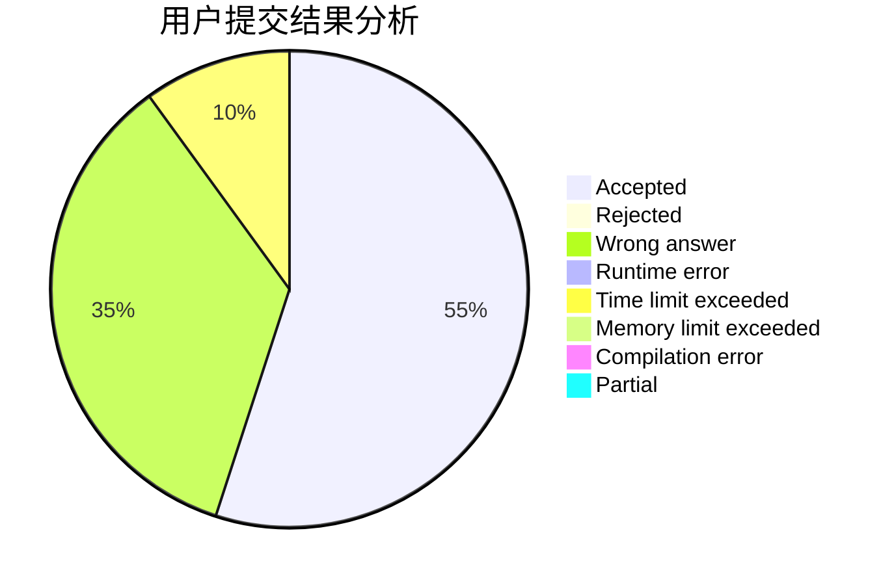
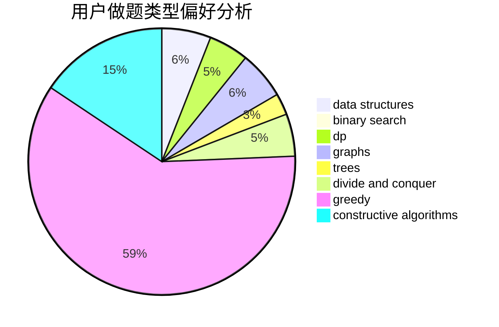
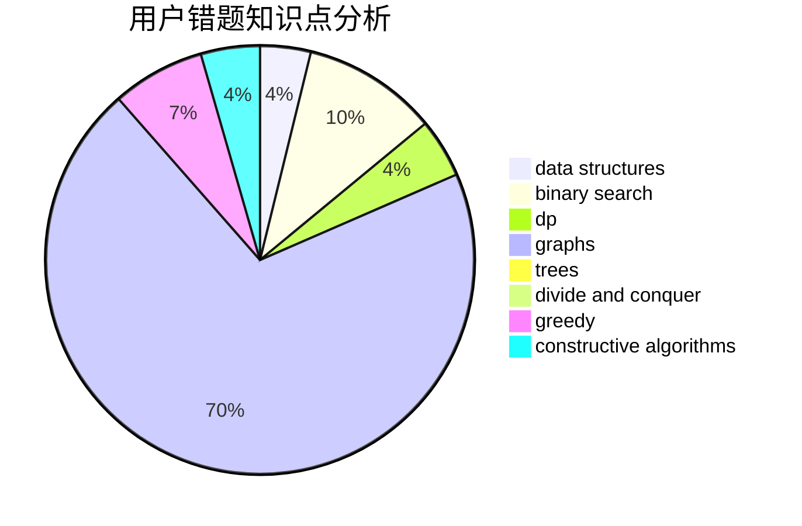

# JerryDream

<!-- tabs:start -->

#### **用户提交结果分析**

#### **用户做题类型偏好分析**

#### **用户错题知识点分析**

<!-- tabs:end -->
# 推荐题目
[1432E](https://codeforces.com/contest/1432/problem/E)		dsu,graphs,sortings,trees		  
[1266F](https://codeforces.com/contest/1266/problem/F)		dfs and similar,
                        graphs		  
[321A](https://codeforces.com/contest/321/problem/A)		binary search,
                        implementation,
                        math		  
[274C](https://codeforces.com/contest/274/problem/C)		brute force,
                        geometry		  
[1028C](https://codeforces.com/contest/1028/problem/C)		geometry,
                        implementation,
                        sortings		  
[810C](https://codeforces.com/contest/810/problem/C)		dsu,graphs,sortings,trees		  
[551E](https://codeforces.com/contest/551/problem/E)		binary search,
                        data structures,
                        implementation		  
[1402B](https://codeforces.com/contest/1402/problem/B)		*special problem,
                        geometry,
                        sortings		  
[226E](https://codeforces.com/contest/226/problem/E)		data structures,
                        trees		  
[38A](https://codeforces.com/contest/38/problem/A)		implementation		  
