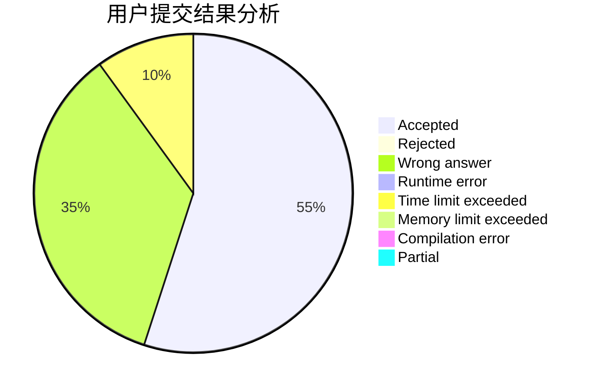
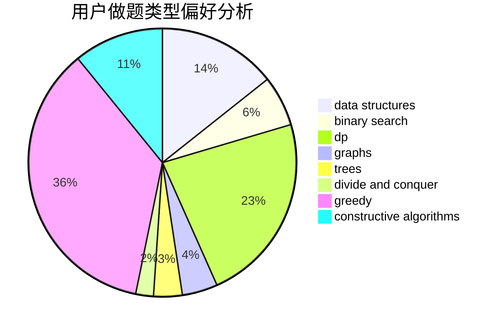
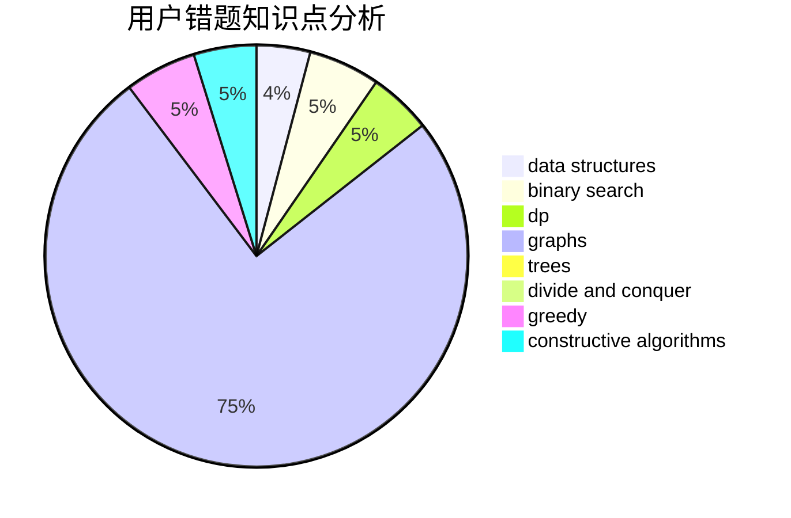

# JerryDream

<!-- tabs:start -->

#### **用户提交结果分析**

#### **用户做题类型偏好分析**

#### **用户错题知识点分析**

<!-- tabs:end -->
# 推荐题目
[1442D](https://codeforces.com/contest/1442/problem/D)		data structures,
                        divide and conquer,
                        dp,
                        greedy		  
[1272A](https://codeforces.com/contest/1272/problem/A)		brute force,
                        greedy,
                        math,
                        sortings		  
[351E](https://codeforces.com/contest/351/problem/E)		greedy		  
[28B](https://codeforces.com/contest/28/problem/B)		dfs and similar,
                        dsu,
                        graphs		  
[1028G](https://codeforces.com/contest/1028/problem/G)		dp,
                        interactive		  
[828C](https://codeforces.com/contest/828/problem/C)		dsu,graphs,sortings,trees		  
[577A](https://codeforces.com/contest/577/problem/A)		implementation,
                        number theory		  
[1413D](https://codeforces.com/contest/1413/problem/D)		data structures,
                        greedy,
                        implementation		  
[246A](https://codeforces.com/contest/246/problem/A)		constructive algorithms,
                        greedy,
                        sortings		  
[418E](https://codeforces.com/contest/418/problem/E)		data structures		  
