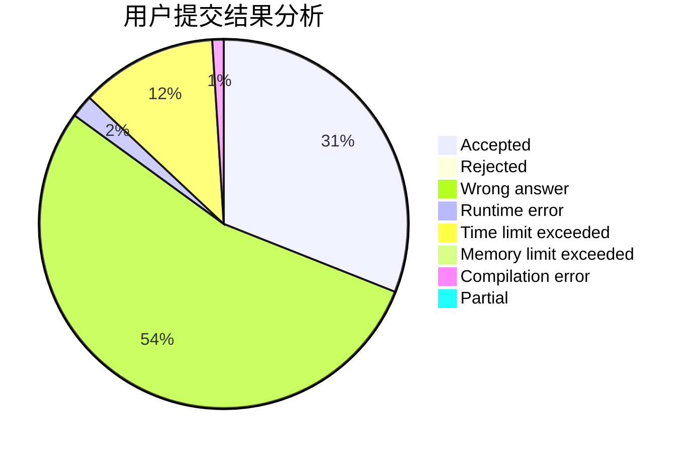
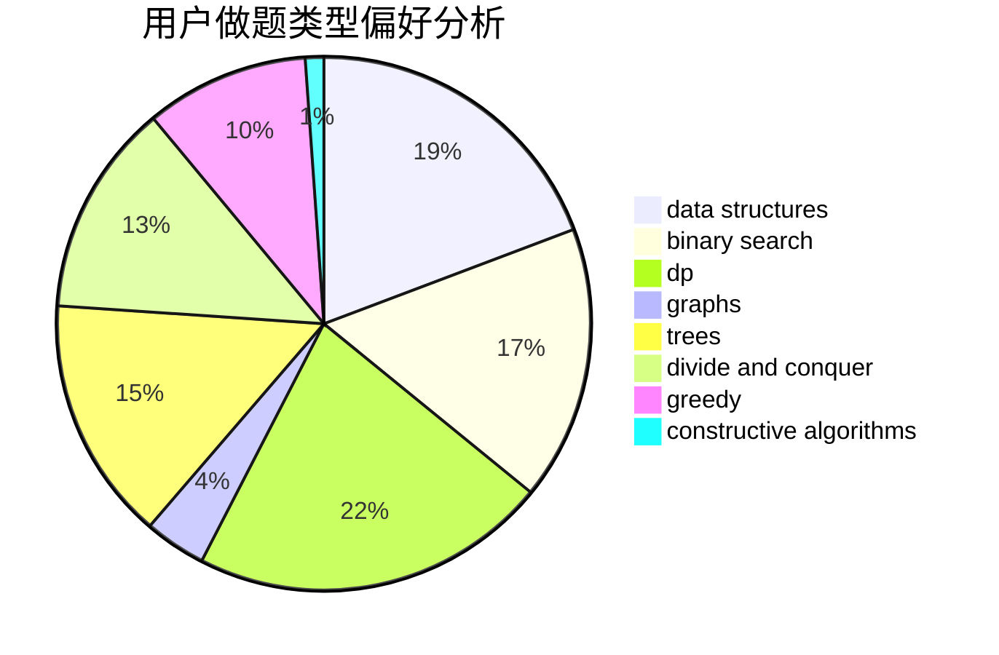
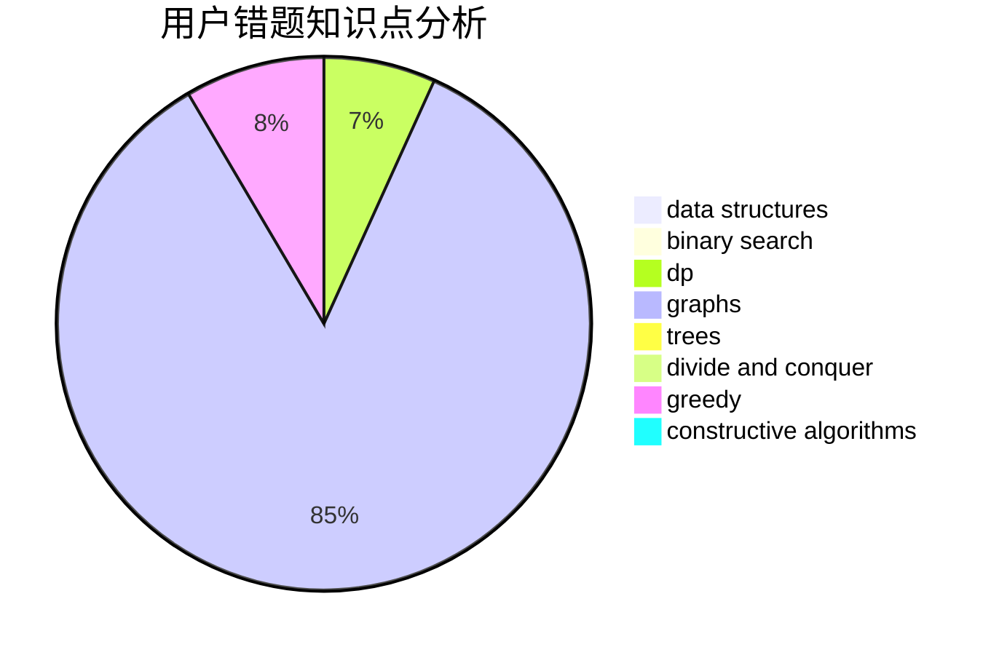

# Jerry_L

<!-- tabs:start -->

#### **用户提交结果分析**

#### **用户做题类型偏好分析**

#### **用户错题知识点分析**

<!-- tabs:end -->
# 推荐题目
[1424G](https://codeforces.com/contest/1424/problem/G)		data structures,
                        sortings		  
[198B](https://codeforces.com/contest/198/problem/B)		shortest paths		  
[1473G](https://codeforces.com/contest/1473/problem/G)		combinatorics,
                        dp,
                        fft,
                        math		  
[607E](https://codeforces.com/contest/607/problem/E)		binary search,
                        geometry		  
[723C](https://codeforces.com/contest/723/problem/C)		greedy		  
[62E](https://codeforces.com/contest/62/problem/E)		dp,
                        flows		  
[948B](https://codeforces.com/contest/948/problem/B)		dsu,graphs,sortings,trees		  
[145C](https://codeforces.com/contest/145/problem/C)		combinatorics,
                        dp,
                        math		  
[377C](https://codeforces.com/contest/377/problem/C)		bitmasks,
                        dp,
                        games		  
[844A](https://codeforces.com/contest/844/problem/A)		greedy,
                        implementation,
                        strings		  
