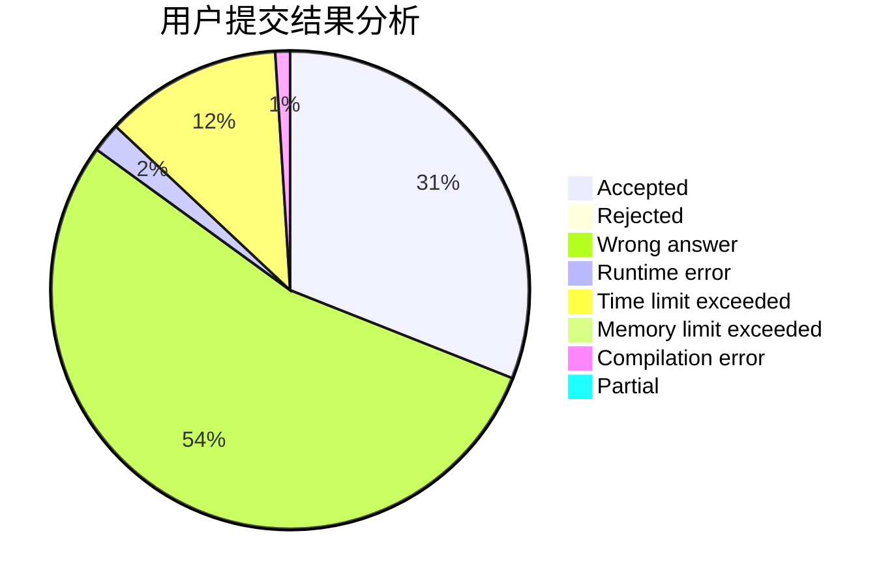
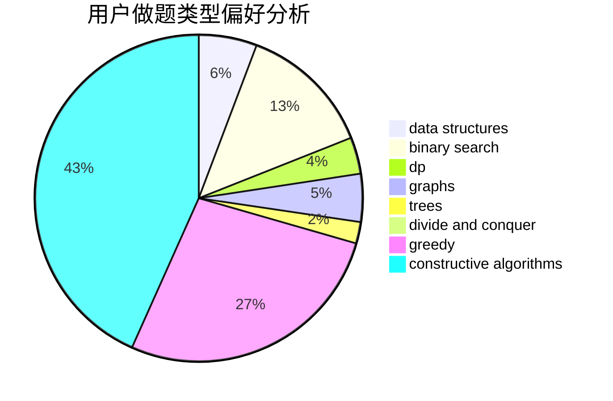
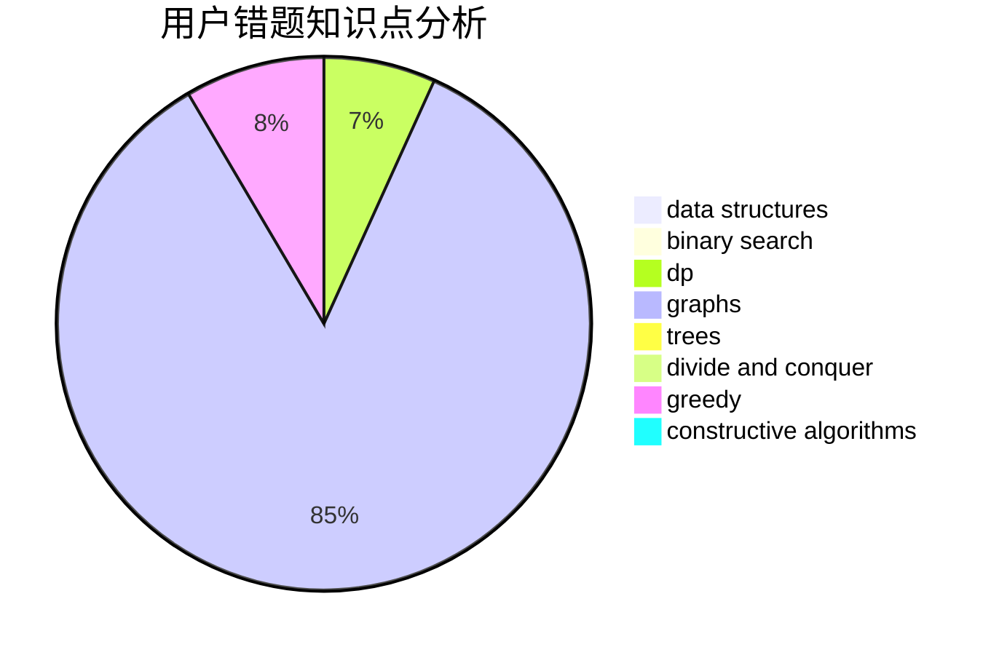

# Jerry_L
<!-- tabs:start -->
#### **用户提交结果分析**

#### **用户做题类型偏好分析**

#### **用户错题知识点分析**

<!-- tabs:end -->
# 推荐题目
[Black Widow](http://codeforces.com/problemset/problem/704/C)		dp,
                        graphs,
                        implementation,
                        math		  
[Quantum Classification - Dataset 5](http://codeforces.com/problemset/problem/1357/D3)		nan		  
[Star](http://codeforces.com/problemset/problem/171/B)		*special problem,
                        combinatorics		  
[Duff in Mafia](http://codeforces.com/problemset/problem/587/D)		2-sat,
                        binary search		  
[Alphabet Permutations](http://codeforces.com/problemset/problem/610/E)		data structures,
                        strings		  
[Showing Off](http://codeforces.com/problemset/problem/1416/F)		flows,
                        graph matchings,
                        greedy,
                        implementation		  
[Wardrobe](http://codeforces.com/problemset/problem/924/E)		nan		  
[Contact ATC](http://codeforces.com/problemset/problem/924/D)		nan		  
[Representative Sampling](http://codeforces.com/problemset/problem/178/F1)		nan		  
[Road Construction](http://codeforces.com/problemset/problem/1252/L)		flows,
                        graphs		  
<!-- tabs:start -->
#### **data structures**
[Black Widow](http://codeforces.com/problemset/problem/610/E)		data structures,
                        strings		  
[Quantum Classification - Dataset 5](http://codeforces.com/problemset/problem/600/B)		binary search,
                        data structures,
                        sortings,
                        two pointers		  
[Star](http://codeforces.com/problemset/problem/1263/E)		data structures,
                        implementation		  
[Duff in Mafia](http://codeforces.com/problemset/problem/1408/E)		data structures,
                        dsu,
                        graphs,
                        greedy,
                        sortings,
                        trees		  
[Alphabet Permutations](http://codeforces.com/problemset/problem/1492/C)		binary search,
                        data structures,
                        dp,
                        greedy,
                        two pointers		  
[Showing Off](http://codeforces.com/problemset/problem/1490/G)		binary search,
                        data structures,
                        math		  
[Wardrobe](http://codeforces.com/problemset/problem/1479/D)		binary search,
                        bitmasks,
                        brute force,
                        data structures,
                        probabilities,
                        trees		  
[Contact ATC](http://codeforces.com/problemset/problem/1497/A)		brute force,
                        data structures,
                        greedy,
                        sortings		  
[Representative Sampling](http://codeforces.com/problemset/problem/1491/C)		brute force,
                        data structures,
                        dp,
                        greedy,
                        implementation		  
[Road Construction](http://codeforces.com/problemset/problem/1492/B)		data structures,
                        greedy,
                        math		  
#### **binary search**
[Black Widow](http://codeforces.com/problemset/problem/587/D)		2-sat,
                        binary search		  
[Quantum Classification - Dataset 5](http://codeforces.com/problemset/problem/600/B)		binary search,
                        data structures,
                        sortings,
                        two pointers		  
[Star](http://codeforces.com/problemset/problem/825/D)		binary search,
                        greedy,
                        implementation		  
[Duff in Mafia](http://codeforces.com/problemset/problem/1108/F)		binary search,
                        dsu,
                        graphs,
                        greedy		  
[Alphabet Permutations](http://codeforces.com/problemset/problem/1493/C)		binary search,
                        brute force,
                        constructive algorithms,
                        greedy,
                        strings		  
[Showing Off](http://codeforces.com/problemset/problem/1492/C)		binary search,
                        data structures,
                        dp,
                        greedy,
                        two pointers		  
[Wardrobe](http://codeforces.com/problemset/problem/1463/D)		binary search,
                        constructive algorithms,
                        greedy,
                        two pointers		  
[Contact ATC](http://codeforces.com/problemset/problem/1490/G)		binary search,
                        data structures,
                        math		  
[Representative Sampling](http://codeforces.com/problemset/problem/1479/D)		binary search,
                        bitmasks,
                        brute force,
                        data structures,
                        probabilities,
                        trees		  
[Road Construction](http://codeforces.com/problemset/problem/1436/E)		binary search,
                        data structures,
                        two pointers		  
#### **dp**
[Black Widow](http://codeforces.com/problemset/problem/704/C)		dp,
                        graphs,
                        implementation,
                        math		  
[Quantum Classification - Dataset 5](http://codeforces.com/problemset/problem/1425/B)		divide and conquer,
                        dp		  
[Star](http://codeforces.com/problemset/problem/1451/C)		dp,
                        greedy,
                        hashing,
                        implementation,
                        strings		  
[Duff in Mafia](http://codeforces.com/problemset/problem/1492/C)		binary search,
                        data structures,
                        dp,
                        greedy,
                        two pointers		  
[Alphabet Permutations](https://codeforces.com/contest/1457/problem/C)		brute force,
                        dp,
                        implementation		  
[Showing Off](http://codeforces.com/problemset/problem/1491/C)		brute force,
                        data structures,
                        dp,
                        greedy,
                        implementation		  
[Wardrobe](http://codeforces.com/problemset/problem/1437/C)		dp,
                        flows,
                        graph matchings,
                        greedy,
                        math,
                        sortings		  
[Contact ATC](http://codeforces.com/problemset/problem/1499/B)		brute force,
                        dp,
                        greedy,
                        implementation		  
[Representative Sampling](http://codeforces.com/problemset/problem/1491/D)		bitmasks,
                        constructive algorithms,
                        dp,
                        greedy,
                        math		  
[Road Construction](http://codeforces.com/problemset/problem/1497/E1)		data structures,
                        dp,
                        greedy,
                        math,
                        number theory,
                        two pointers		  
#### **graph**
[Black Widow](http://codeforces.com/problemset/problem/704/C)		dp,
                        graphs,
                        implementation,
                        math		  
[Quantum Classification - Dataset 5](http://codeforces.com/problemset/problem/1416/F)		flows,
                        graph matchings,
                        greedy,
                        implementation		  
[Star](http://codeforces.com/problemset/problem/1252/L)		flows,
                        graphs		  
[Duff in Mafia](http://codeforces.com/problemset/problem/350/B)		graphs		  
[Alphabet Permutations](http://codeforces.com/problemset/problem/770/C)		*special problem,
                        dfs and similar,
                        graphs,
                        implementation		  
[Showing Off](http://codeforces.com/problemset/problem/1361/E)		dfs and similar,
                        graphs,
                        probabilities,
                        trees		  
[Wardrobe](http://codeforces.com/problemset/problem/1108/F)		binary search,
                        dsu,
                        graphs,
                        greedy		  
[Contact ATC](http://codeforces.com/problemset/problem/1408/E)		data structures,
                        dsu,
                        graphs,
                        greedy,
                        sortings,
                        trees		  
[Representative Sampling](http://codeforces.com/problemset/problem/1487/C)		brute force,
                        constructive algorithms,
                        dfs and similar,
                        graphs,
                        greedy,
                        implementation,
                        math		  
[Road Construction](http://codeforces.com/problemset/problem/1437/C)		dp,
                        flows,
                        graph matchings,
                        greedy,
                        math,
                        sortings		  
#### **trees**
[Black Widow](http://codeforces.com/problemset/problem/1361/E)		dfs and similar,
                        graphs,
                        probabilities,
                        trees		  
[Quantum Classification - Dataset 5](http://codeforces.com/problemset/problem/1408/E)		data structures,
                        dsu,
                        graphs,
                        greedy,
                        sortings,
                        trees		  
[Star](http://codeforces.com/problemset/problem/1479/D)		binary search,
                        bitmasks,
                        brute force,
                        data structures,
                        probabilities,
                        trees		  
[Duff in Mafia](http://codeforces.com/problemset/problem/1511/C)		brute force,
                        data structures,
                        implementation,
                        trees		  
[Alphabet Permutations](http://codeforces.com/problemset/problem/1499/F)		combinatorics,
                        dfs and similar,
                        dp,
                        trees		  
[Showing Off](http://codeforces.com/problemset/problem/1491/E)		brute force,
                        dfs and similar,
                        divide and conquer,
                        number theory,
                        trees		  
[Wardrobe](http://codeforces.com/problemset/problem/1466/D)		data structures,
                        greedy,
                        sortings,
                        trees		  
[Contact ATC](http://codeforces.com/problemset/problem/1495/D)		combinatorics,
                        dfs and similar,
                        graphs,
                        math,
                        shortest paths,
                        trees		  
[Representative Sampling](http://codeforces.com/problemset/problem/1303/G)		data structures,
                        divide and conquer,
                        geometry,
                        trees		  
[Road Construction](http://codeforces.com/problemset/problem/1454/E)		combinatorics,
                        dfs and similar,
                        graphs,
                        trees		  
#### **divide and conquer**
[Black Widow](http://codeforces.com/problemset/problem/1425/B)		divide and conquer,
                        dp		  
[Quantum Classification - Dataset 5](http://codeforces.com/problemset/problem/1466/G)		combinatorics,
                        divide and conquer,
                        hashing,
                        math,
                        string suffix structures,
                        strings		  
[Star](http://codeforces.com/problemset/problem/1461/D)		binary search,
                        brute force,
                        data structures,
                        divide and conquer,
                        implementation,
                        sortings		  
[Duff in Mafia](http://codeforces.com/problemset/problem/1466/G)		combinatorics,
                        divide and conquer,
                        hashing,
                        math,
                        string suffix structures,
                        strings		  
[Alphabet Permutations](http://codeforces.com/problemset/problem/1490/D)		dfs and similar,
                        divide and conquer,
                        implementation		  
[Showing Off](https://codeforces.com/contest/1483/problem/C)		data structures,
                        divide and conquer,
                        dp		  
[Wardrobe](http://codeforces.com/problemset/problem/1491/E)		brute force,
                        dfs and similar,
                        divide and conquer,
                        number theory,
                        trees		  
[Contact ATC](http://codeforces.com/problemset/problem/1303/G)		data structures,
                        divide and conquer,
                        geometry,
                        trees		  
[Representative Sampling](http://codeforces.com/problemset/problem/1494/D)		constructive algorithms,
                        data structures,
                        dfs and similar,
                        divide and conquer,
                        dsu,
                        greedy,
                        sortings,
                        trees		  
[Road Construction](http://codeforces.com/problemset/problem/1482/E)		data structures,
                        divide and conquer,
                        dp		  
#### **greedy**
[Black Widow](http://codeforces.com/problemset/problem/1416/F)		flows,
                        graph matchings,
                        greedy,
                        implementation		  
[Quantum Classification - Dataset 5](http://codeforces.com/problemset/problem/825/D)		binary search,
                        greedy,
                        implementation		  
[Star](http://codeforces.com/problemset/problem/1108/F)		binary search,
                        dsu,
                        graphs,
                        greedy		  
[Duff in Mafia](http://codeforces.com/problemset/problem/1451/C)		dp,
                        greedy,
                        hashing,
                        implementation,
                        strings		  
[Alphabet Permutations](http://codeforces.com/problemset/problem/1375/B)		constructive algorithms,
                        greedy		  
[Showing Off](http://codeforces.com/problemset/problem/1413/E)		greedy,
                        math,
                        ternary search		  
[Wardrobe](http://codeforces.com/problemset/problem/1337/B)		greedy,
                        implementation,
                        math		  
[Contact ATC](http://codeforces.com/problemset/problem/1493/C)		binary search,
                        brute force,
                        constructive algorithms,
                        greedy,
                        strings		  
[Representative Sampling](http://codeforces.com/problemset/problem/1408/E)		data structures,
                        dsu,
                        graphs,
                        greedy,
                        sortings,
                        trees		  
[Road Construction](http://codeforces.com/problemset/problem/1492/C)		binary search,
                        data structures,
                        dp,
                        greedy,
                        two pointers		  
#### **constructive algorithms**
[Black Widow](http://codeforces.com/problemset/problem/421/A)		constructive algorithms,
                        implementation		  
[Quantum Classification - Dataset 5](http://codeforces.com/problemset/problem/1375/B)		constructive algorithms,
                        greedy		  
[Star](http://codeforces.com/problemset/problem/1493/C)		binary search,
                        brute force,
                        constructive algorithms,
                        greedy,
                        strings		  
[Duff in Mafia](http://codeforces.com/problemset/problem/1493/A)		constructive algorithms,
                        greedy		  
[Alphabet Permutations](http://codeforces.com/problemset/problem/1463/D)		binary search,
                        constructive algorithms,
                        greedy,
                        two pointers		  
[Showing Off](https://codeforces.com/contest/1456/problem/B)		bitmasks,
                        brute force,
                        constructive algorithms		  
[Wardrobe](http://codeforces.com/problemset/problem/1492/D)		bitmasks,
                        constructive algorithms,
                        greedy,
                        math		  
[Contact ATC](https://codeforces.com/contest/1504/problem/D)		constructive algorithms,
                        games,
                        interactive		  
[Representative Sampling](https://codeforces.com/contest/1483/problem/A)		brute force,
                        constructive algorithms,
                        greedy,
                        implementation		  
[Road Construction](https://codeforces.com/contest/1457/problem/D)		bitmasks,
                        brute force,
                        constructive algorithms		  
#### **sortings**
[Black Widow](http://codeforces.com/problemset/problem/600/B)		binary search,
                        data structures,
                        sortings,
                        two pointers		  
[Quantum Classification - Dataset 5](http://codeforces.com/problemset/problem/1408/E)		data structures,
                        dsu,
                        graphs,
                        greedy,
                        sortings,
                        trees		  
[Star](https://codeforces.com/contest/1496/problem/C)		geometry,
                        greedy,
                        math,
                        sortings		  
[Duff in Mafia](http://codeforces.com/problemset/problem/1495/A)		geometry,
                        greedy,
                        math,
                        sortings		  
[Alphabet Permutations](http://codeforces.com/problemset/problem/1497/A)		brute force,
                        data structures,
                        greedy,
                        sortings		  
[Showing Off](http://codeforces.com/problemset/problem/1427/A)		math,
                        sortings		  
[Wardrobe](http://codeforces.com/problemset/problem/1461/D)		binary search,
                        brute force,
                        data structures,
                        divide and conquer,
                        implementation,
                        sortings		  
[Contact ATC](http://codeforces.com/problemset/problem/1437/C)		dp,
                        flows,
                        graph matchings,
                        greedy,
                        math,
                        sortings		  
[Representative Sampling](http://codeforces.com/problemset/problem/1473/A)		greedy,
                        implementation,
                        math,
                        sortings		  
[Road Construction](http://codeforces.com/problemset/problem/1486/B)		binary search,
                        geometry,
                        shortest paths,
                        sortings		  
<!-- tabs:end -->
