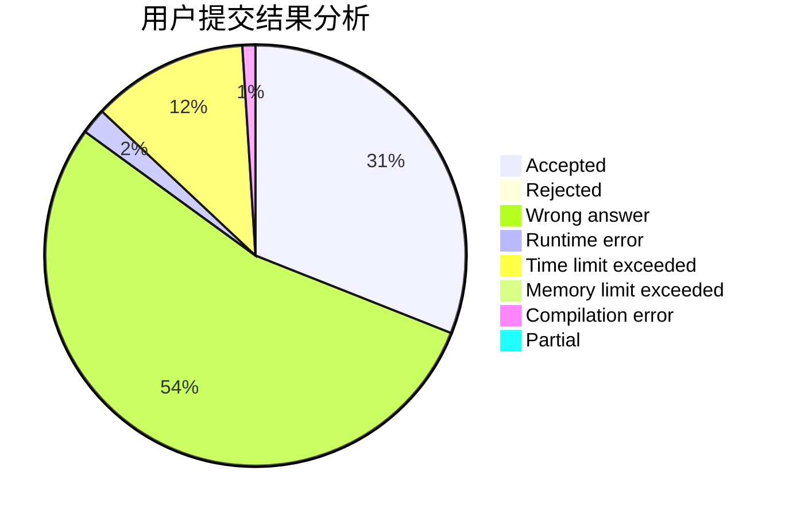
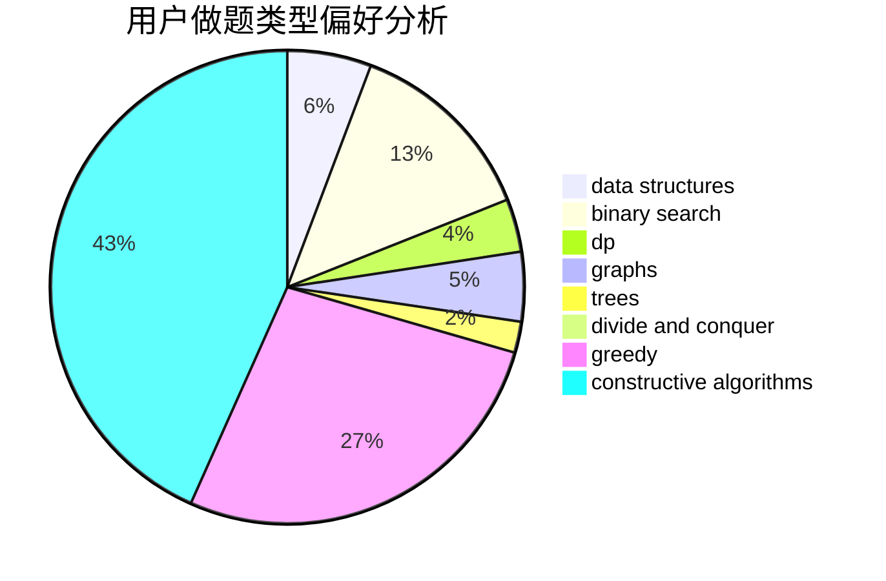
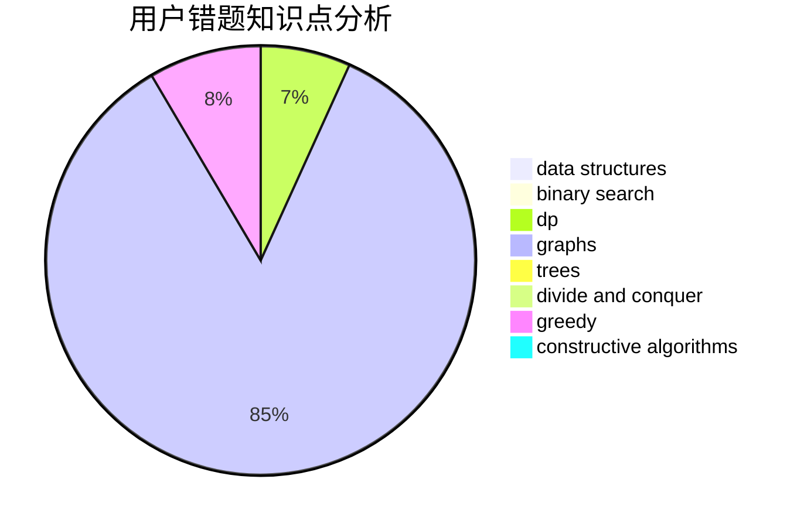

# Jerry_L

<!-- tabs:start -->

#### **用户提交结果分析**

#### **用户做题类型偏好分析**

#### **用户错题知识点分析**

<!-- tabs:end -->
# 推荐题目
[1416F](https://codeforces.com/contest/1416/problem/F)		flows,
                        graph matchings,
                        greedy,
                        implementation		  
[171B](https://codeforces.com/contest/171/problem/B)		*special problem,
                        combinatorics		  
[1466G](https://codeforces.com/contest/1466/problem/G)		combinatorics,
                        divide and conquer,
                        hashing,
                        math,
                        string suffix structures,
                        strings		  
[587D](https://codeforces.com/contest/587/problem/D)		2-sat,
                        binary search		  
[704C](https://codeforces.com/contest/704/problem/C)		dp,
                        graphs,
                        implementation,
                        math		  
[610E](https://codeforces.com/contest/610/problem/E)		data structures,
                        strings		  
[924D](https://codeforces.com/contest/924/problem/D)		nan		  
[1451C](https://codeforces.com/contest/1451/problem/C)		dp,
                        greedy,
                        hashing,
                        implementation,
                        strings		  
[350B](https://codeforces.com/contest/350/problem/B)		graphs		  
[825D](https://codeforces.com/contest/825/problem/D)		binary search,
                        greedy,
                        implementation		  
