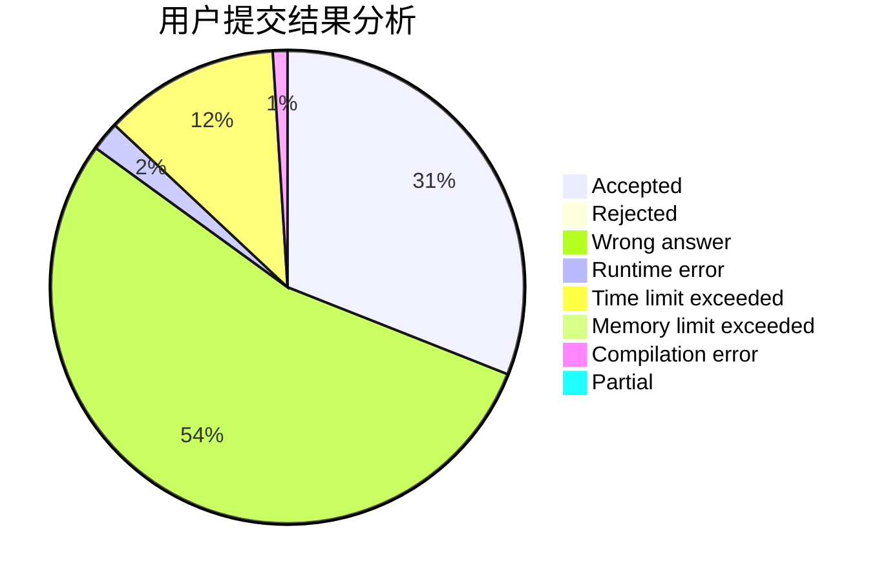
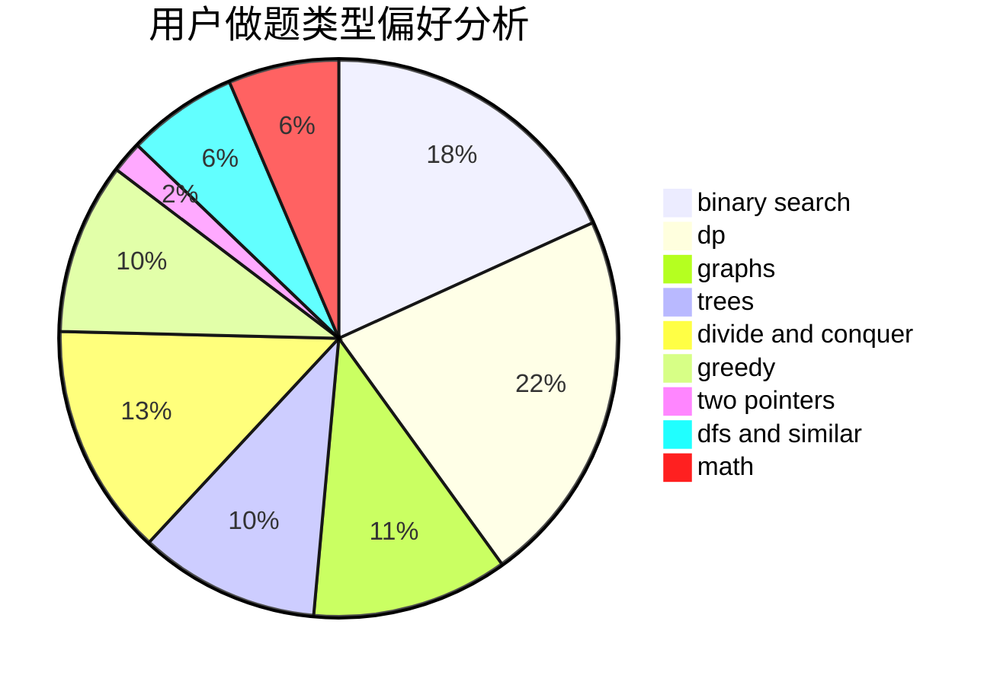

# Jerry_L

<!-- tabs:start -->

#### **用户提交结果分析**

#### **用户做题类型偏好分析**

<!-- tabs:end -->
# 推荐题目
[1424G](https://codeforces.com/contest/1424/problem/G)
[198B](https://codeforces.com/contest/198/problem/B)
[1473G](https://codeforces.com/contest/1473/problem/G)
[607E](https://codeforces.com/contest/607/problem/E)
[723C](https://codeforces.com/contest/723/problem/C)
[62E](https://codeforces.com/contest/62/problem/E)
[948B](https://codeforces.com/contest/948/problem/B)
[145C](https://codeforces.com/contest/145/problem/C)
[377C](https://codeforces.com/contest/377/problem/C)
[844A](https://codeforces.com/contest/844/problem/A)
