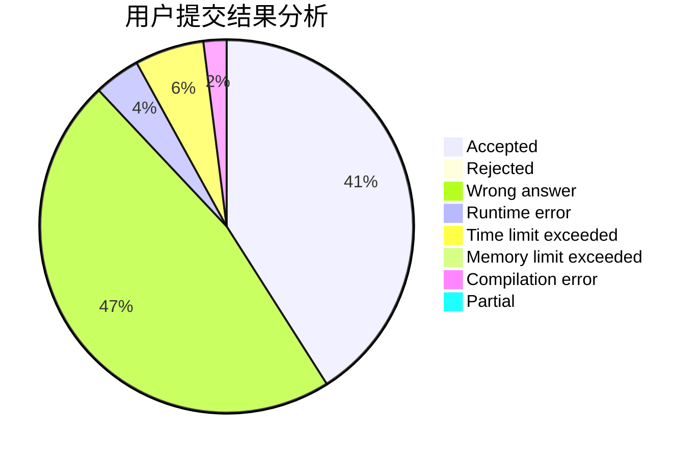
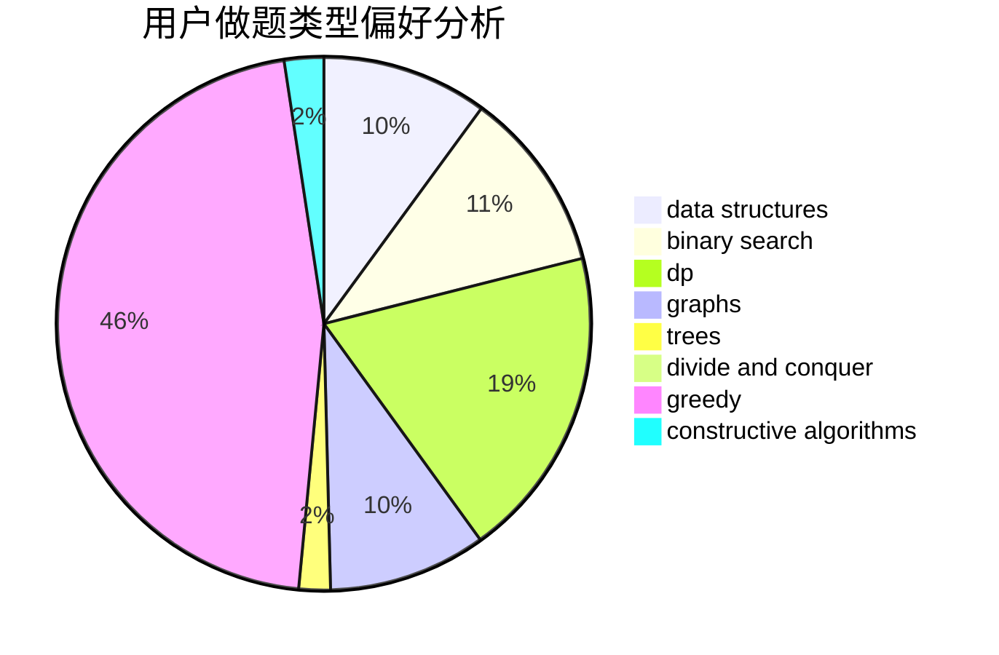

# Jetiaime

<!-- tabs:start -->

#### **用户提交结果分析**

#### **用户做题类型偏好分析**

#### **用户错题知识点分析**

<!-- tabs:end -->
# 推荐题目
[1363D](https://codeforces.com/contest/1363/problem/D)		binary search,
                        implementation,
                        interactive,
                        math		  
[149E](https://codeforces.com/contest/149/problem/E)		string suffix structures,
                        strings		  
[895B](https://codeforces.com/contest/895/problem/B)		binary search,
                        math,
                        sortings,
                        two pointers		  
[183D](https://codeforces.com/contest/183/problem/D)		dp,
                        greedy,
                        probabilities		  
[1036F](https://codeforces.com/contest/1036/problem/F)		combinatorics,
                        math,
                        number theory		  
[587D](https://codeforces.com/contest/587/problem/D)		2-sat,
                        binary search		  
[1474C](https://codeforces.com/contest/1474/problem/C)		brute force,
                        constructive algorithms,
                        data structures,
                        greedy,
                        implementation,
                        sortings		  
[51A](https://codeforces.com/contest/51/problem/A)		implementation		  
[887F](https://codeforces.com/contest/887/problem/F)		greedy,
                        sortings		  
[364D](https://codeforces.com/contest/364/problem/D)		brute force,
                        math,
                        probabilities		  
