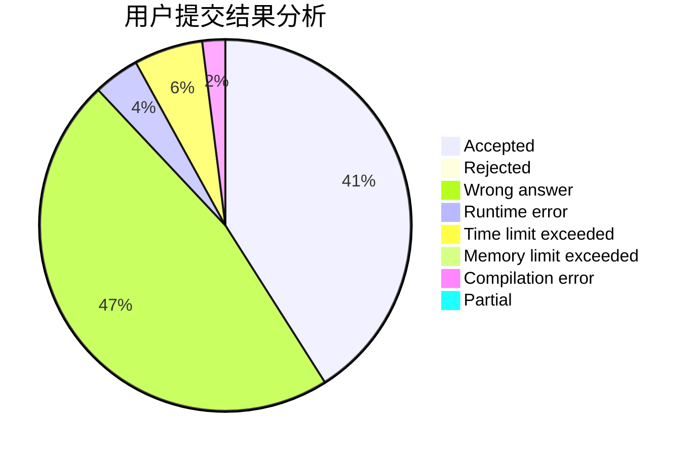
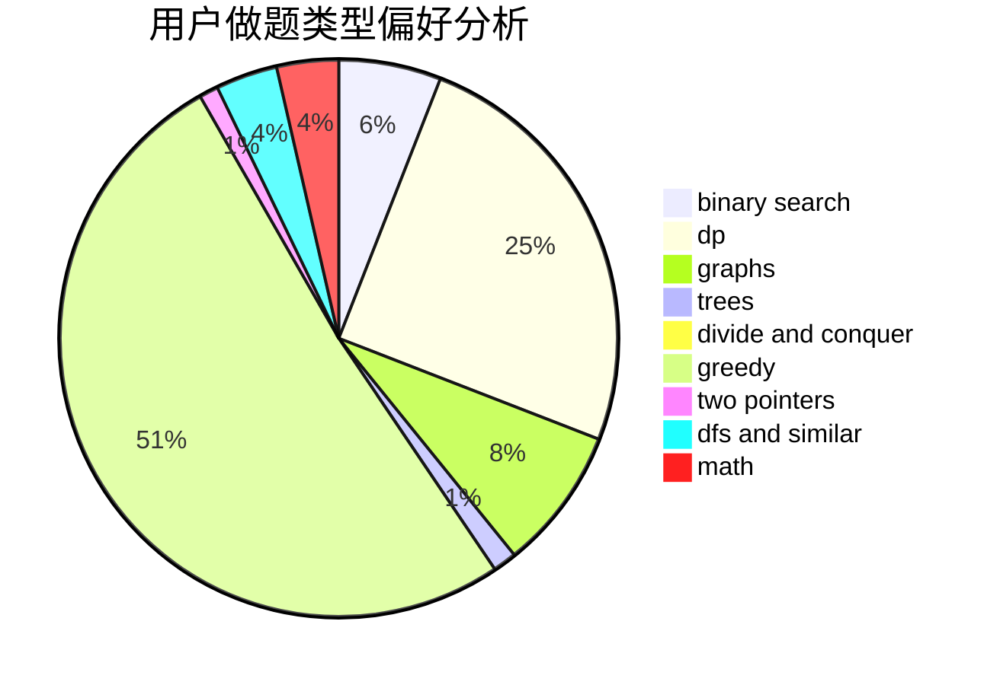

# Jetiaime

<!-- tabs:start -->

#### **用户提交结果分析**

#### **用户做题类型偏好分析**

<!-- tabs:end -->
# 推荐题目
[1370C](https://codeforces.com/contest/1370/problem/C)
[1510A](https://codeforces.com/contest/1510/problem/A)
[912E](https://codeforces.com/contest/912/problem/E)
[20A](https://codeforces.com/contest/20/problem/A)
[1037C](https://codeforces.com/contest/1037/problem/C)
[607E](https://codeforces.com/contest/607/problem/E)
[1482H](https://codeforces.com/contest/1482/problem/H)
[545B](https://codeforces.com/contest/545/problem/B)
[907B](https://codeforces.com/contest/907/problem/B)
[392A](https://codeforces.com/contest/392/problem/A)
