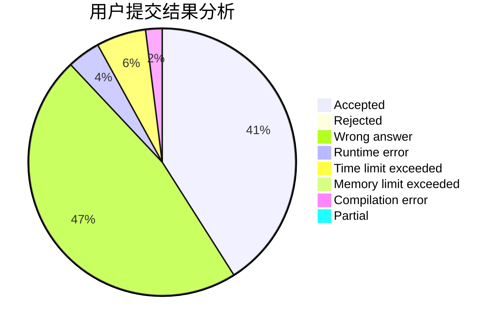
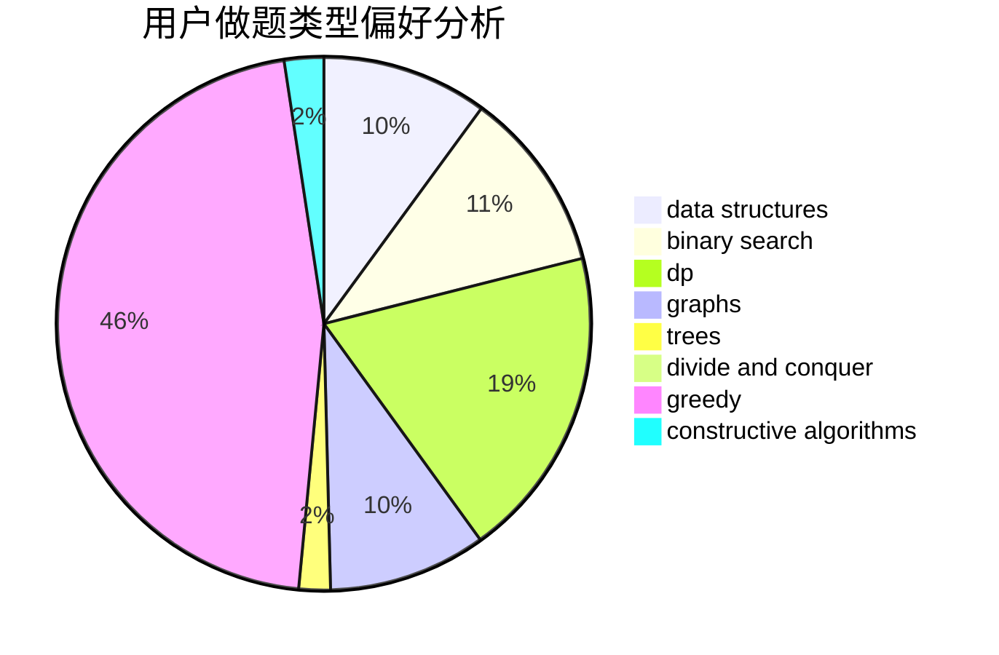

# Jetiaime
<!-- tabs:start -->
#### **用户提交结果分析**

#### **用户做题类型偏好分析**

#### **用户错题知识点分析**

<!-- tabs:end -->
# 推荐题目
[Array Destruction](http://codeforces.com/problemset/problem/1474/C)		brute force,
                        constructive algorithms,
                        data structures,
                        greedy,
                        implementation,
                        sortings		  
[Relatively Prime Powers](http://codeforces.com/problemset/problem/1036/F)		combinatorics,
                        math,
                        number theory		  
[XK Segments](http://codeforces.com/problemset/problem/895/B)		binary search,
                        math,
                        sortings,
                        two pointers		  
[Bear and Tree Jumps](http://codeforces.com/problemset/problem/771/C)		dfs and similar,
                        dp,
                        trees		  
[Big Secret](http://codeforces.com/problemset/problem/925/C)		constructive algorithms,
                        math		  
[T-shirt](http://codeforces.com/problemset/problem/183/D)		dp,
                        greedy,
                        probabilities		  
[Row of Models](http://codeforces.com/problemset/problem/887/F)		greedy,
                        sortings		  
[The Bakery](http://codeforces.com/problemset/problem/833/B)		binary search,
                        data structures,
                        divide and conquer,
                        dp,
                        two pointers		  
[Parametric Circulation](http://codeforces.com/problemset/problem/925/F)		binary search,
                        flows		  
[Guess The Maximums](http://codeforces.com/problemset/problem/1363/D)		binary search,
                        implementation,
                        interactive,
                        math		  
<!-- tabs:start -->
#### **data structures**
[Array Destruction](http://codeforces.com/problemset/problem/1474/C)		brute force,
                        constructive algorithms,
                        data structures,
                        greedy,
                        implementation,
                        sortings		  
[Relatively Prime Powers](http://codeforces.com/problemset/problem/833/B)		binary search,
                        data structures,
                        divide and conquer,
                        dp,
                        two pointers		  
[XK Segments](http://codeforces.com/problemset/problem/926/J)		data structures		  
[Bear and Tree Jumps](http://codeforces.com/problemset/problem/925/E)		data structures,
                        trees		  
[Big Secret](http://codeforces.com/problemset/problem/1179/A)		data structures,
                        implementation		  
[T-shirt](http://codeforces.com/problemset/problem/1200/A)		brute force,
                        data structures,
                        implementation		  
[Row of Models](http://codeforces.com/problemset/problem/1175/B)		data structures,
                        expression parsing,
                        implementation		  
[The Bakery](http://codeforces.com/problemset/problem/1236/D)		brute force,
                        data structures,
                        greedy,
                        implementation		  
[Parametric Circulation](http://codeforces.com/problemset/problem/1492/C)		binary search,
                        data structures,
                        dp,
                        greedy,
                        two pointers		  
[Guess The Maximums](http://codeforces.com/problemset/problem/1490/G)		binary search,
                        data structures,
                        math		  
#### **binary search**
[Array Destruction](http://codeforces.com/problemset/problem/895/B)		binary search,
                        math,
                        sortings,
                        two pointers		  
[Relatively Prime Powers](http://codeforces.com/problemset/problem/833/B)		binary search,
                        data structures,
                        divide and conquer,
                        dp,
                        two pointers		  
[XK Segments](http://codeforces.com/problemset/problem/925/F)		binary search,
                        flows		  
[Bear and Tree Jumps](http://codeforces.com/problemset/problem/1363/D)		binary search,
                        implementation,
                        interactive,
                        math		  
[Big Secret](http://codeforces.com/problemset/problem/587/D)		2-sat,
                        binary search		  
[T-shirt](https://codeforces.com/contest/480/problem/A)		binary search,
                        greedy,
                        sortings		  
[Row of Models](http://codeforces.com/problemset/problem/1419/D2)		binary search,
                        brute force,
                        constructive algorithms,
                        greedy,
                        sortings,
                        two pointers		  
[The Bakery](http://codeforces.com/problemset/problem/1492/C)		binary search,
                        data structures,
                        dp,
                        greedy,
                        two pointers		  
[Parametric Circulation](http://codeforces.com/problemset/problem/1463/D)		binary search,
                        constructive algorithms,
                        greedy,
                        two pointers		  
[Guess The Maximums](http://codeforces.com/problemset/problem/1490/G)		binary search,
                        data structures,
                        math		  
#### **dp**
[Array Destruction](http://codeforces.com/problemset/problem/771/C)		dfs and similar,
                        dp,
                        trees		  
[Relatively Prime Powers](http://codeforces.com/problemset/problem/183/D)		dp,
                        greedy,
                        probabilities		  
[XK Segments](http://codeforces.com/problemset/problem/833/B)		binary search,
                        data structures,
                        divide and conquer,
                        dp,
                        two pointers		  
[Bear and Tree Jumps](http://codeforces.com/problemset/problem/825/F)		dp,
                        hashing,
                        string suffix structures,
                        strings		  
[Big Secret](http://codeforces.com/problemset/problem/1012/F)		dp,
                        implementation		  
[T-shirt](http://codeforces.com/problemset/problem/1120/D)		dfs and similar,
                        dp,
                        dsu,
                        graphs,
                        greedy,
                        trees		  
[Row of Models](http://codeforces.com/problemset/problem/1472/F)		brute force,
                        dp,
                        graph matchings,
                        greedy,
                        sortings		  
[The Bakery](http://codeforces.com/problemset/problem/755/G)		combinatorics,
                        divide and conquer,
                        dp,
                        fft,
                        math,
                        number theory		  
[Parametric Circulation](http://codeforces.com/problemset/problem/1492/C)		binary search,
                        data structures,
                        dp,
                        greedy,
                        two pointers		  
[Guess The Maximums](https://codeforces.com/contest/1457/problem/C)		brute force,
                        dp,
                        implementation		  
#### **graph**
[Array Destruction](https://codeforces.com/contest/438/problem/A)		graphs,
                        greedy,
                        sortings		  
[Relatively Prime Powers](http://codeforces.com/problemset/problem/1082/D)		constructive algorithms,
                        graphs,
                        implementation		  
[XK Segments](http://codeforces.com/problemset/problem/1120/D)		dfs and similar,
                        dp,
                        dsu,
                        graphs,
                        greedy,
                        trees		  
[Bear and Tree Jumps](http://codeforces.com/problemset/problem/1472/F)		brute force,
                        dp,
                        graph matchings,
                        greedy,
                        sortings		  
[Big Secret](http://codeforces.com/problemset/problem/1487/C)		brute force,
                        constructive algorithms,
                        dfs and similar,
                        graphs,
                        greedy,
                        implementation,
                        math		  
[T-shirt](http://codeforces.com/problemset/problem/1437/C)		dp,
                        flows,
                        graph matchings,
                        greedy,
                        math,
                        sortings		  
[Row of Models](http://codeforces.com/problemset/problem/1470/D)		constructive algorithms,
                        dfs and similar,
                        graph matchings,
                        graphs,
                        greedy		  
[The Bakery](http://codeforces.com/problemset/problem/1476/C)		dp,
                        graphs,
                        greedy		  
[Parametric Circulation](http://codeforces.com/problemset/problem/1304/D)		constructive algorithms,
                        graphs,
                        greedy,
                        two pointers		  
[Guess The Maximums](http://codeforces.com/problemset/problem/1475/C)		combinatorics,
                        graphs,
                        math		  
#### **trees**
[Array Destruction](http://codeforces.com/problemset/problem/771/C)		dfs and similar,
                        dp,
                        trees		  
[Relatively Prime Powers](http://codeforces.com/problemset/problem/925/E)		data structures,
                        trees		  
[XK Segments](https://codeforces.com/contest/1087/problem/D)		constructive algorithms,
                        implementation,
                        trees		  
[Bear and Tree Jumps](http://codeforces.com/problemset/problem/1120/D)		dfs and similar,
                        dp,
                        dsu,
                        graphs,
                        greedy,
                        trees		  
[Big Secret](http://codeforces.com/problemset/problem/1479/D)		binary search,
                        bitmasks,
                        brute force,
                        data structures,
                        probabilities,
                        trees		  
[T-shirt](http://codeforces.com/problemset/problem/1511/C)		brute force,
                        data structures,
                        implementation,
                        trees		  
[Row of Models](http://codeforces.com/problemset/problem/1499/F)		combinatorics,
                        dfs and similar,
                        dp,
                        trees		  
[The Bakery](http://codeforces.com/problemset/problem/1491/E)		brute force,
                        dfs and similar,
                        divide and conquer,
                        number theory,
                        trees		  
[Parametric Circulation](http://codeforces.com/problemset/problem/1466/D)		data structures,
                        greedy,
                        sortings,
                        trees		  
[Guess The Maximums](http://codeforces.com/problemset/problem/1495/D)		combinatorics,
                        dfs and similar,
                        graphs,
                        math,
                        shortest paths,
                        trees		  
#### **divide and conquer**
[Array Destruction](http://codeforces.com/problemset/problem/833/B)		binary search,
                        data structures,
                        divide and conquer,
                        dp,
                        two pointers		  
[Relatively Prime Powers](http://codeforces.com/problemset/problem/755/G)		combinatorics,
                        divide and conquer,
                        dp,
                        fft,
                        math,
                        number theory		  
[XK Segments](http://codeforces.com/problemset/problem/1461/D)		binary search,
                        brute force,
                        data structures,
                        divide and conquer,
                        implementation,
                        sortings		  
[Bear and Tree Jumps](http://codeforces.com/problemset/problem/1466/G)		combinatorics,
                        divide and conquer,
                        hashing,
                        math,
                        string suffix structures,
                        strings		  
[Big Secret](http://codeforces.com/problemset/problem/1490/D)		dfs and similar,
                        divide and conquer,
                        implementation		  
[T-shirt](https://codeforces.com/contest/1483/problem/C)		data structures,
                        divide and conquer,
                        dp		  
[Row of Models](http://codeforces.com/problemset/problem/1491/E)		brute force,
                        dfs and similar,
                        divide and conquer,
                        number theory,
                        trees		  
[The Bakery](http://codeforces.com/problemset/problem/1303/G)		data structures,
                        divide and conquer,
                        geometry,
                        trees		  
[Parametric Circulation](http://codeforces.com/problemset/problem/1494/D)		constructive algorithms,
                        data structures,
                        dfs and similar,
                        divide and conquer,
                        dsu,
                        greedy,
                        sortings,
                        trees		  
[Guess The Maximums](http://codeforces.com/problemset/problem/1482/E)		data structures,
                        divide and conquer,
                        dp		  
#### **greedy**
[Array Destruction](http://codeforces.com/problemset/problem/1474/C)		brute force,
                        constructive algorithms,
                        data structures,
                        greedy,
                        implementation,
                        sortings		  
[Relatively Prime Powers](http://codeforces.com/problemset/problem/183/D)		dp,
                        greedy,
                        probabilities		  
[XK Segments](http://codeforces.com/problemset/problem/887/F)		greedy,
                        sortings		  
[Bear and Tree Jumps](https://codeforces.com/contest/480/problem/A)		binary search,
                        greedy,
                        sortings		  
[Big Secret](https://codeforces.com/contest/438/problem/A)		graphs,
                        greedy,
                        sortings		  
[T-shirt](https://codeforces.com/contest/1501/problem/E)		bitmasks,
                        brute force,
                        constructive algorithms,
                        greedy,
                        two pointers		  
[Row of Models](http://codeforces.com/problemset/problem/1120/D)		dfs and similar,
                        dp,
                        dsu,
                        graphs,
                        greedy,
                        trees		  
[The Bakery](http://codeforces.com/problemset/problem/1472/F)		brute force,
                        dp,
                        graph matchings,
                        greedy,
                        sortings		  
[Parametric Circulation](http://codeforces.com/problemset/problem/1236/D)		brute force,
                        data structures,
                        greedy,
                        implementation		  
[Guess The Maximums](http://codeforces.com/problemset/problem/1419/D2)		binary search,
                        brute force,
                        constructive algorithms,
                        greedy,
                        sortings,
                        two pointers		  
#### **constructive algorithms**
[Array Destruction](http://codeforces.com/problemset/problem/1474/C)		brute force,
                        constructive algorithms,
                        data structures,
                        greedy,
                        implementation,
                        sortings		  
[Relatively Prime Powers](http://codeforces.com/problemset/problem/925/C)		constructive algorithms,
                        math		  
[XK Segments](http://codeforces.com/problemset/problem/1082/D)		constructive algorithms,
                        graphs,
                        implementation		  
[Bear and Tree Jumps](https://codeforces.com/contest/1087/problem/D)		constructive algorithms,
                        implementation,
                        trees		  
[Big Secret](https://codeforces.com/contest/1501/problem/E)		bitmasks,
                        brute force,
                        constructive algorithms,
                        greedy,
                        two pointers		  
[T-shirt](http://codeforces.com/problemset/problem/1419/D2)		binary search,
                        brute force,
                        constructive algorithms,
                        greedy,
                        sortings,
                        two pointers		  
[Row of Models](http://codeforces.com/problemset/problem/1063/A)		constructive algorithms,
                        strings		  
[The Bakery](http://codeforces.com/problemset/problem/1493/A)		constructive algorithms,
                        greedy		  
[Parametric Circulation](http://codeforces.com/problemset/problem/1463/D)		binary search,
                        constructive algorithms,
                        greedy,
                        two pointers		  
[Guess The Maximums](https://codeforces.com/contest/1456/problem/B)		bitmasks,
                        brute force,
                        constructive algorithms		  
#### **sortings**
[Array Destruction](http://codeforces.com/problemset/problem/1474/C)		brute force,
                        constructive algorithms,
                        data structures,
                        greedy,
                        implementation,
                        sortings		  
[Relatively Prime Powers](http://codeforces.com/problemset/problem/895/B)		binary search,
                        math,
                        sortings,
                        two pointers		  
[XK Segments](http://codeforces.com/problemset/problem/887/F)		greedy,
                        sortings		  
[Bear and Tree Jumps](https://codeforces.com/contest/480/problem/A)		binary search,
                        greedy,
                        sortings		  
[Big Secret](https://codeforces.com/contest/438/problem/A)		graphs,
                        greedy,
                        sortings		  
[T-shirt](http://codeforces.com/problemset/problem/1472/F)		brute force,
                        dp,
                        graph matchings,
                        greedy,
                        sortings		  
[Row of Models](http://codeforces.com/problemset/problem/1419/D2)		binary search,
                        brute force,
                        constructive algorithms,
                        greedy,
                        sortings,
                        two pointers		  
[The Bakery](https://codeforces.com/contest/1496/problem/C)		geometry,
                        greedy,
                        math,
                        sortings		  
[Parametric Circulation](http://codeforces.com/problemset/problem/1495/A)		geometry,
                        greedy,
                        math,
                        sortings		  
[Guess The Maximums](http://codeforces.com/problemset/problem/1497/A)		brute force,
                        data structures,
                        greedy,
                        sortings		  
<!-- tabs:end -->
