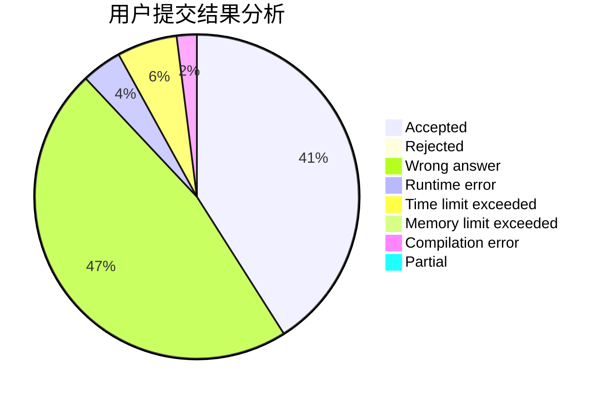
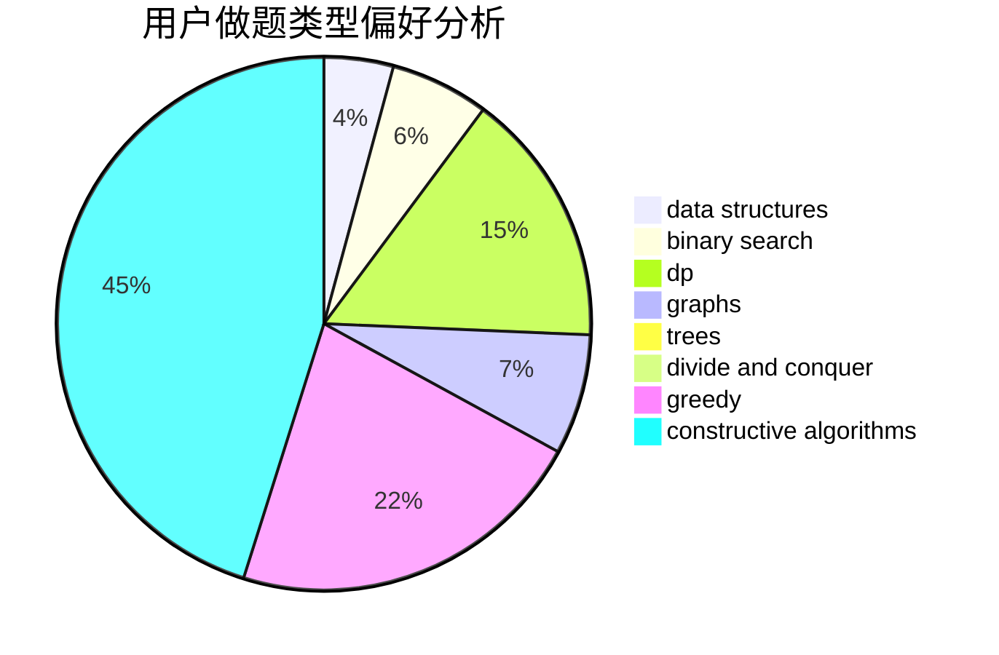
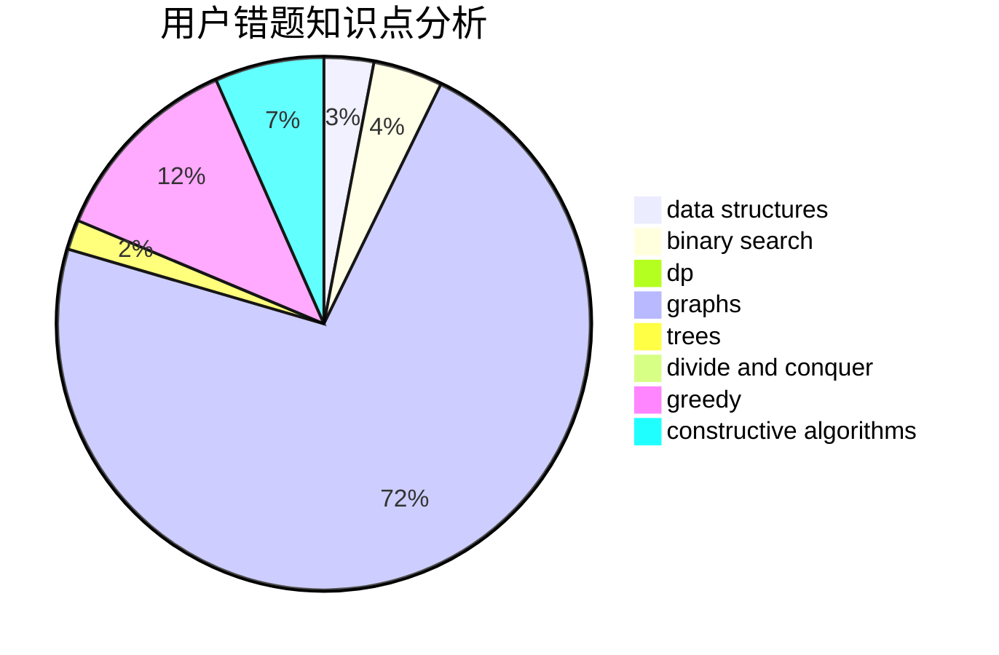

# Jetiaime

<!-- tabs:start -->

#### **用户提交结果分析**

#### **用户做题类型偏好分析**

#### **用户错题知识点分析**

<!-- tabs:end -->
# 推荐题目
[1370C](https://codeforces.com/contest/1370/problem/C)		games,
                        math,
                        number theory		  
[1510A](https://codeforces.com/contest/1510/problem/A)		nan		  
[912E](https://codeforces.com/contest/912/problem/E)		binary search,
                        dfs and similar,
                        math,
                        meet-in-the-middle,
                        number theory,
                        two pointers		  
[20A](https://codeforces.com/contest/20/problem/A)		implementation		  
[1037C](https://codeforces.com/contest/1037/problem/C)		dp,
                        greedy,
                        strings		  
[607E](https://codeforces.com/contest/607/problem/E)		binary search,
                        geometry		  
[1482H](https://codeforces.com/contest/1482/problem/H)		data structures,
                        string suffix structures,
                        trees		  
[545B](https://codeforces.com/contest/545/problem/B)		greedy		  
[907B](https://codeforces.com/contest/907/problem/B)		implementation		  
[392A](https://codeforces.com/contest/392/problem/A)		math		  
