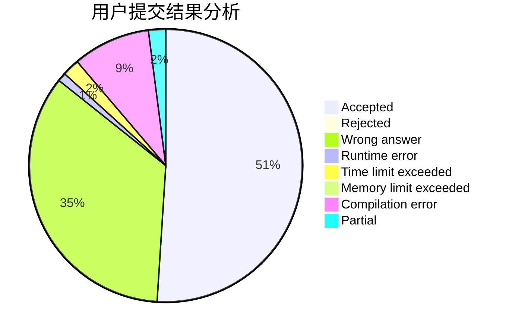
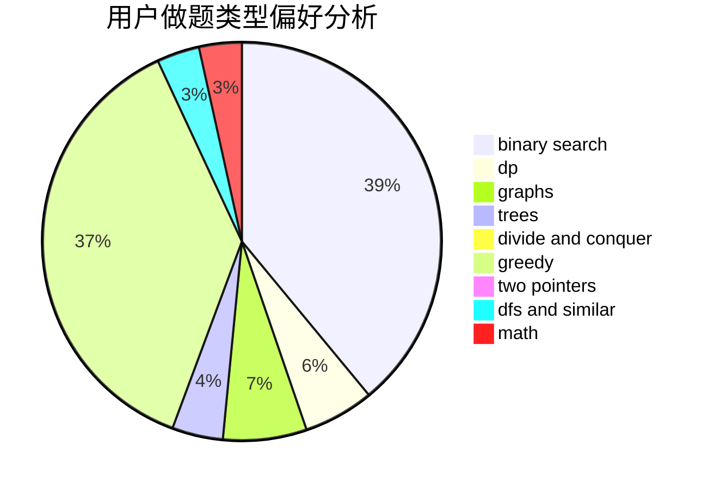

# Jetman

<!-- tabs:start -->

#### **用户提交结果分析**

#### **用户做题类型偏好分析**

<!-- tabs:end -->
# 推荐题目
[1278D](https://codeforces.com/contest/1278/problem/D)
[949E](https://codeforces.com/contest/949/problem/E)
[1020A](https://codeforces.com/contest/1020/problem/A)
[236D](https://codeforces.com/contest/236/problem/D)
[938A](https://codeforces.com/contest/938/problem/A)
[291E](https://codeforces.com/contest/291/problem/E)
[675D](https://codeforces.com/contest/675/problem/D)
[820D](https://codeforces.com/contest/820/problem/D)
[585D](https://codeforces.com/contest/585/problem/D)
[78C](https://codeforces.com/contest/78/problem/C)
