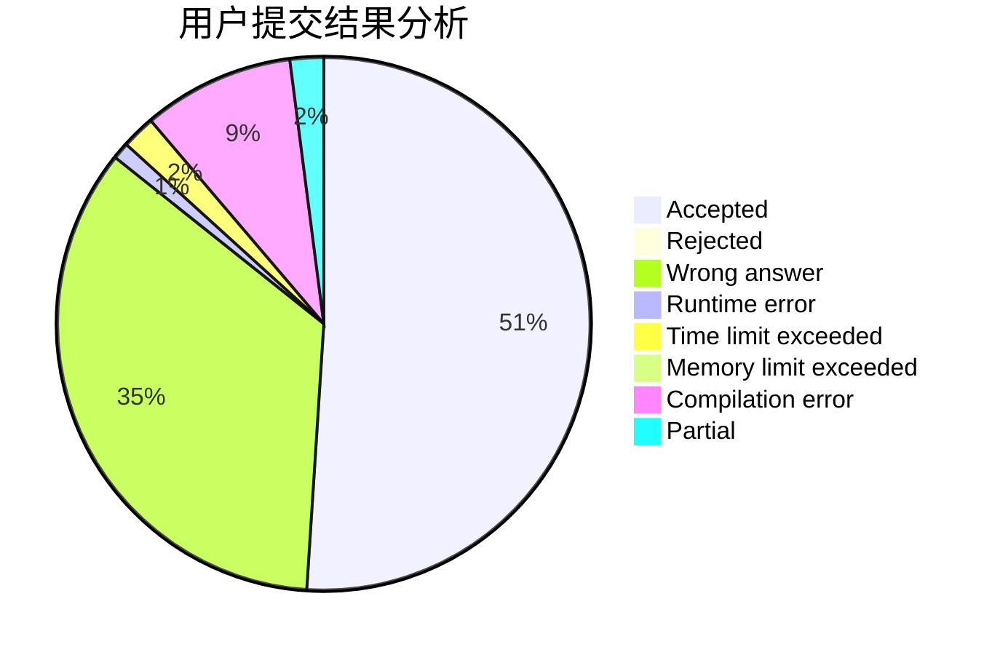
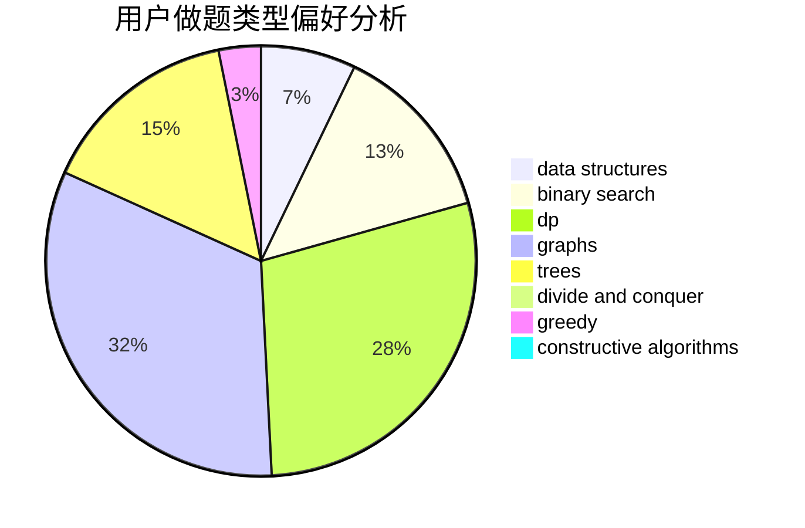

# Jetman

<!-- tabs:start -->

#### **用户提交结果分析**

#### **用户做题类型偏好分析**

#### **用户错题知识点分析**

<!-- tabs:end -->
# 推荐题目
[1278D](https://codeforces.com/contest/1278/problem/D)		data structures,
                        dsu,
                        graphs,
                        trees		  
[949E](https://codeforces.com/contest/949/problem/E)		brute force		  
[1020A](https://codeforces.com/contest/1020/problem/A)		math		  
[236D](https://codeforces.com/contest/236/problem/D)		dsu,graphs,sortings,trees		  
[938A](https://codeforces.com/contest/938/problem/A)		implementation		  
[291E](https://codeforces.com/contest/291/problem/E)		*special problem,
                        dfs and similar,
                        hashing,
                        strings		  
[675D](https://codeforces.com/contest/675/problem/D)		data structures,
                        trees		  
[820D](https://codeforces.com/contest/820/problem/D)		dsu,graphs,sortings,trees		  
[585D](https://codeforces.com/contest/585/problem/D)		meet-in-the-middle		  
[78C](https://codeforces.com/contest/78/problem/C)		dp,
                        games,
                        number theory		  
