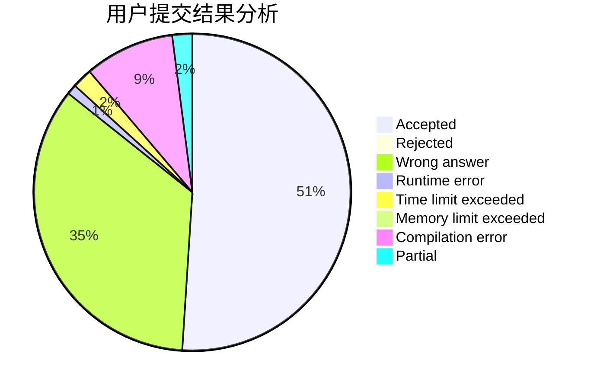
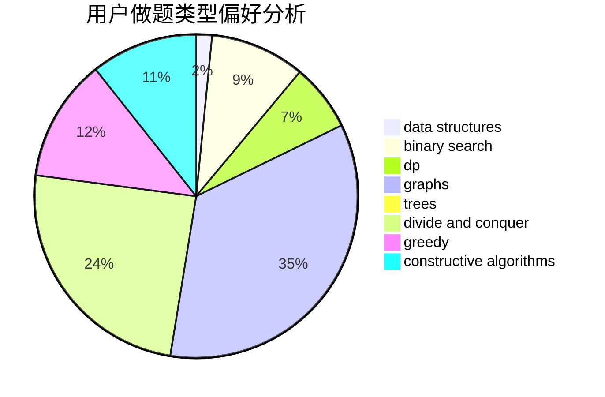

# Jetman

<!-- tabs:start -->

#### **用户提交结果分析**

#### **用户做题类型偏好分析**

#### **用户错题知识点分析**

<!-- tabs:end -->
# 推荐题目
[1269D](https://codeforces.com/contest/1269/problem/D)		dsu,graphs,sortings,trees		  
[928B](https://codeforces.com/contest/928/problem/B)		*special problem,
                        dp		  
[1019E](https://codeforces.com/contest/1019/problem/E)		data structures,
                        divide and conquer,
                        trees		  
[218A](https://codeforces.com/contest/218/problem/A)		brute force,
                        constructive algorithms,
                        implementation		  
[917C](https://codeforces.com/contest/917/problem/C)		combinatorics,
                        dp,
                        matrices		  
[277A](https://codeforces.com/contest/277/problem/A)		dfs and similar,
                        dsu		  
[651D](https://codeforces.com/contest/651/problem/D)		dsu,graphs,sortings,trees		  
[804E](https://codeforces.com/contest/804/problem/E)		constructive algorithms		  
[566E](https://codeforces.com/contest/566/problem/E)		bitmasks,
                        constructive algorithms,
                        trees		  
[76D](https://codeforces.com/contest/76/problem/D)		dp,
                        greedy,
                        math		  
