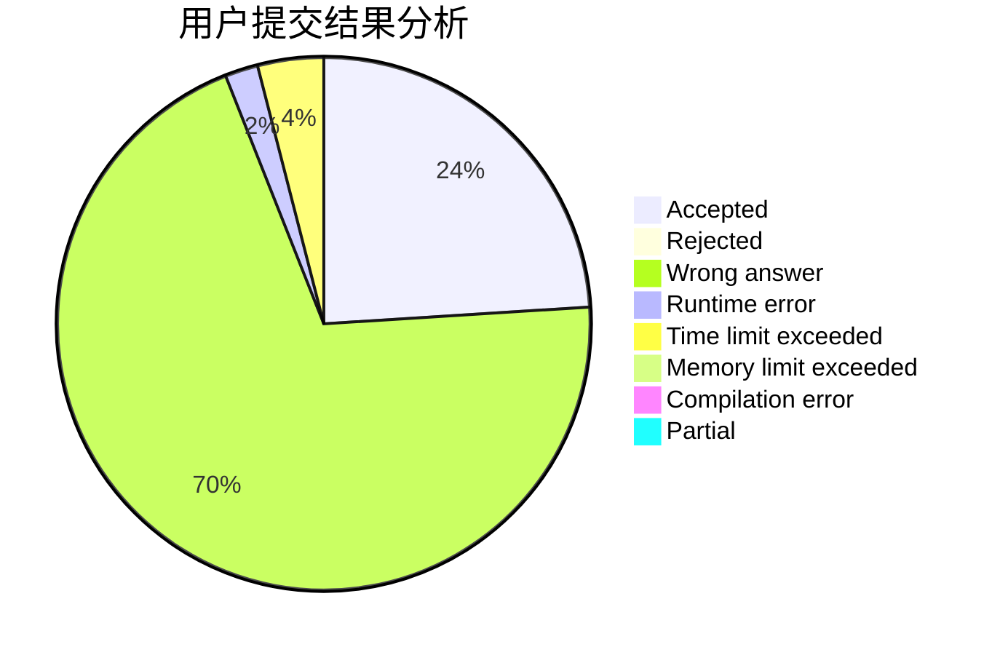
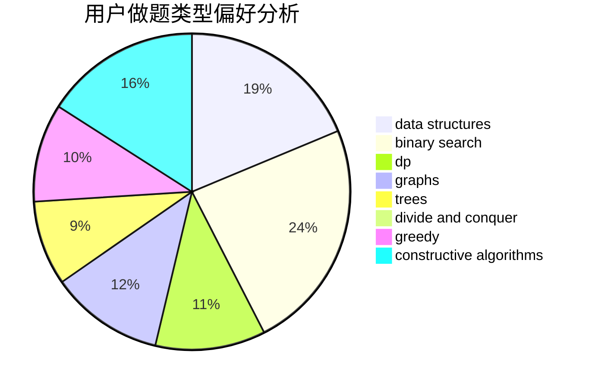
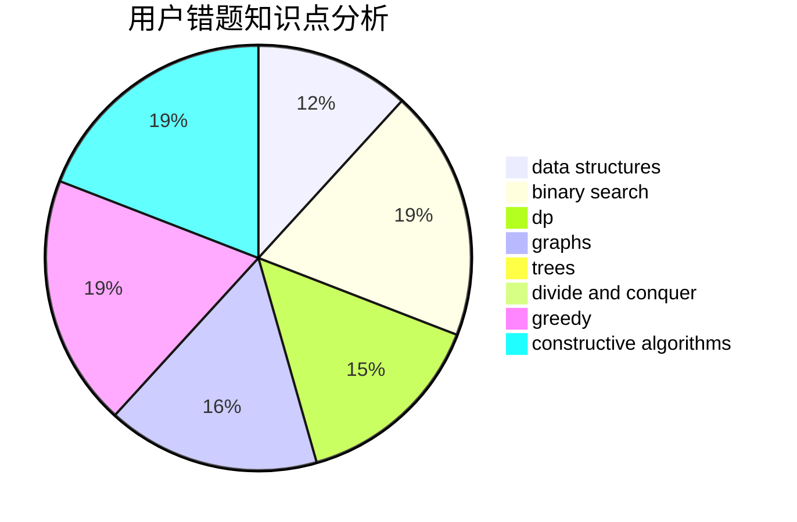

# JiRan
<!-- tabs:start -->
#### **用户提交结果分析**

#### **用户做题类型偏好分析**

#### **用户错题知识点分析**

<!-- tabs:end -->
# 推荐题目
[Cthulhu](http://codeforces.com/problemset/problem/103/B)		dfs and similar,
                        dsu,
                        graphs		  
[Did you mean...](https://codeforces.com/contest/860/problem/A)		dp,
                        greedy,
                        implementation		  
[Compote](http://codeforces.com/problemset/problem/746/A)		implementation,
                        math		  
[My pretty girl Noora](http://codeforces.com/problemset/problem/822/D)		brute force,
                        dp,
                        greedy,
                        math,
                        number theory		  
[Eleventh Birthday](http://codeforces.com/problemset/problem/856/C)		combinatorics,
                        dp,
                        math		  
[Flipping Game](http://codeforces.com/problemset/problem/327/A)		brute force,
                        dp,
                        implementation		  
[Lever](http://codeforces.com/problemset/problem/376/A)		implementation,
                        math		  
[Functions On The Segments](http://codeforces.com/problemset/problem/837/G)		data structures		  
[Game](http://codeforces.com/problemset/problem/630/R)		games,
                        math		  
[Cheaterius's Problem](http://codeforces.com/problemset/problem/51/A)		implementation		  
<!-- tabs:start -->
#### **data structures**
[Cthulhu](http://codeforces.com/problemset/problem/837/G)		data structures		  
[Did you mean...](http://codeforces.com/problemset/problem/1167/E)		binary search,
                        combinatorics,
                        data structures,
                        two pointers		  
[Compote](https://codeforces.com/contest/686/problem/D)		data structures,
                        dfs and similar,
                        dp,
                        trees		  
[My pretty girl Noora](http://codeforces.com/problemset/problem/877/D)		data structures,
                        dfs and similar,
                        graphs,
                        shortest paths		  
[Eleventh Birthday](http://codeforces.com/problemset/problem/566/D)		data structures,
                        dsu		  
[Flipping Game](http://codeforces.com/problemset/problem/1455/G)		data structures,
                        dp		  
[Lever](http://codeforces.com/problemset/problem/1492/C)		binary search,
                        data structures,
                        dp,
                        greedy,
                        two pointers		  
[Functions On The Segments](http://codeforces.com/problemset/problem/1490/G)		binary search,
                        data structures,
                        math		  
[Game](http://codeforces.com/problemset/problem/1479/D)		binary search,
                        bitmasks,
                        brute force,
                        data structures,
                        probabilities,
                        trees		  
[Cheaterius's Problem](http://codeforces.com/problemset/problem/1497/A)		brute force,
                        data structures,
                        greedy,
                        sortings		  
#### **binary search**
[Cthulhu](http://codeforces.com/problemset/problem/1167/E)		binary search,
                        combinatorics,
                        data structures,
                        two pointers		  
[Did you mean...](http://codeforces.com/problemset/problem/732/D)		binary search,
                        greedy,
                        sortings		  
[Compote](http://codeforces.com/problemset/problem/809/B)		binary search,
                        interactive		  
[My pretty girl Noora](http://codeforces.com/problemset/problem/1288/A)		binary search,
                        brute force,
                        math,
                        ternary search		  
[Eleventh Birthday](http://codeforces.com/problemset/problem/1487/D)		binary search,
                        brute force,
                        math,
                        number theory		  
[Flipping Game](http://codeforces.com/problemset/problem/1492/C)		binary search,
                        data structures,
                        dp,
                        greedy,
                        two pointers		  
[Lever](http://codeforces.com/problemset/problem/1463/D)		binary search,
                        constructive algorithms,
                        greedy,
                        two pointers		  
[Functions On The Segments](http://codeforces.com/problemset/problem/1490/G)		binary search,
                        data structures,
                        math		  
[Game](http://codeforces.com/problemset/problem/1479/D)		binary search,
                        bitmasks,
                        brute force,
                        data structures,
                        probabilities,
                        trees		  
[Cheaterius's Problem](http://codeforces.com/problemset/problem/1436/E)		binary search,
                        data structures,
                        two pointers		  
#### **dp**
[Cthulhu](https://codeforces.com/contest/860/problem/A)		dp,
                        greedy,
                        implementation		  
[Did you mean...](http://codeforces.com/problemset/problem/822/D)		brute force,
                        dp,
                        greedy,
                        math,
                        number theory		  
[Compote](http://codeforces.com/problemset/problem/856/C)		combinatorics,
                        dp,
                        math		  
[My pretty girl Noora](http://codeforces.com/problemset/problem/327/A)		brute force,
                        dp,
                        implementation		  
[Eleventh Birthday](http://codeforces.com/problemset/problem/729/B)		dp,
                        implementation		  
[Flipping Game](http://codeforces.com/problemset/problem/358/D)		dp,
                        greedy		  
[Lever](https://codeforces.com/contest/686/problem/D)		data structures,
                        dfs and similar,
                        dp,
                        trees		  
[Functions On The Segments](http://codeforces.com/problemset/problem/1006/F)		bitmasks,
                        brute force,
                        dp,
                        meet-in-the-middle		  
[Game](http://codeforces.com/problemset/problem/258/B)		brute force,
                        combinatorics,
                        dp		  
[Cheaterius's Problem](http://codeforces.com/problemset/problem/1479/E)		dp,
                        fft,
                        math,
                        number theory,
                        probabilities		  
#### **graph**
[Cthulhu](http://codeforces.com/problemset/problem/103/B)		dfs and similar,
                        dsu,
                        graphs		  
[Did you mean...](http://codeforces.com/problemset/problem/25/C)		graphs,
                        shortest paths		  
[Compote](http://codeforces.com/problemset/problem/1217/D)		constructive algorithms,
                        dfs and similar,
                        graphs		  
[My pretty girl Noora](http://codeforces.com/problemset/problem/877/D)		data structures,
                        dfs and similar,
                        graphs,
                        shortest paths		  
[Eleventh Birthday](http://codeforces.com/problemset/problem/1156/G)		graphs,
                        greedy,
                        hashing,
                        implementation		  
[Flipping Game](http://codeforces.com/problemset/problem/1169/B)		graphs,
                        implementation		  
[Lever](http://codeforces.com/problemset/problem/1485/D)		constructive algorithms,
                        graphs,
                        math,
                        number theory		  
[Functions On The Segments](http://codeforces.com/problemset/problem/1487/C)		brute force,
                        constructive algorithms,
                        dfs and similar,
                        graphs,
                        greedy,
                        implementation,
                        math		  
[Game](http://codeforces.com/problemset/problem/1437/C)		dp,
                        flows,
                        graph matchings,
                        greedy,
                        math,
                        sortings		  
[Cheaterius's Problem](http://codeforces.com/problemset/problem/1470/D)		constructive algorithms,
                        dfs and similar,
                        graph matchings,
                        graphs,
                        greedy		  
#### **trees**
[Cthulhu](https://codeforces.com/contest/686/problem/D)		data structures,
                        dfs and similar,
                        dp,
                        trees		  
[Did you mean...](http://codeforces.com/problemset/problem/1479/D)		binary search,
                        bitmasks,
                        brute force,
                        data structures,
                        probabilities,
                        trees		  
[Compote](http://codeforces.com/problemset/problem/1511/C)		brute force,
                        data structures,
                        implementation,
                        trees		  
[My pretty girl Noora](http://codeforces.com/problemset/problem/1499/F)		combinatorics,
                        dfs and similar,
                        dp,
                        trees		  
[Eleventh Birthday](http://codeforces.com/problemset/problem/1491/E)		brute force,
                        dfs and similar,
                        divide and conquer,
                        number theory,
                        trees		  
[Flipping Game](http://codeforces.com/problemset/problem/1466/D)		data structures,
                        greedy,
                        sortings,
                        trees		  
[Lever](http://codeforces.com/problemset/problem/1495/D)		combinatorics,
                        dfs and similar,
                        graphs,
                        math,
                        shortest paths,
                        trees		  
[Functions On The Segments](http://codeforces.com/problemset/problem/1303/G)		data structures,
                        divide and conquer,
                        geometry,
                        trees		  
[Game](http://codeforces.com/problemset/problem/1454/E)		combinatorics,
                        dfs and similar,
                        graphs,
                        trees		  
[Cheaterius's Problem](http://codeforces.com/problemset/problem/1494/D)		constructive algorithms,
                        data structures,
                        dfs and similar,
                        divide and conquer,
                        dsu,
                        greedy,
                        sortings,
                        trees		  
#### **divide and conquer**
[Cthulhu](http://codeforces.com/problemset/problem/1461/D)		binary search,
                        brute force,
                        data structures,
                        divide and conquer,
                        implementation,
                        sortings		  
[Did you mean...](http://codeforces.com/problemset/problem/1466/G)		combinatorics,
                        divide and conquer,
                        hashing,
                        math,
                        string suffix structures,
                        strings		  
[Compote](http://codeforces.com/problemset/problem/1490/D)		dfs and similar,
                        divide and conquer,
                        implementation		  
[My pretty girl Noora](https://codeforces.com/contest/1483/problem/C)		data structures,
                        divide and conquer,
                        dp		  
[Eleventh Birthday](http://codeforces.com/problemset/problem/1491/E)		brute force,
                        dfs and similar,
                        divide and conquer,
                        number theory,
                        trees		  
[Flipping Game](http://codeforces.com/problemset/problem/1303/G)		data structures,
                        divide and conquer,
                        geometry,
                        trees		  
[Lever](http://codeforces.com/problemset/problem/1494/D)		constructive algorithms,
                        data structures,
                        dfs and similar,
                        divide and conquer,
                        dsu,
                        greedy,
                        sortings,
                        trees		  
[Functions On The Segments](http://codeforces.com/problemset/problem/1482/E)		data structures,
                        divide and conquer,
                        dp		  
[Game](http://codeforces.com/problemset/problem/566/C)		dfs and similar,
                        divide and conquer,
                        trees		  
[Cheaterius's Problem](http://codeforces.com/problemset/problem/1428/F)		binary search,
                        data structures,
                        divide and conquer,
                        dp,
                        two pointers		  
#### **greedy**
[Cthulhu](https://codeforces.com/contest/860/problem/A)		dp,
                        greedy,
                        implementation		  
[Did you mean...](http://codeforces.com/problemset/problem/822/D)		brute force,
                        dp,
                        greedy,
                        math,
                        number theory		  
[Compote](http://codeforces.com/problemset/problem/62/A)		greedy,
                        math		  
[My pretty girl Noora](http://codeforces.com/problemset/problem/358/D)		dp,
                        greedy		  
[Eleventh Birthday](http://codeforces.com/problemset/problem/1365/A)		games,
                        greedy,
                        implementation		  
[Flipping Game](http://codeforces.com/problemset/problem/732/D)		binary search,
                        greedy,
                        sortings		  
[Lever](http://codeforces.com/problemset/problem/1370/A)		greedy,
                        implementation,
                        math,
                        number theory		  
[Functions On The Segments](http://codeforces.com/problemset/problem/535/D)		greedy,
                        hashing,
                        string suffix structures,
                        strings		  
[Game](https://codeforces.com/contest/1456/problem/C)		constructive algorithms,
                        greedy,
                        math		  
[Cheaterius's Problem](http://codeforces.com/problemset/problem/1156/G)		graphs,
                        greedy,
                        hashing,
                        implementation		  
#### **constructive algorithms**
[Cthulhu](http://codeforces.com/problemset/problem/1217/D)		constructive algorithms,
                        dfs and similar,
                        graphs		  
[Did you mean...](https://codeforces.com/contest/1456/problem/C)		constructive algorithms,
                        greedy,
                        math		  
[Compote](http://codeforces.com/problemset/problem/460/D)		brute force,
                        constructive algorithms,
                        math		  
[My pretty girl Noora](http://codeforces.com/problemset/problem/763/B)		constructive algorithms,
                        geometry		  
[Eleventh Birthday](http://codeforces.com/problemset/problem/1401/A)		constructive algorithms,
                        math		  
[Flipping Game](http://codeforces.com/problemset/problem/1305/B)		constructive algorithms,
                        greedy,
                        strings,
                        two pointers		  
[Lever](http://codeforces.com/problemset/problem/1485/D)		constructive algorithms,
                        graphs,
                        math,
                        number theory		  
[Functions On The Segments](http://codeforces.com/problemset/problem/1493/A)		constructive algorithms,
                        greedy		  
[Game](http://codeforces.com/problemset/problem/1463/D)		binary search,
                        constructive algorithms,
                        greedy,
                        two pointers		  
[Cheaterius's Problem](https://codeforces.com/contest/1456/problem/B)		bitmasks,
                        brute force,
                        constructive algorithms		  
#### **sortings**
[Cthulhu](http://codeforces.com/problemset/problem/732/D)		binary search,
                        greedy,
                        sortings		  
[Did you mean...](https://codeforces.com/contest/1496/problem/C)		geometry,
                        greedy,
                        math,
                        sortings		  
[Compote](http://codeforces.com/problemset/problem/1501/B)		dp,
                        implementation,
                        sortings		  
[My pretty girl Noora](https://codeforces.com/contest/1496/problem/C)		geometry,
                        greedy,
                        math,
                        sortings		  
[Eleventh Birthday](http://codeforces.com/problemset/problem/1495/A)		geometry,
                        greedy,
                        math,
                        sortings		  
[Flipping Game](http://codeforces.com/problemset/problem/1497/A)		brute force,
                        data structures,
                        greedy,
                        sortings		  
[Lever](http://codeforces.com/problemset/problem/1427/A)		math,
                        sortings		  
[Functions On The Segments](http://codeforces.com/problemset/problem/1461/D)		binary search,
                        brute force,
                        data structures,
                        divide and conquer,
                        implementation,
                        sortings		  
[Game](http://codeforces.com/problemset/problem/1437/C)		dp,
                        flows,
                        graph matchings,
                        greedy,
                        math,
                        sortings		  
[Cheaterius's Problem](http://codeforces.com/problemset/problem/1473/A)		greedy,
                        implementation,
                        math,
                        sortings		  
<!-- tabs:end -->
