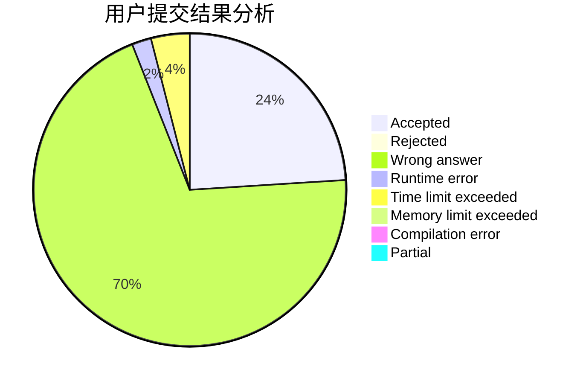
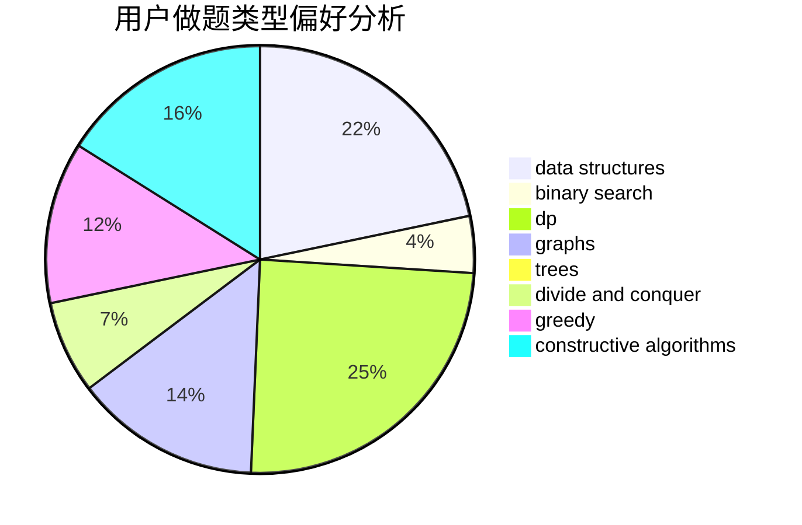
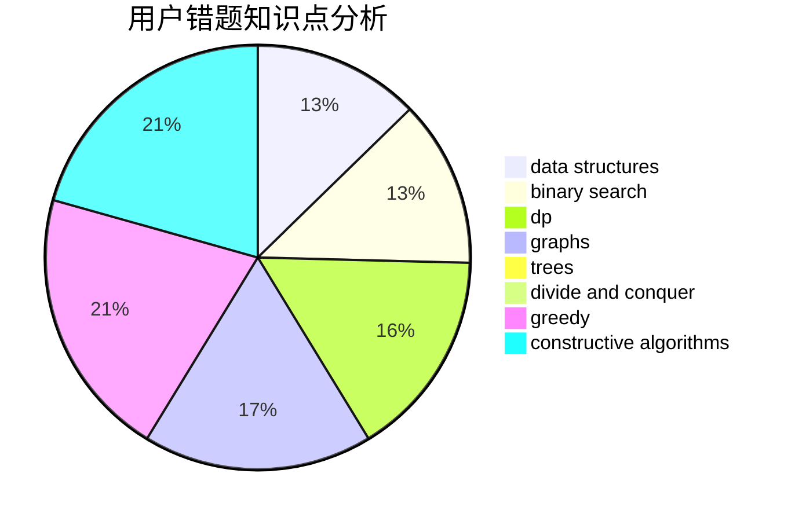

# JiRan

<!-- tabs:start -->

#### **用户提交结果分析**

#### **用户做题类型偏好分析**

#### **用户错题知识点分析**

<!-- tabs:end -->
# 推荐题目
[103E](https://codeforces.com/contest/103/problem/E)		flows,
                        graph matchings		  
[1314A](https://codeforces.com/contest/1314/problem/A)		dsu,graphs,sortings,trees		  
[383E](https://codeforces.com/contest/383/problem/E)		combinatorics,
                        divide and conquer,
                        dp		  
[875C](https://codeforces.com/contest/875/problem/C)		2-sat,
                        dfs and similar,
                        graphs,
                        implementation		  
[746B](https://codeforces.com/contest/746/problem/B)		implementation,
                        strings		  
[545B](https://codeforces.com/contest/545/problem/B)		greedy		  
[1225A](https://codeforces.com/contest/1225/problem/A)		math		  
[781F](https://codeforces.com/contest/781/problem/F)		dsu,graphs,sortings,trees		  
[765C](https://codeforces.com/contest/765/problem/C)		math		  
[842C](https://codeforces.com/contest/842/problem/C)		dfs and similar,
                        graphs,
                        math,
                        number theory,
                        trees		  
