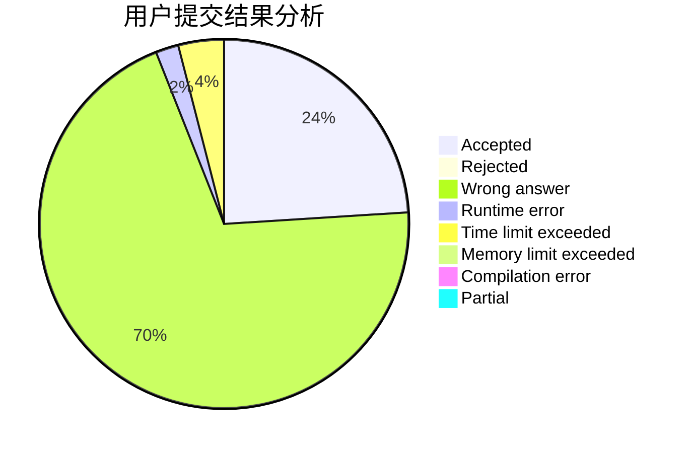
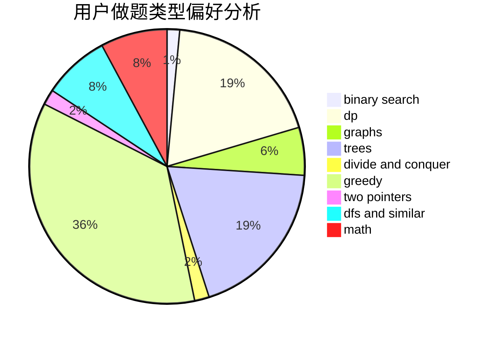

# JiRan

<!-- tabs:start -->

#### **用户提交结果分析**

#### **用户做题类型偏好分析**

<!-- tabs:end -->
# 推荐题目
[103E](https://codeforces.com/contest/103/problem/E)
[1314A](https://codeforces.com/contest/1314/problem/A)
[383E](https://codeforces.com/contest/383/problem/E)
[875C](https://codeforces.com/contest/875/problem/C)
[746B](https://codeforces.com/contest/746/problem/B)
[545B](https://codeforces.com/contest/545/problem/B)
[1225A](https://codeforces.com/contest/1225/problem/A)
[781F](https://codeforces.com/contest/781/problem/F)
[765C](https://codeforces.com/contest/765/problem/C)
[842C](https://codeforces.com/contest/842/problem/C)
