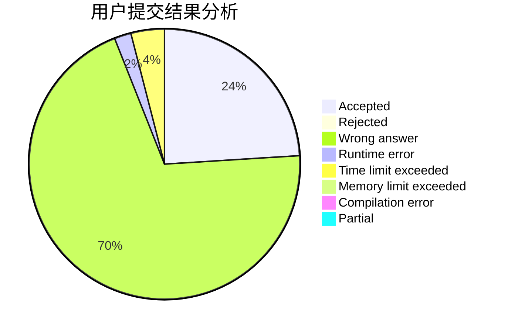
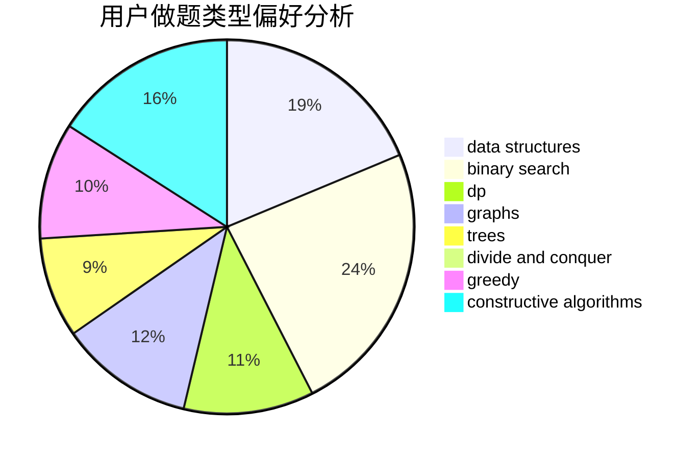
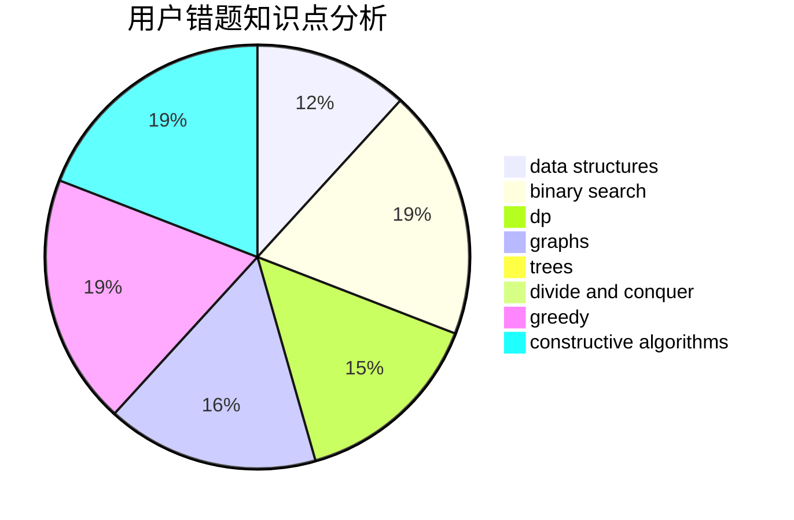

# JiRan

<!-- tabs:start -->

#### **用户提交结果分析**

#### **用户做题类型偏好分析**

#### **用户错题知识点分析**

<!-- tabs:end -->
# 推荐题目
[103B](https://codeforces.com/contest/103/problem/B)		dfs and similar,
                        dsu,
                        graphs		  
[1305B](https://codeforces.com/contest/1305/problem/B)		constructive algorithms,
                        greedy,
                        strings,
                        two pointers		  
[358D](https://codeforces.com/contest/358/problem/D)		dp,
                        greedy		  
[856C](https://codeforces.com/contest/856/problem/C)		combinatorics,
                        dp,
                        math		  
[729B](https://codeforces.com/contest/729/problem/B)		dp,
                        implementation		  
[51A](https://codeforces.com/contest/51/problem/A)		implementation		  
[1217D](https://codeforces.com/contest/1217/problem/D)		constructive algorithms,
                        dfs and similar,
                        graphs		  
[763B](https://codeforces.com/contest/763/problem/B)		constructive algorithms,
                        geometry		  
[746A](https://codeforces.com/contest/746/problem/A)		implementation,
                        math		  
[822D](https://codeforces.com/contest/822/problem/D)		brute force,
                        dp,
                        greedy,
                        math,
                        number theory		  
