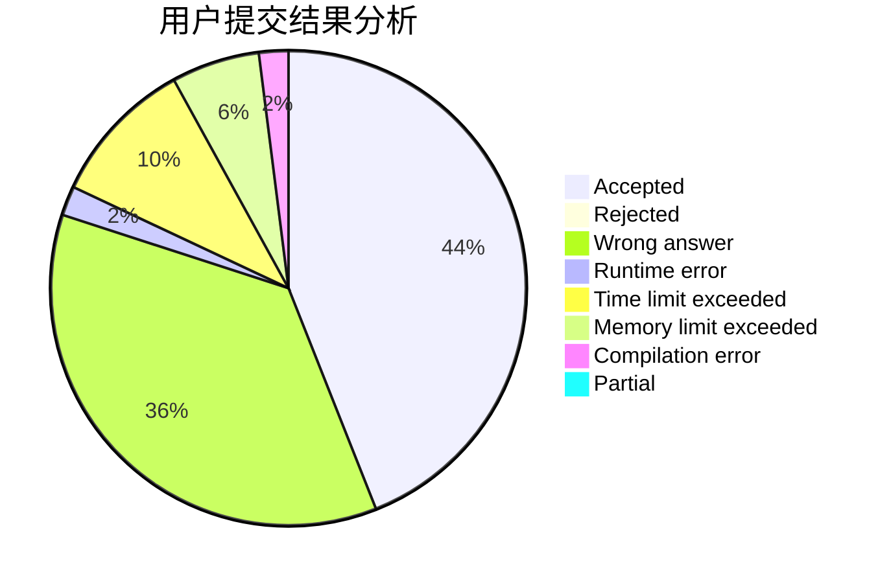
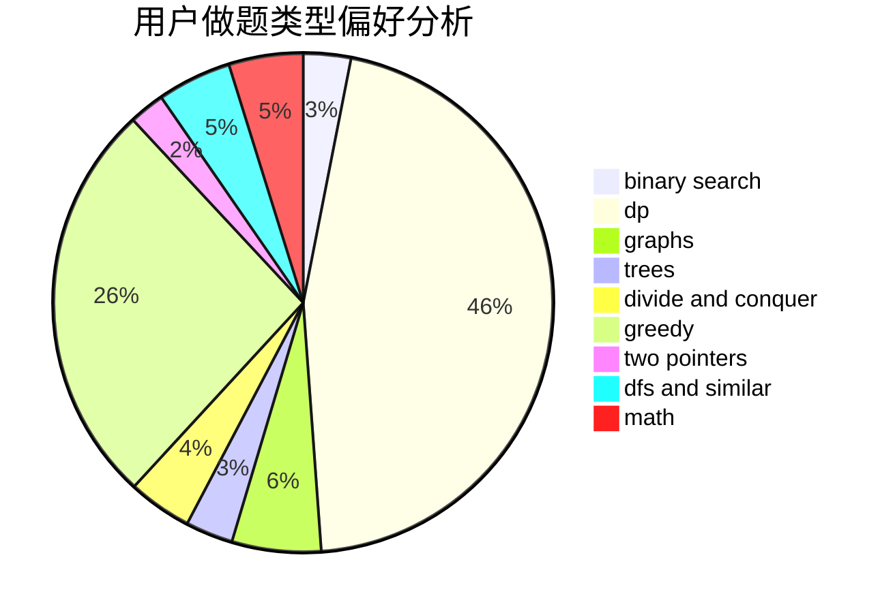

# JiaFeiMiao

<!-- tabs:start -->

#### **用户提交结果分析**

#### **用户做题类型偏好分析**

<!-- tabs:end -->
# 推荐题目
[592C](https://codeforces.com/contest/592/problem/C)
[1267I](https://codeforces.com/contest/1267/problem/I)
[870C](https://codeforces.com/contest/870/problem/C)
[94C](https://codeforces.com/contest/94/problem/C)
[746B](https://codeforces.com/contest/746/problem/B)
[12871](https://codeforces.com/contest/1287/problem/1)
[1225A](https://codeforces.com/contest/1225/problem/A)
[584C](https://codeforces.com/contest/584/problem/C)
[118D](https://codeforces.com/contest/118/problem/D)
[772A](https://codeforces.com/contest/772/problem/A)
