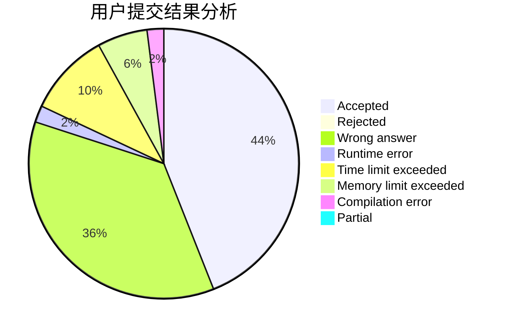
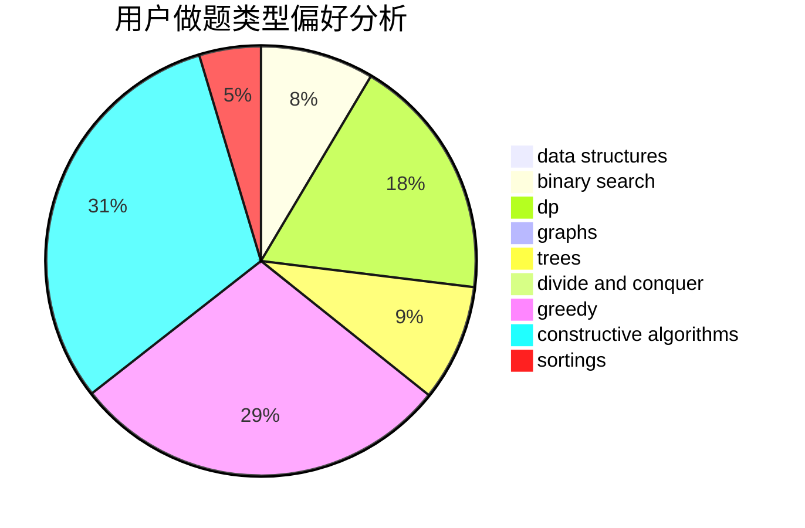

# JiaFeiMiao
<!-- tabs:start -->
#### **用户提交结果分析**

#### **用户做题类型偏好分析**

#### **用户错题知识点分析**

<!-- tabs:end -->
# 推荐题目
[1063B](http://codeforces.com/problemset/problem/1063/B)		graphs,
                        shortest paths		  
[572A](http://codeforces.com/problemset/problem/572/A)		sortings		  
[1262A](https://codeforces.com/contest/1262/problem/A)		math		  
[930A](http://codeforces.com/problemset/problem/930/A)		dfs and similar,
                        graphs,
                        trees		  
[527C](http://codeforces.com/problemset/problem/527/C)		binary search,
                        data structures,
                        implementation		  
[1164N](https://codeforces.com/contest/1164/problem/N)		nan		  
[754D](http://codeforces.com/problemset/problem/754/D)		binary search,
                        data structures,
                        greedy,
                        sortings		  
[1280F](http://codeforces.com/problemset/problem/1280/F)		combinatorics,
                        constructive algorithms,
                        math		  
[729B](http://codeforces.com/problemset/problem/729/B)		dp,
                        implementation		  
[1078A](https://codeforces.com/contest/1078/problem/A)		geometry,
                        implementation		  
<!-- tabs:start -->
#### **data structures**
[527C](http://codeforces.com/problemset/problem/527/C)		binary search,
                        data structures,
                        implementation		  
[754D](http://codeforces.com/problemset/problem/754/D)		binary search,
                        data structures,
                        greedy,
                        sortings		  
[295A](http://codeforces.com/problemset/problem/295/A)		data structures,
                        implementation		  
[282E](http://codeforces.com/problemset/problem/282/E)		bitmasks,
                        data structures,
                        trees		  
[212D](http://codeforces.com/problemset/problem/212/D)		binary search,
                        data structures,
                        dsu		  
[896C](http://codeforces.com/problemset/problem/896/C)		data structures,
                        probabilities		  
[1492C](http://codeforces.com/problemset/problem/1492/C)		binary search,
                        data structures,
                        dp,
                        greedy,
                        two pointers		  
[1490G](http://codeforces.com/problemset/problem/1490/G)		binary search,
                        data structures,
                        math		  
[1479D](http://codeforces.com/problemset/problem/1479/D)		binary search,
                        bitmasks,
                        brute force,
                        data structures,
                        probabilities,
                        trees		  
[1497A](http://codeforces.com/problemset/problem/1497/A)		brute force,
                        data structures,
                        greedy,
                        sortings		  
#### **binary search**
[527C](http://codeforces.com/problemset/problem/527/C)		binary search,
                        data structures,
                        implementation		  
[754D](http://codeforces.com/problemset/problem/754/D)		binary search,
                        data structures,
                        greedy,
                        sortings		  
[780B](http://codeforces.com/problemset/problem/780/B)		binary search		  
[212D](http://codeforces.com/problemset/problem/212/D)		binary search,
                        data structures,
                        dsu		  
[852D](http://codeforces.com/problemset/problem/852/D)		binary search,
                        flows,
                        graph matchings,
                        shortest paths		  
[1492C](http://codeforces.com/problemset/problem/1492/C)		binary search,
                        data structures,
                        dp,
                        greedy,
                        two pointers		  
[1463D](http://codeforces.com/problemset/problem/1463/D)		binary search,
                        constructive algorithms,
                        greedy,
                        two pointers		  
[1490G](http://codeforces.com/problemset/problem/1490/G)		binary search,
                        data structures,
                        math		  
[1479D](http://codeforces.com/problemset/problem/1479/D)		binary search,
                        bitmasks,
                        brute force,
                        data structures,
                        probabilities,
                        trees		  
[1436E](http://codeforces.com/problemset/problem/1436/E)		binary search,
                        data structures,
                        two pointers		  
#### **dp**
[729B](http://codeforces.com/problemset/problem/729/B)		dp,
                        implementation		  
[379D](http://codeforces.com/problemset/problem/379/D)		bitmasks,
                        brute force,
                        dp		  
[1314D](https://codeforces.com/contest/1314/problem/D)		dp,
                        graphs,
                        probabilities		  
[593E](http://codeforces.com/problemset/problem/593/E)		dp,
                        matrices		  
[1076F](http://codeforces.com/problemset/problem/1076/F)		dp,
                        greedy		  
[180C](http://codeforces.com/problemset/problem/180/C)		dp		  
[1225G](http://codeforces.com/problemset/problem/1225/G)		bitmasks,
                        constructive algorithms,
                        dp,
                        greedy,
                        number theory		  
[544E](https://codeforces.com/contest/544/problem/E)		bitmasks,
                        dp		  
[1278F](http://codeforces.com/problemset/problem/1278/F)		combinatorics,
                        dp,
                        math,
                        number theory,
                        probabilities		  
[1053B](https://codeforces.com/contest/1053/problem/B)		bitmasks,
                        dp		  
#### **graph**
[1063B](http://codeforces.com/problemset/problem/1063/B)		graphs,
                        shortest paths		  
[930A](http://codeforces.com/problemset/problem/930/A)		dfs and similar,
                        graphs,
                        trees		  
[1314D](https://codeforces.com/contest/1314/problem/D)		dp,
                        graphs,
                        probabilities		  
[1217D](http://codeforces.com/problemset/problem/1217/D)		constructive algorithms,
                        dfs and similar,
                        graphs		  
[1210D](http://codeforces.com/problemset/problem/1210/D)		graphs		  
[1162C](https://codeforces.com/contest/1162/problem/C)		graphs		  
[852D](http://codeforces.com/problemset/problem/852/D)		binary search,
                        flows,
                        graph matchings,
                        shortest paths		  
[1495C](http://codeforces.com/problemset/problem/1495/C)		constructive algorithms,
                        graphs		  
[1000E](http://codeforces.com/problemset/problem/1000/E)		dfs and similar,
                        graphs,
                        trees		  
[1487C](http://codeforces.com/problemset/problem/1487/C)		brute force,
                        constructive algorithms,
                        dfs and similar,
                        graphs,
                        greedy,
                        implementation,
                        math		  
#### **trees**
[930A](http://codeforces.com/problemset/problem/930/A)		dfs and similar,
                        graphs,
                        trees		  
[282E](http://codeforces.com/problemset/problem/282/E)		bitmasks,
                        data structures,
                        trees		  
[1000E](http://codeforces.com/problemset/problem/1000/E)		dfs and similar,
                        graphs,
                        trees		  
[1479D](http://codeforces.com/problemset/problem/1479/D)		binary search,
                        bitmasks,
                        brute force,
                        data structures,
                        probabilities,
                        trees		  
[1511C](http://codeforces.com/problemset/problem/1511/C)		brute force,
                        data structures,
                        implementation,
                        trees		  
[1499F](http://codeforces.com/problemset/problem/1499/F)		combinatorics,
                        dfs and similar,
                        dp,
                        trees		  
[1491E](http://codeforces.com/problemset/problem/1491/E)		brute force,
                        dfs and similar,
                        divide and conquer,
                        number theory,
                        trees		  
[1466D](http://codeforces.com/problemset/problem/1466/D)		data structures,
                        greedy,
                        sortings,
                        trees		  
[1495D](http://codeforces.com/problemset/problem/1495/D)		combinatorics,
                        dfs and similar,
                        graphs,
                        math,
                        shortest paths,
                        trees		  
[1303G](http://codeforces.com/problemset/problem/1303/G)		data structures,
                        divide and conquer,
                        geometry,
                        trees		  
#### **divide and conquer**
[1461D](http://codeforces.com/problemset/problem/1461/D)		binary search,
                        brute force,
                        data structures,
                        divide and conquer,
                        implementation,
                        sortings		  
[1466G](http://codeforces.com/problemset/problem/1466/G)		combinatorics,
                        divide and conquer,
                        hashing,
                        math,
                        string suffix structures,
                        strings		  
[1490D](http://codeforces.com/problemset/problem/1490/D)		dfs and similar,
                        divide and conquer,
                        implementation		  
[1483C](https://codeforces.com/contest/1483/problem/C)		data structures,
                        divide and conquer,
                        dp		  
[1491E](http://codeforces.com/problemset/problem/1491/E)		brute force,
                        dfs and similar,
                        divide and conquer,
                        number theory,
                        trees		  
[1303G](http://codeforces.com/problemset/problem/1303/G)		data structures,
                        divide and conquer,
                        geometry,
                        trees		  
[1494D](http://codeforces.com/problemset/problem/1494/D)		constructive algorithms,
                        data structures,
                        dfs and similar,
                        divide and conquer,
                        dsu,
                        greedy,
                        sortings,
                        trees		  
[1482E](http://codeforces.com/problemset/problem/1482/E)		data structures,
                        divide and conquer,
                        dp		  
[566C](http://codeforces.com/problemset/problem/566/C)		dfs and similar,
                        divide and conquer,
                        trees		  
[1428F](http://codeforces.com/problemset/problem/1428/F)		binary search,
                        data structures,
                        divide and conquer,
                        dp,
                        two pointers		  
#### **greedy**
[754D](http://codeforces.com/problemset/problem/754/D)		binary search,
                        data structures,
                        greedy,
                        sortings		  
[754A](http://codeforces.com/problemset/problem/754/A)		constructive algorithms,
                        greedy,
                        implementation		  
[1076F](http://codeforces.com/problemset/problem/1076/F)		dp,
                        greedy		  
[1225G](http://codeforces.com/problemset/problem/1225/G)		bitmasks,
                        constructive algorithms,
                        dp,
                        greedy,
                        number theory		  
[902B](http://codeforces.com/problemset/problem/902/B)		dfs and similar,
                        dsu,
                        greedy		  
[1492C](http://codeforces.com/problemset/problem/1492/C)		binary search,
                        data structures,
                        dp,
                        greedy,
                        two pointers		  
[1496C](https://codeforces.com/contest/1496/problem/C)		geometry,
                        greedy,
                        math,
                        sortings		  
[1493A](http://codeforces.com/problemset/problem/1493/A)		constructive algorithms,
                        greedy		  
[1463D](http://codeforces.com/problemset/problem/1463/D)		binary search,
                        constructive algorithms,
                        greedy,
                        two pointers		  
[1462C](http://codeforces.com/problemset/problem/1462/C)		brute force,
                        greedy,
                        math		  
#### **constructive algorithms**
[1280F](http://codeforces.com/problemset/problem/1280/F)		combinatorics,
                        constructive algorithms,
                        math		  
[754A](http://codeforces.com/problemset/problem/754/A)		constructive algorithms,
                        greedy,
                        implementation		  
[878A](http://codeforces.com/problemset/problem/878/A)		bitmasks,
                        constructive algorithms		  
[1217D](http://codeforces.com/problemset/problem/1217/D)		constructive algorithms,
                        dfs and similar,
                        graphs		  
[1225G](http://codeforces.com/problemset/problem/1225/G)		bitmasks,
                        constructive algorithms,
                        dp,
                        greedy,
                        number theory		  
[1495C](http://codeforces.com/problemset/problem/1495/C)		constructive algorithms,
                        graphs		  
[1365F](http://codeforces.com/problemset/problem/1365/F)		constructive algorithms,
                        implementation,
                        sortings		  
[1493A](http://codeforces.com/problemset/problem/1493/A)		constructive algorithms,
                        greedy		  
[1463D](http://codeforces.com/problemset/problem/1463/D)		binary search,
                        constructive algorithms,
                        greedy,
                        two pointers		  
[1456B](https://codeforces.com/contest/1456/problem/B)		bitmasks,
                        brute force,
                        constructive algorithms		  
#### **sortings**
[572A](http://codeforces.com/problemset/problem/572/A)		sortings		  
[754D](http://codeforces.com/problemset/problem/754/D)		binary search,
                        data structures,
                        greedy,
                        sortings		  
[560A](http://codeforces.com/problemset/problem/560/A)		implementation,
                        sortings		  
[1365F](http://codeforces.com/problemset/problem/1365/F)		constructive algorithms,
                        implementation,
                        sortings		  
[1475G](http://codeforces.com/problemset/problem/1475/G)		dp,
                        math,
                        number theory,
                        sortings		  
[1496C](https://codeforces.com/contest/1496/problem/C)		geometry,
                        greedy,
                        math,
                        sortings		  
[1495A](http://codeforces.com/problemset/problem/1495/A)		geometry,
                        greedy,
                        math,
                        sortings		  
[1497A](http://codeforces.com/problemset/problem/1497/A)		brute force,
                        data structures,
                        greedy,
                        sortings		  
[1427A](http://codeforces.com/problemset/problem/1427/A)		math,
                        sortings		  
[1461D](http://codeforces.com/problemset/problem/1461/D)		binary search,
                        brute force,
                        data structures,
                        divide and conquer,
                        implementation,
                        sortings		  
<!-- tabs:end -->
