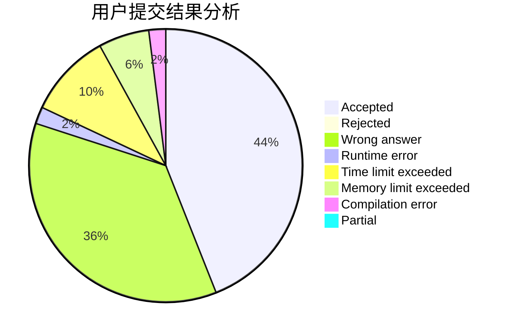
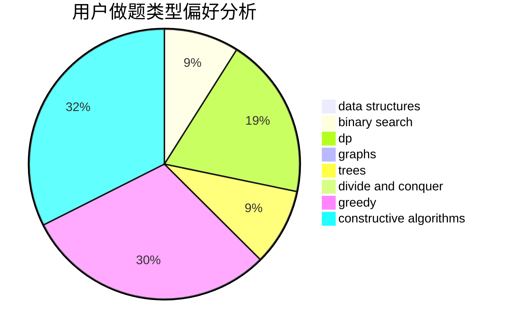

# JiaFeiMiao

<!-- tabs:start -->

#### **用户提交结果分析**

#### **用户做题类型偏好分析**

#### **用户错题知识点分析**

<!-- tabs:end -->
# 推荐题目
[572A](https://codeforces.com/contest/572/problem/A)		sortings		  
[1262A](https://codeforces.com/contest/1262/problem/A)		dsu,graphs,sortings,trees		  
[852D](https://codeforces.com/contest/852/problem/D)		binary search,
                        flows,
                        graph matchings,
                        shortest paths		  
[930A](https://codeforces.com/contest/930/problem/A)		dfs and similar,
                        graphs,
                        trees		  
[729B](https://codeforces.com/contest/729/problem/B)		dp,
                        implementation		  
[1280F](https://codeforces.com/contest/1280/problem/F)		combinatorics,
                        constructive algorithms,
                        math		  
[1217D](https://codeforces.com/contest/1217/problem/D)		constructive algorithms,
                        dfs and similar,
                        graphs		  
[560A](https://codeforces.com/contest/560/problem/A)		implementation,
                        sortings		  
[1186A](https://codeforces.com/contest/1186/problem/A)		implementation		  
[754A](https://codeforces.com/contest/754/problem/A)		constructive algorithms,
                        greedy,
                        implementation		  
