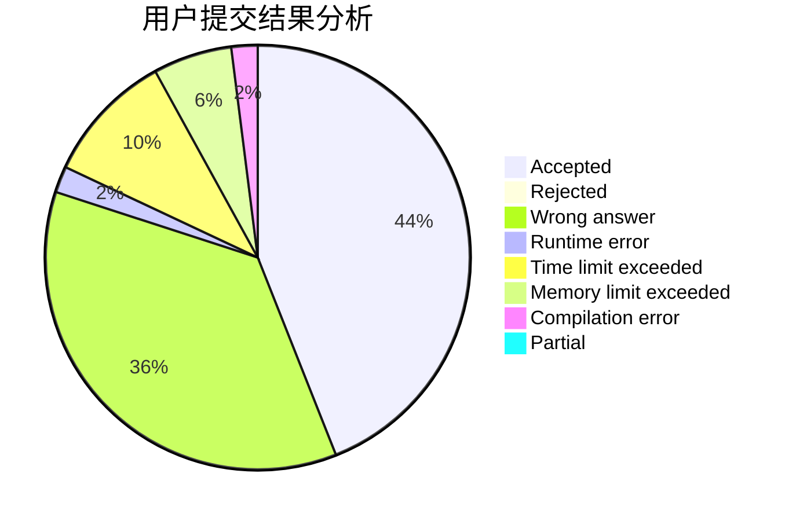
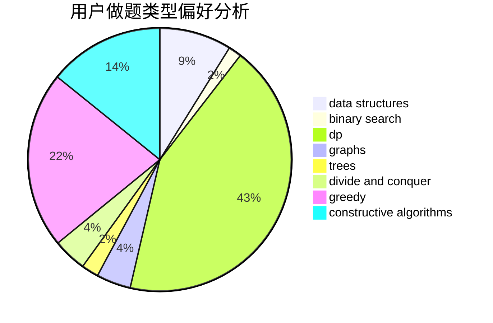

# JiaFeiMiao

<!-- tabs:start -->

#### **用户提交结果分析**

#### **用户做题类型偏好分析**

#### **用户错题知识点分析**

<!-- tabs:end -->
# 推荐题目
[592C](https://codeforces.com/contest/592/problem/C)		math		  
[1267I](https://codeforces.com/contest/1267/problem/I)		brute force,
                        constructive algorithms,
                        implementation,
                        interactive,
                        sortings		  
[870C](https://codeforces.com/contest/870/problem/C)		dp,
                        greedy,
                        math,
                        number theory		  
[94C](https://codeforces.com/contest/94/problem/C)		dsu,graphs,sortings,trees		  
[746B](https://codeforces.com/contest/746/problem/B)		implementation,
                        strings		  
[12871](https://codeforces.com/contest/1287/problem/1)		dsu,graphs,sortings,trees		  
[1225A](https://codeforces.com/contest/1225/problem/A)		math		  
[584C](https://codeforces.com/contest/584/problem/C)		constructive algorithms,
                        greedy,
                        strings		  
[118D](https://codeforces.com/contest/118/problem/D)		dp		  
[772A](https://codeforces.com/contest/772/problem/A)		binary search,
                        math		  
