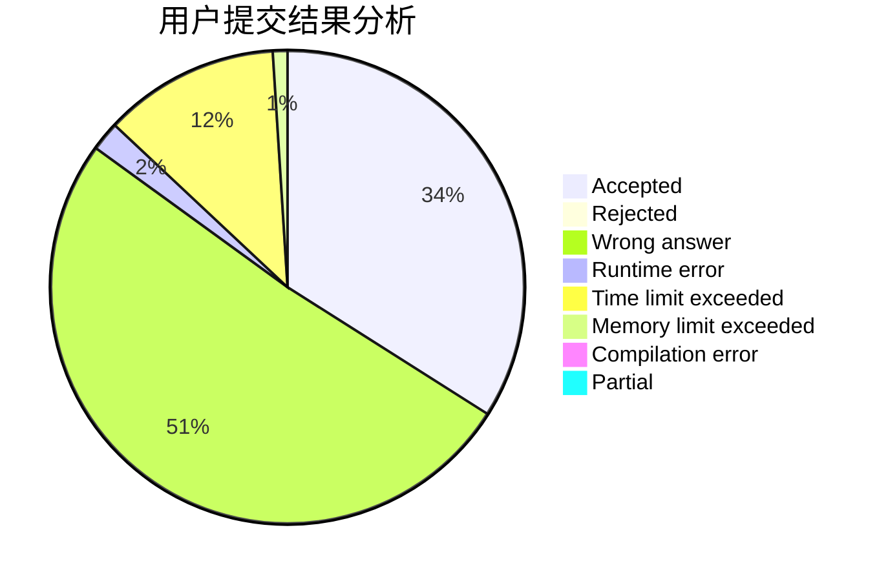
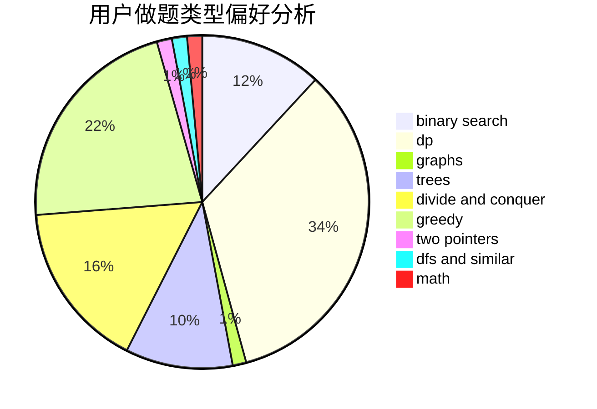

# Jian_Ron

<!-- tabs:start -->

#### **用户提交结果分析**

#### **用户做题类型偏好分析**

<!-- tabs:end -->
# 推荐题目
[604A](https://codeforces.com/contest/604/problem/A)
[1073D](https://codeforces.com/contest/1073/problem/D)
[1442D](https://codeforces.com/contest/1442/problem/D)
[950A](https://codeforces.com/contest/950/problem/A)
[78C](https://codeforces.com/contest/78/problem/C)
[799A](https://codeforces.com/contest/799/problem/A)
[34A](https://codeforces.com/contest/34/problem/A)
[1009E](https://codeforces.com/contest/1009/problem/E)
[796A](https://codeforces.com/contest/796/problem/A)
[1256F](https://codeforces.com/contest/1256/problem/F)
