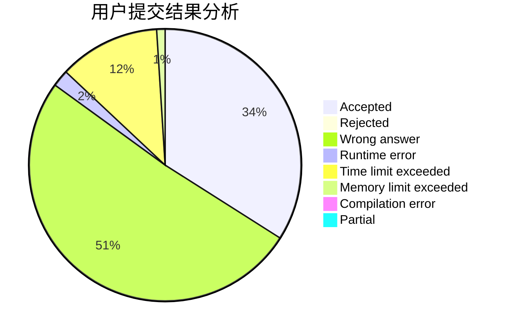
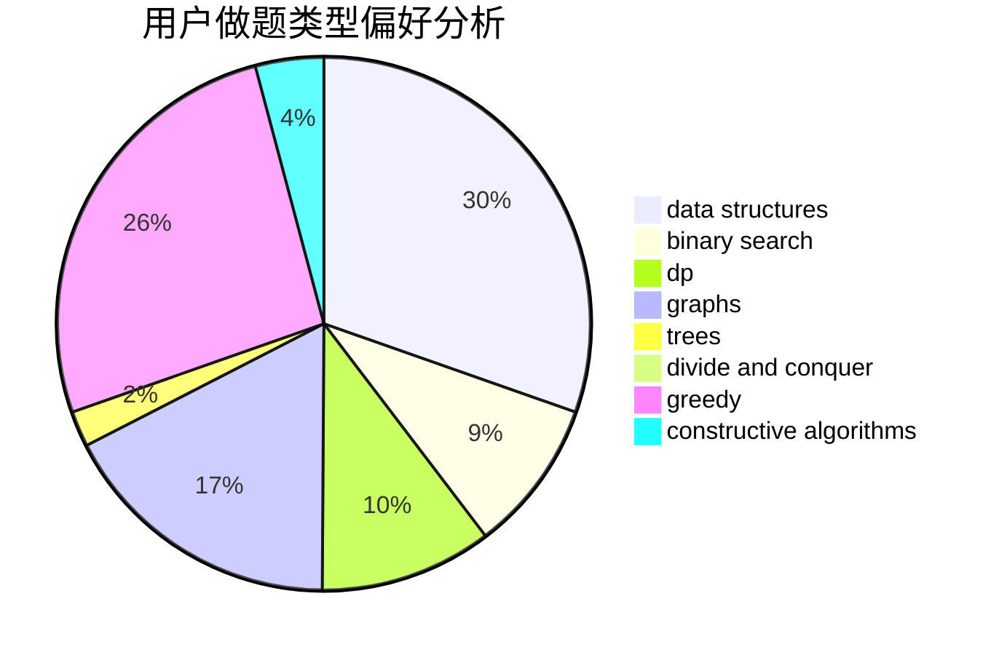
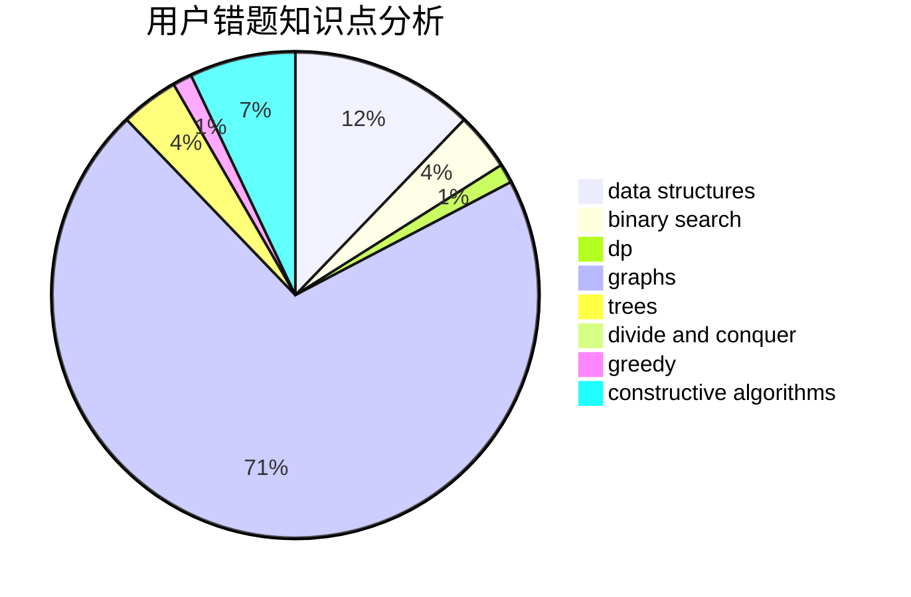

# Jian_Ron

<!-- tabs:start -->

#### **用户提交结果分析**

#### **用户做题类型偏好分析**

#### **用户错题知识点分析**

<!-- tabs:end -->
# 推荐题目
[582E](https://codeforces.com/contest/582/problem/E)		bitmasks,
                        dp,
                        expression parsing		  
[1073A](https://codeforces.com/contest/1073/problem/A)		implementation,
                        strings		  
[1432E](https://codeforces.com/contest/1432/problem/E)		dsu,graphs,sortings,trees		  
[930B](https://codeforces.com/contest/930/problem/B)		implementation,
                        probabilities,
                        strings		  
[76D](https://codeforces.com/contest/76/problem/D)		dp,
                        greedy,
                        math		  
[780C](https://codeforces.com/contest/780/problem/C)		dfs and similar,
                        graphs,
                        greedy,
                        trees		  
[319B](https://codeforces.com/contest/319/problem/B)		data structures,
                        implementation		  
[1009B](https://codeforces.com/contest/1009/problem/B)		greedy,
                        implementation		  
[777D](https://codeforces.com/contest/777/problem/D)		binary search,
                        greedy,
                        implementation,
                        strings		  
[1251E1](https://codeforces.com/contest/1251E/problem/1)		data structures,
                        dp,
                        greedy		  
