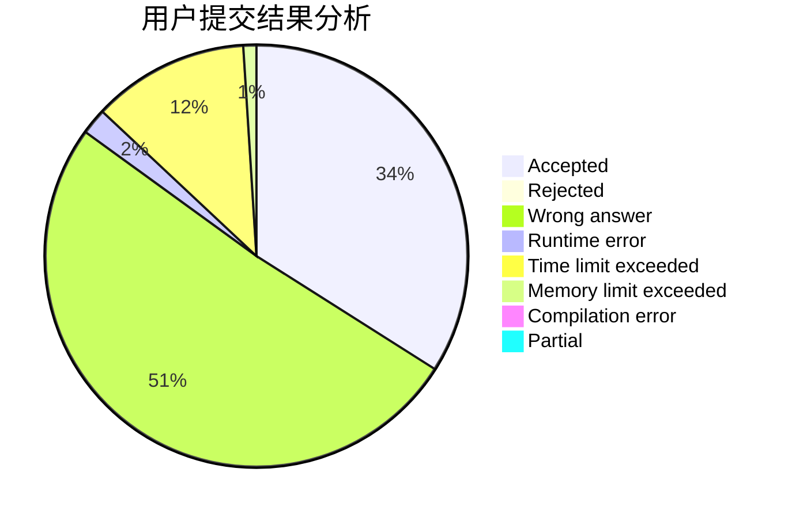
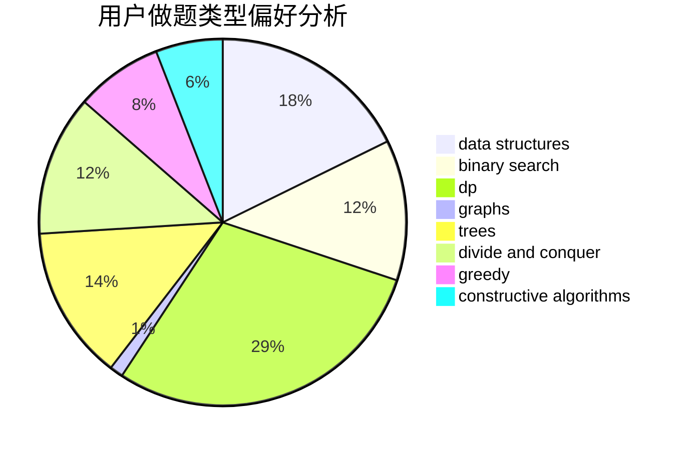
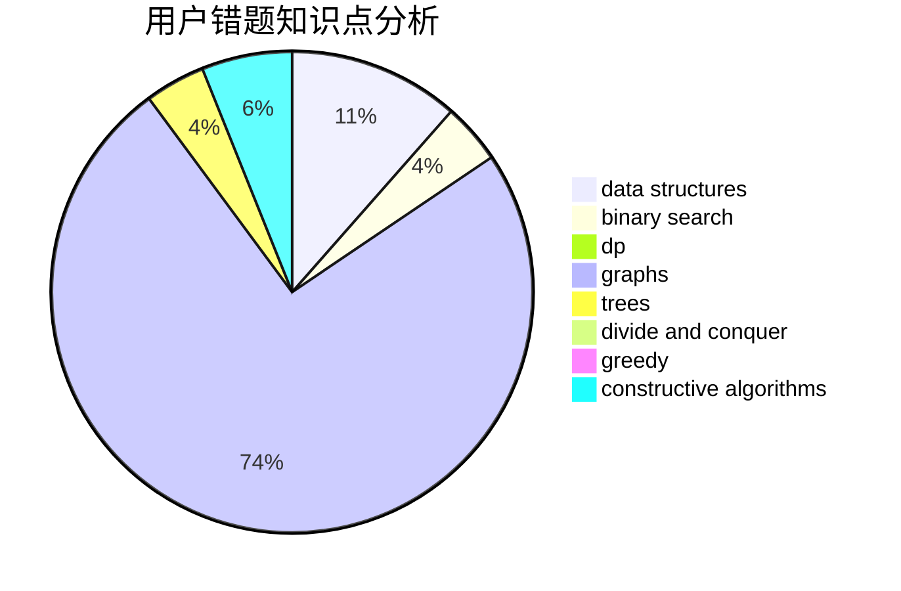

# Jian_Ron

<!-- tabs:start -->

#### **用户提交结果分析**

#### **用户做题类型偏好分析**

#### **用户错题知识点分析**

<!-- tabs:end -->
# 推荐题目
[604A](https://codeforces.com/contest/604/problem/A)		implementation		  
[1073D](https://codeforces.com/contest/1073/problem/D)		binary search,
                        brute force,
                        data structures,
                        greedy		  
[1442D](https://codeforces.com/contest/1442/problem/D)		data structures,
                        divide and conquer,
                        dp,
                        greedy		  
[950A](https://codeforces.com/contest/950/problem/A)		implementation,
                        math		  
[78C](https://codeforces.com/contest/78/problem/C)		dp,
                        games,
                        number theory		  
[799A](https://codeforces.com/contest/799/problem/A)		brute force,
                        implementation		  
[34A](https://codeforces.com/contest/34/problem/A)		implementation		  
[1009E](https://codeforces.com/contest/1009/problem/E)		combinatorics,
                        math,
                        probabilities		  
[796A](https://codeforces.com/contest/796/problem/A)		brute force,
                        implementation		  
[1256F](https://codeforces.com/contest/1256/problem/F)		constructive algorithms,
                        sortings,
                        strings		  
