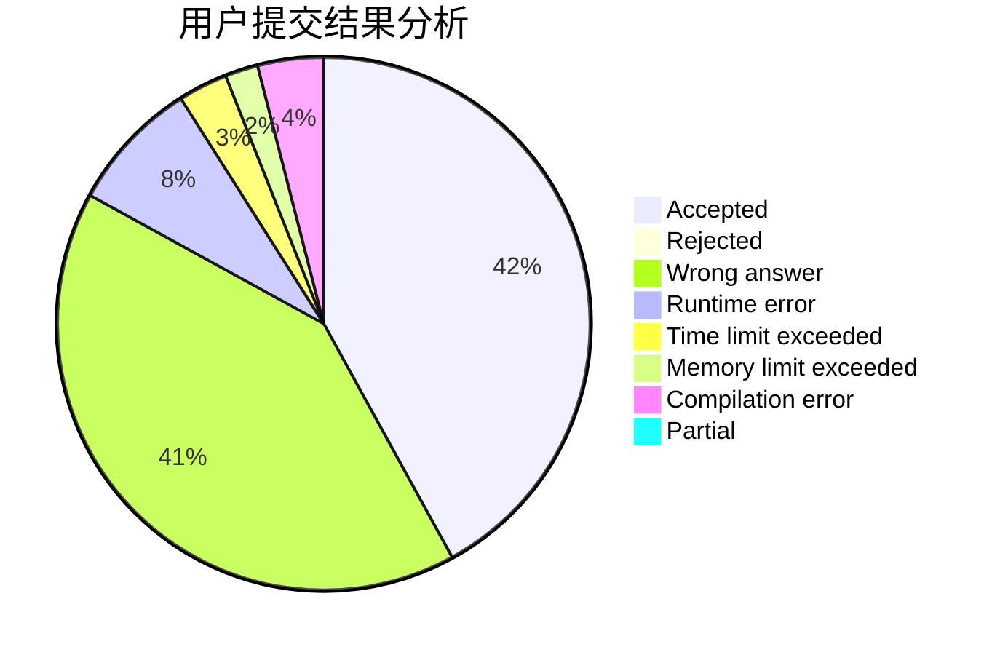
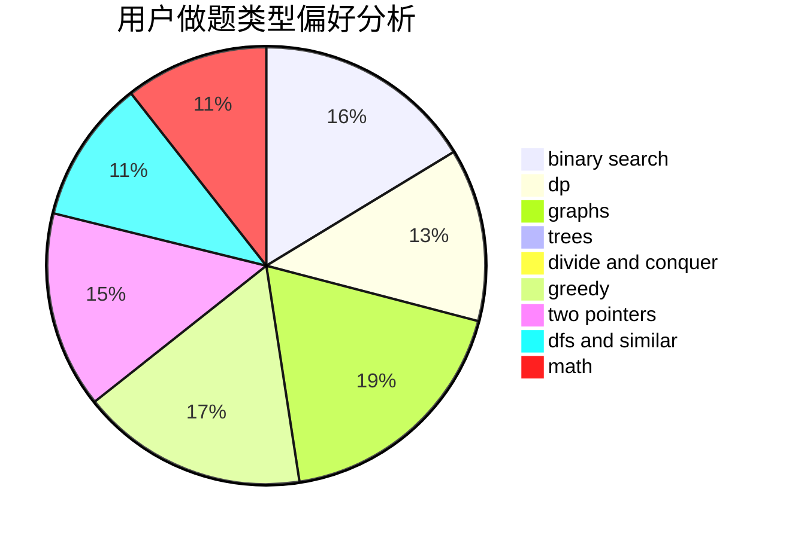

# Jiang-Shan

<!-- tabs:start -->

#### **用户提交结果分析**

#### **用户做题类型偏好分析**

<!-- tabs:end -->
# 推荐题目
[950C](https://codeforces.com/contest/950/problem/C)
[1029A](https://codeforces.com/contest/1029/problem/A)
[1361C](https://codeforces.com/contest/1361/problem/C)
[1072C](https://codeforces.com/contest/1072/problem/C)
[1314D](https://codeforces.com/contest/1314/problem/D)
[789C](https://codeforces.com/contest/789/problem/C)
[309B](https://codeforces.com/contest/309/problem/B)
[346E](https://codeforces.com/contest/346/problem/E)
[950D](https://codeforces.com/contest/950/problem/D)
[1408H](https://codeforces.com/contest/1408/problem/H)
