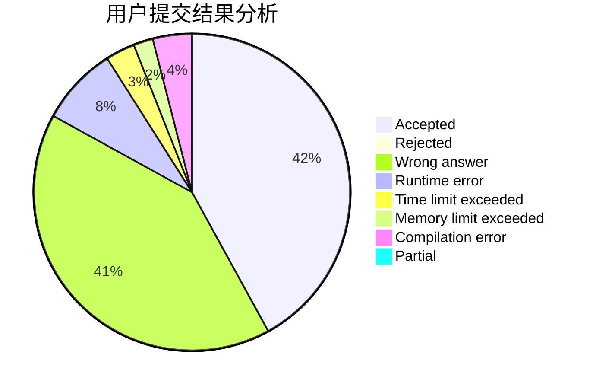
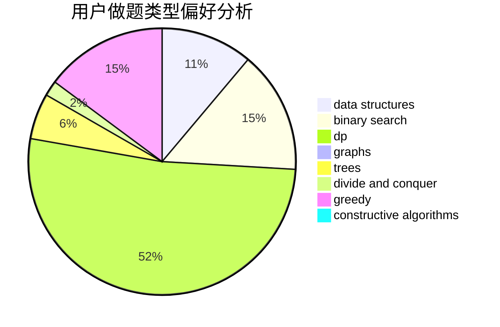
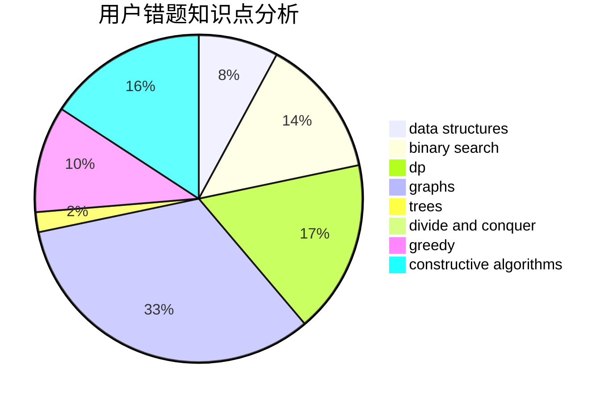

# Jiang-Shan

<!-- tabs:start -->

#### **用户提交结果分析**

#### **用户做题类型偏好分析**

#### **用户错题知识点分析**

<!-- tabs:end -->
# 推荐题目
[930D](https://codeforces.com/contest/930/problem/D)		data structures,
                        games,
                        implementation		  
[1028E](https://codeforces.com/contest/1028/problem/E)		constructive algorithms		  
[1354F](https://codeforces.com/contest/1354/problem/F)		constructive algorithms,
                        dp,
                        flows,
                        graph matchings,
                        greedy,
                        sortings		  
[1071D](https://codeforces.com/contest/1071/problem/D)		dsu,graphs,sortings,trees		  
[1305E](https://codeforces.com/contest/1305/problem/E)		constructive algorithms,
                        greedy,
                        implementation,
                        math		  
[76B](https://codeforces.com/contest/76/problem/B)		greedy,
                        two pointers		  
[292E](https://codeforces.com/contest/292/problem/E)		data structures		  
[317C](https://codeforces.com/contest/317/problem/C)		constructive algorithms,
                        dfs and similar,
                        graphs,
                        trees		  
[930E](https://codeforces.com/contest/930/problem/E)		data structures,
                        dp,
                        math		  
[1399F](https://codeforces.com/contest/1399/problem/F)		data structures,
                        dp,
                        graphs,
                        sortings		  
