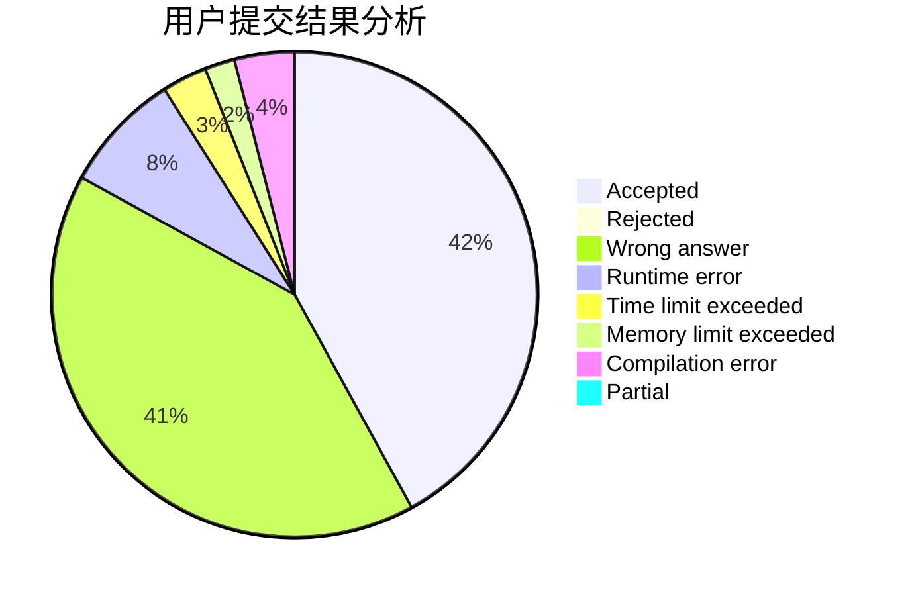
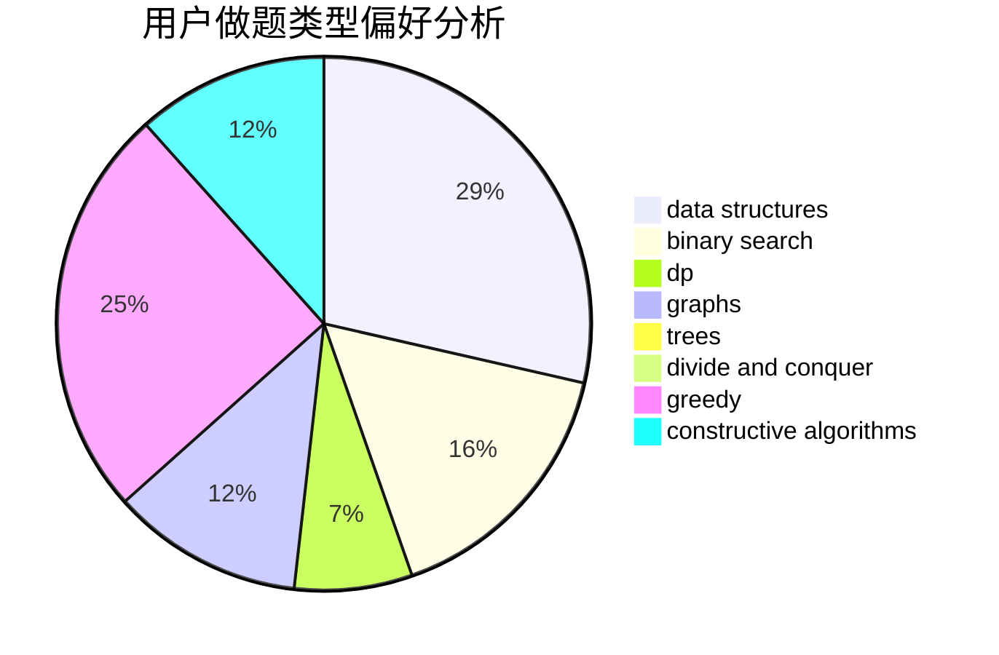
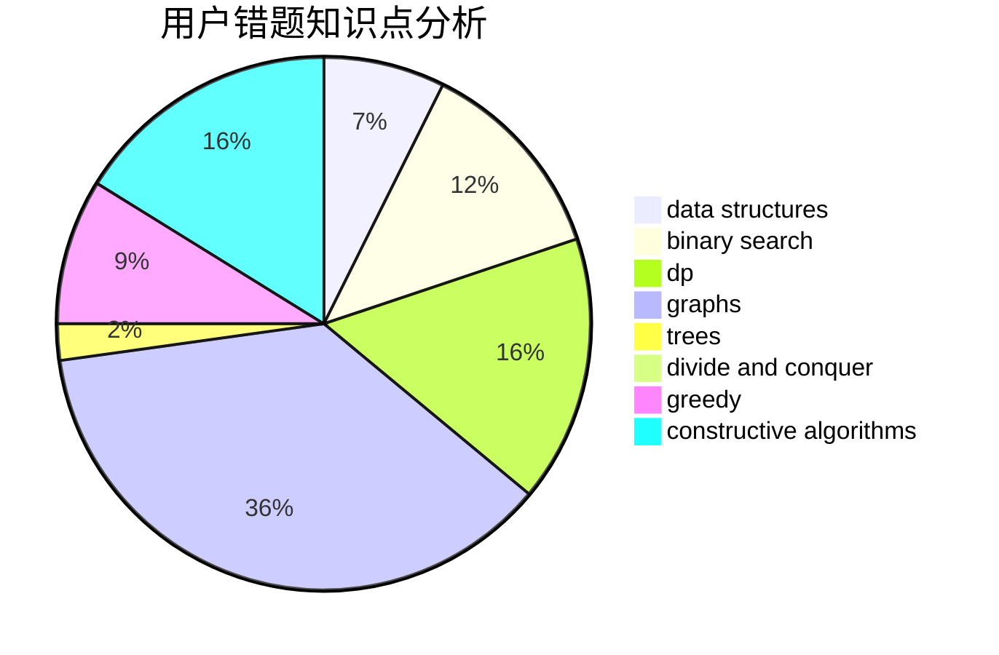

# Jiang-Shan

<!-- tabs:start -->

#### **用户提交结果分析**

#### **用户做题类型偏好分析**

#### **用户错题知识点分析**

<!-- tabs:end -->
# 推荐题目
[950C](https://codeforces.com/contest/950/problem/C)		dsu,graphs,sortings,trees		  
[1029A](https://codeforces.com/contest/1029/problem/A)		implementation,
                        strings		  
[1361C](https://codeforces.com/contest/1361/problem/C)		binary search,
                        bitmasks,
                        constructive algorithms,
                        dfs and similar,
                        dsu,
                        graphs		  
[1072C](https://codeforces.com/contest/1072/problem/C)		dsu,graphs,sortings,trees		  
[1314D](https://codeforces.com/contest/1314/problem/D)		dsu,graphs,sortings,trees		  
[789C](https://codeforces.com/contest/789/problem/C)		dsu,graphs,sortings,trees		  
[309B](https://codeforces.com/contest/309/problem/B)		dp,
                        two pointers		  
[346E](https://codeforces.com/contest/346/problem/E)		math,
                        number theory		  
[950D](https://codeforces.com/contest/950/problem/D)		dsu,graphs,sortings,trees		  
[1408H](https://codeforces.com/contest/1408/problem/H)		binary search,
                        data structures,
                        flows,
                        greedy		  
