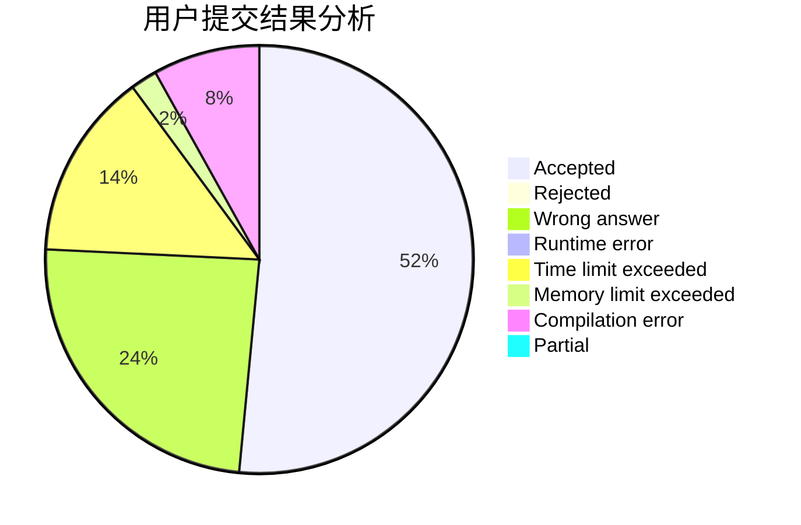
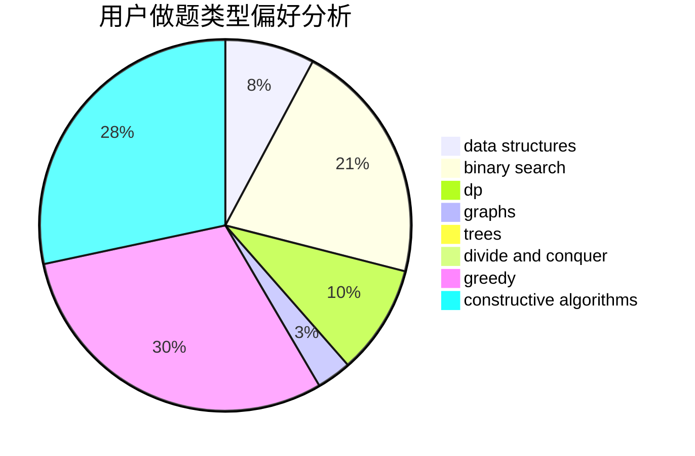
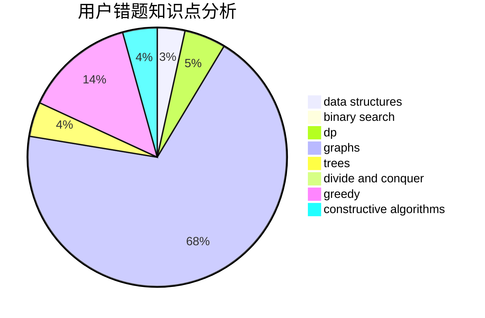

# JiayinDeng
<!-- tabs:start -->
#### **用户提交结果分析**

#### **用户做题类型偏好分析**

#### **用户错题知识点分析**

<!-- tabs:end -->
# 推荐题目
[The Queue](http://codeforces.com/problemset/problem/767/B)		brute force,
                        greedy		  
[Police Stations](http://codeforces.com/problemset/problem/796/D)		constructive algorithms,
                        dfs and similar,
                        dp,
                        graphs,
                        shortest paths,
                        trees		  
[The Great Hero](http://codeforces.com/problemset/problem/1480/B)		greedy,
                        implementation,
                        sortings		  
[Collecting Coins](http://codeforces.com/problemset/problem/1294/A)		math		  
[Bear and Poker](https://codeforces.com/contest/574/problem/C)		implementation,
                        math,
                        number theory		  
[Permutation Game](http://codeforces.com/problemset/problem/1033/C)		brute force,
                        dp,
                        games		  
[Triangle](http://codeforces.com/problemset/problem/18/A)		brute force,
                        geometry		  
[Pasha and Tea](http://codeforces.com/problemset/problem/557/B)		constructive algorithms,
                        implementation,
                        math,
                        sortings		  
[New Year Transportation](http://codeforces.com/problemset/problem/500/A)		dfs and similar,
                        graphs,
                        implementation		  
[MUH and Sticks](http://codeforces.com/problemset/problem/471/A)		implementation		  
<!-- tabs:start -->
#### **data structures**
[The Queue](https://codeforces.com/contest/831/problem/E)		data structures,
                        implementation,
                        sortings		  
[Police Stations](https://codeforces.com/contest/1432/problem/D)		data structures,
                        dp,
                        strings		  
[The Great Hero](http://codeforces.com/problemset/problem/38/G)		data structures		  
[Collecting Coins](http://codeforces.com/problemset/problem/61/E)		data structures,
                        trees		  
[Bear and Poker](http://codeforces.com/problemset/problem/235/C)		data structures,
                        string suffix structures,
                        strings		  
[Permutation Game](http://codeforces.com/problemset/problem/1492/C)		binary search,
                        data structures,
                        dp,
                        greedy,
                        two pointers		  
[Triangle](http://codeforces.com/problemset/problem/1490/G)		binary search,
                        data structures,
                        math		  
[Pasha and Tea](http://codeforces.com/problemset/problem/1479/D)		binary search,
                        bitmasks,
                        brute force,
                        data structures,
                        probabilities,
                        trees		  
[New Year Transportation](http://codeforces.com/problemset/problem/1497/A)		brute force,
                        data structures,
                        greedy,
                        sortings		  
[MUH and Sticks](http://codeforces.com/problemset/problem/1491/C)		brute force,
                        data structures,
                        dp,
                        greedy,
                        implementation		  
#### **binary search**
[The Queue](http://codeforces.com/problemset/problem/1492/C)		binary search,
                        data structures,
                        dp,
                        greedy,
                        two pointers		  
[Police Stations](http://codeforces.com/problemset/problem/1463/D)		binary search,
                        constructive algorithms,
                        greedy,
                        two pointers		  
[The Great Hero](http://codeforces.com/problemset/problem/1490/G)		binary search,
                        data structures,
                        math		  
[Collecting Coins](http://codeforces.com/problemset/problem/1479/D)		binary search,
                        bitmasks,
                        brute force,
                        data structures,
                        probabilities,
                        trees		  
[Bear and Poker](http://codeforces.com/problemset/problem/1436/E)		binary search,
                        data structures,
                        two pointers		  
[Permutation Game](http://codeforces.com/problemset/problem/1461/D)		binary search,
                        brute force,
                        data structures,
                        divide and conquer,
                        implementation,
                        sortings		  
[Triangle](http://codeforces.com/problemset/problem/1493/C)		binary search,
                        brute force,
                        constructive algorithms,
                        greedy,
                        strings		  
[Pasha and Tea](http://codeforces.com/problemset/problem/1487/D)		binary search,
                        brute force,
                        math,
                        number theory		  
[New Year Transportation](http://codeforces.com/problemset/problem/1486/B)		binary search,
                        geometry,
                        shortest paths,
                        sortings		  
[MUH and Sticks](http://codeforces.com/problemset/problem/1486/C1)		binary search,
                        interactive		  
#### **dp**
[The Queue](http://codeforces.com/problemset/problem/796/D)		constructive algorithms,
                        dfs and similar,
                        dp,
                        graphs,
                        shortest paths,
                        trees		  
[Police Stations](http://codeforces.com/problemset/problem/1033/C)		brute force,
                        dp,
                        games		  
[The Great Hero](http://codeforces.com/problemset/problem/335/D)		brute force,
                        dp		  
[Collecting Coins](https://codeforces.com/contest/674/problem/F)		dp,
                        math,
                        meet-in-the-middle		  
[Bear and Poker](https://codeforces.com/contest/1432/problem/D)		data structures,
                        dp,
                        strings		  
[Permutation Game](http://codeforces.com/problemset/problem/526/E)		dp,
                        implementation		  
[Triangle](http://codeforces.com/problemset/problem/14/D)		dfs and similar,
                        dp,
                        graphs,
                        shortest paths,
                        trees,
                        two pointers		  
[Pasha and Tea](http://codeforces.com/problemset/problem/773/D)		dp,
                        graphs,
                        shortest paths		  
[New Year Transportation](http://codeforces.com/problemset/problem/1132/F)		dp		  
[MUH and Sticks](http://codeforces.com/problemset/problem/1428/G1)		dp,
                        greedy		  
#### **graph**
[The Queue](http://codeforces.com/problemset/problem/796/D)		constructive algorithms,
                        dfs and similar,
                        dp,
                        graphs,
                        shortest paths,
                        trees		  
[Police Stations](http://codeforces.com/problemset/problem/500/A)		dfs and similar,
                        graphs,
                        implementation		  
[The Great Hero](http://codeforces.com/problemset/problem/1242/E)		constructive algorithms,
                        graphs		  
[Collecting Coins](http://codeforces.com/problemset/problem/14/D)		dfs and similar,
                        dp,
                        graphs,
                        shortest paths,
                        trees,
                        two pointers		  
[Bear and Poker](http://codeforces.com/problemset/problem/773/D)		dp,
                        graphs,
                        shortest paths		  
[Permutation Game](http://codeforces.com/problemset/problem/1487/C)		brute force,
                        constructive algorithms,
                        dfs and similar,
                        graphs,
                        greedy,
                        implementation,
                        math		  
[Triangle](http://codeforces.com/problemset/problem/1437/C)		dp,
                        flows,
                        graph matchings,
                        greedy,
                        math,
                        sortings		  
[Pasha and Tea](http://codeforces.com/problemset/problem/1470/D)		constructive algorithms,
                        dfs and similar,
                        graph matchings,
                        graphs,
                        greedy		  
[New Year Transportation](http://codeforces.com/problemset/problem/1476/C)		dp,
                        graphs,
                        greedy		  
[MUH and Sticks](http://codeforces.com/problemset/problem/1304/D)		constructive algorithms,
                        graphs,
                        greedy,
                        two pointers		  
#### **trees**
[The Queue](http://codeforces.com/problemset/problem/796/D)		constructive algorithms,
                        dfs and similar,
                        dp,
                        graphs,
                        shortest paths,
                        trees		  
[Police Stations](http://codeforces.com/problemset/problem/14/D)		dfs and similar,
                        dp,
                        graphs,
                        shortest paths,
                        trees,
                        two pointers		  
[The Great Hero](http://codeforces.com/problemset/problem/61/E)		data structures,
                        trees		  
[Collecting Coins](http://codeforces.com/problemset/problem/1479/D)		binary search,
                        bitmasks,
                        brute force,
                        data structures,
                        probabilities,
                        trees		  
[Bear and Poker](http://codeforces.com/problemset/problem/1511/C)		brute force,
                        data structures,
                        implementation,
                        trees		  
[Permutation Game](http://codeforces.com/problemset/problem/1499/F)		combinatorics,
                        dfs and similar,
                        dp,
                        trees		  
[Triangle](http://codeforces.com/problemset/problem/1491/E)		brute force,
                        dfs and similar,
                        divide and conquer,
                        number theory,
                        trees		  
[Pasha and Tea](http://codeforces.com/problemset/problem/1466/D)		data structures,
                        greedy,
                        sortings,
                        trees		  
[New Year Transportation](http://codeforces.com/problemset/problem/1495/D)		combinatorics,
                        dfs and similar,
                        graphs,
                        math,
                        shortest paths,
                        trees		  
[MUH and Sticks](http://codeforces.com/problemset/problem/1303/G)		data structures,
                        divide and conquer,
                        geometry,
                        trees		  
#### **divide and conquer**
[The Queue](http://codeforces.com/problemset/problem/1461/D)		binary search,
                        brute force,
                        data structures,
                        divide and conquer,
                        implementation,
                        sortings		  
[Police Stations](http://codeforces.com/problemset/problem/1466/G)		combinatorics,
                        divide and conquer,
                        hashing,
                        math,
                        string suffix structures,
                        strings		  
[The Great Hero](http://codeforces.com/problemset/problem/1490/D)		dfs and similar,
                        divide and conquer,
                        implementation		  
[Collecting Coins](https://codeforces.com/contest/1483/problem/C)		data structures,
                        divide and conquer,
                        dp		  
[Bear and Poker](http://codeforces.com/problemset/problem/1491/E)		brute force,
                        dfs and similar,
                        divide and conquer,
                        number theory,
                        trees		  
[Permutation Game](http://codeforces.com/problemset/problem/1303/G)		data structures,
                        divide and conquer,
                        geometry,
                        trees		  
[Triangle](http://codeforces.com/problemset/problem/1494/D)		constructive algorithms,
                        data structures,
                        dfs and similar,
                        divide and conquer,
                        dsu,
                        greedy,
                        sortings,
                        trees		  
[Pasha and Tea](http://codeforces.com/problemset/problem/1482/E)		data structures,
                        divide and conquer,
                        dp		  
[New Year Transportation](http://codeforces.com/problemset/problem/566/C)		dfs and similar,
                        divide and conquer,
                        trees		  
[MUH and Sticks](http://codeforces.com/problemset/problem/1428/F)		binary search,
                        data structures,
                        divide and conquer,
                        dp,
                        two pointers		  
#### **greedy**
[The Queue](http://codeforces.com/problemset/problem/767/B)		brute force,
                        greedy		  
[Police Stations](http://codeforces.com/problemset/problem/1480/B)		greedy,
                        implementation,
                        sortings		  
[The Great Hero](http://codeforces.com/problemset/problem/723/C)		greedy		  
[Collecting Coins](http://codeforces.com/problemset/problem/862/A)		greedy,
                        implementation		  
[Bear and Poker](http://codeforces.com/problemset/problem/266/C)		constructive algorithms,
                        greedy,
                        math		  
[Permutation Game](http://codeforces.com/problemset/problem/1253/B)		greedy,
                        implementation		  
[Triangle](http://codeforces.com/problemset/problem/1428/G1)		dp,
                        greedy		  
[Pasha and Tea](http://codeforces.com/problemset/problem/1185/C1)		greedy,
                        sortings		  
[New Year Transportation](http://codeforces.com/problemset/problem/931/A)		brute force,
                        greedy,
                        implementation,
                        math		  
[MUH and Sticks](http://codeforces.com/problemset/problem/1492/C)		binary search,
                        data structures,
                        dp,
                        greedy,
                        two pointers		  
#### **constructive algorithms**
[The Queue](http://codeforces.com/problemset/problem/796/D)		constructive algorithms,
                        dfs and similar,
                        dp,
                        graphs,
                        shortest paths,
                        trees		  
[Police Stations](http://codeforces.com/problemset/problem/557/B)		constructive algorithms,
                        implementation,
                        math,
                        sortings		  
[The Great Hero](http://codeforces.com/problemset/problem/1242/E)		constructive algorithms,
                        graphs		  
[Collecting Coins](http://codeforces.com/problemset/problem/266/C)		constructive algorithms,
                        greedy,
                        math		  
[Bear and Poker](http://codeforces.com/problemset/problem/931/B)		constructive algorithms,
                        implementation		  
[Permutation Game](http://codeforces.com/problemset/problem/1493/A)		constructive algorithms,
                        greedy		  
[Triangle](http://codeforces.com/problemset/problem/1463/D)		binary search,
                        constructive algorithms,
                        greedy,
                        two pointers		  
[Pasha and Tea](https://codeforces.com/contest/1456/problem/B)		bitmasks,
                        brute force,
                        constructive algorithms		  
[New Year Transportation](http://codeforces.com/problemset/problem/1492/D)		bitmasks,
                        constructive algorithms,
                        greedy,
                        math		  
[MUH and Sticks](https://codeforces.com/contest/1504/problem/D)		constructive algorithms,
                        games,
                        interactive		  
#### **sortings**
[The Queue](http://codeforces.com/problemset/problem/1480/B)		greedy,
                        implementation,
                        sortings		  
[Police Stations](http://codeforces.com/problemset/problem/557/B)		constructive algorithms,
                        implementation,
                        math,
                        sortings		  
[The Great Hero](https://codeforces.com/contest/831/problem/E)		data structures,
                        implementation,
                        sortings		  
[Collecting Coins](http://codeforces.com/problemset/problem/1185/C1)		greedy,
                        sortings		  
[Bear and Poker](https://codeforces.com/contest/1496/problem/C)		geometry,
                        greedy,
                        math,
                        sortings		  
[Permutation Game](http://codeforces.com/problemset/problem/1495/A)		geometry,
                        greedy,
                        math,
                        sortings		  
[Triangle](http://codeforces.com/problemset/problem/1497/A)		brute force,
                        data structures,
                        greedy,
                        sortings		  
[Pasha and Tea](http://codeforces.com/problemset/problem/1427/A)		math,
                        sortings		  
[New Year Transportation](http://codeforces.com/problemset/problem/1461/D)		binary search,
                        brute force,
                        data structures,
                        divide and conquer,
                        implementation,
                        sortings		  
[MUH and Sticks](http://codeforces.com/problemset/problem/1437/C)		dp,
                        flows,
                        graph matchings,
                        greedy,
                        math,
                        sortings		  
<!-- tabs:end -->
