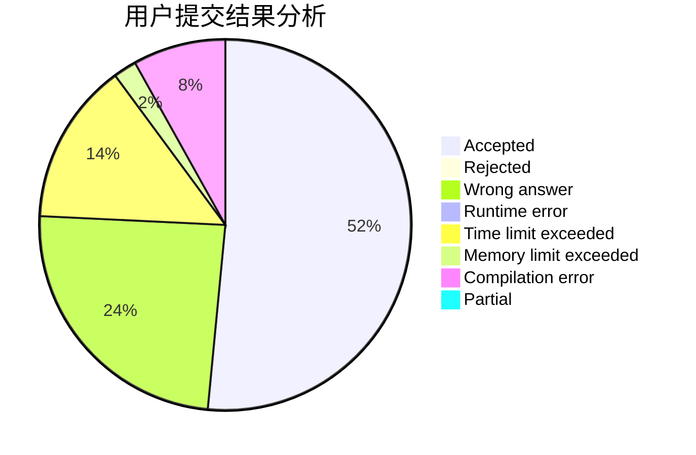
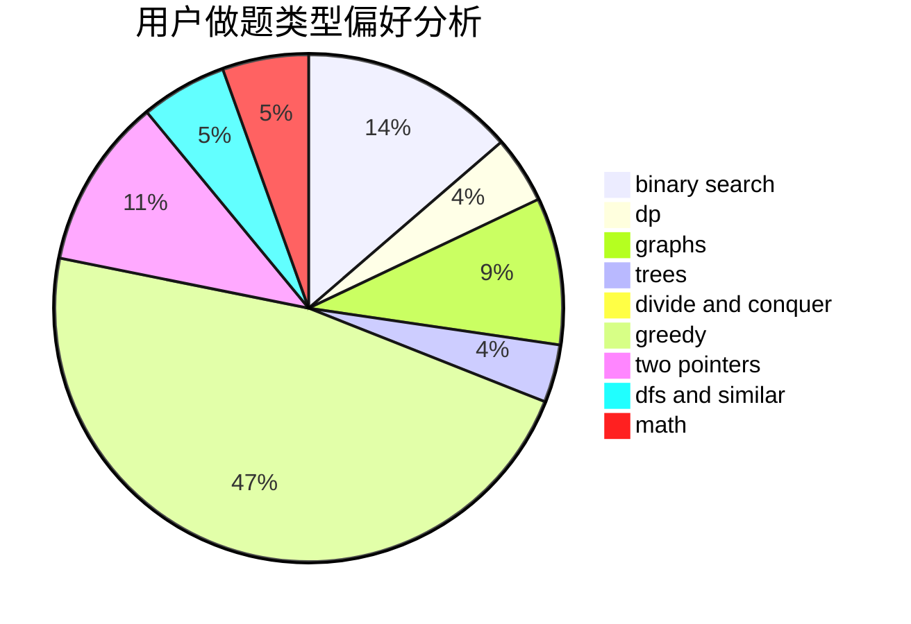

# JiayinDeng

<!-- tabs:start -->

#### **用户提交结果分析**

#### **用户做题类型偏好分析**

<!-- tabs:end -->
# 推荐题目
[1043E](https://codeforces.com/contest/1043/problem/E)
[1219C](https://codeforces.com/contest/1219/problem/C)
[786D](https://codeforces.com/contest/786/problem/D)
[521A](https://codeforces.com/contest/521/problem/A)
[1036E](https://codeforces.com/contest/1036/problem/E)
[580C](https://codeforces.com/contest/580/problem/C)
[1300C](https://codeforces.com/contest/1300/problem/C)
[699C](https://codeforces.com/contest/699/problem/C)
[803B](https://codeforces.com/contest/803/problem/B)
[594D](https://codeforces.com/contest/594/problem/D)
