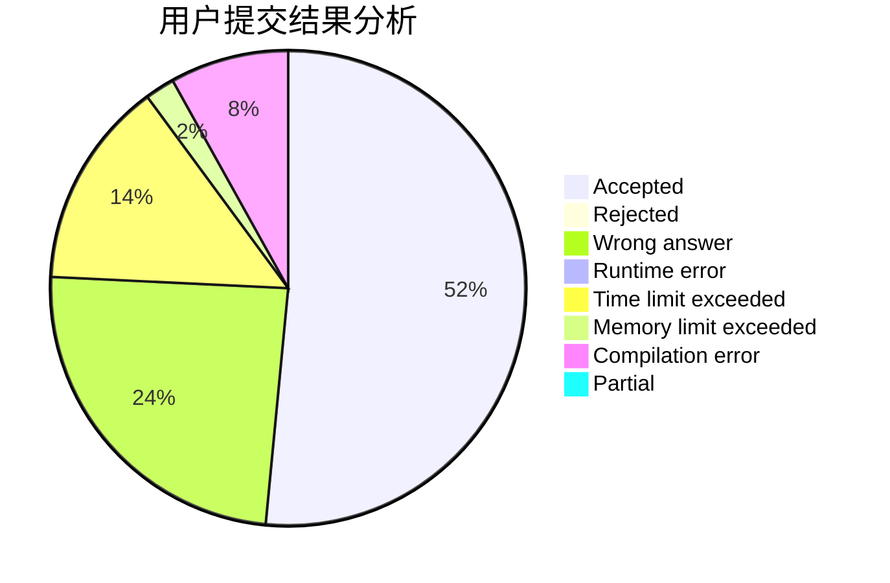
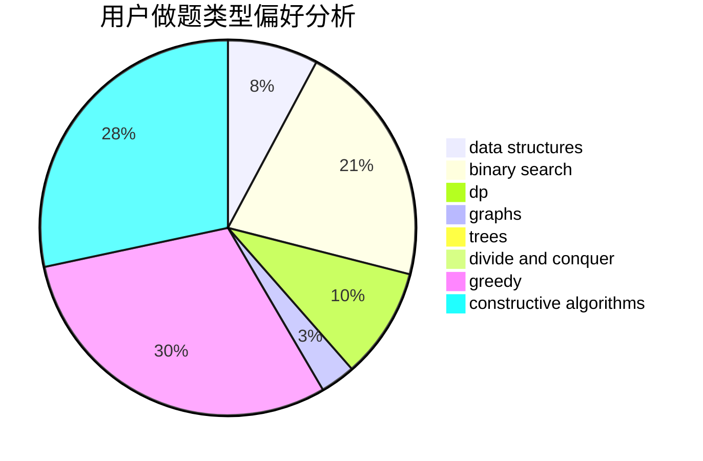
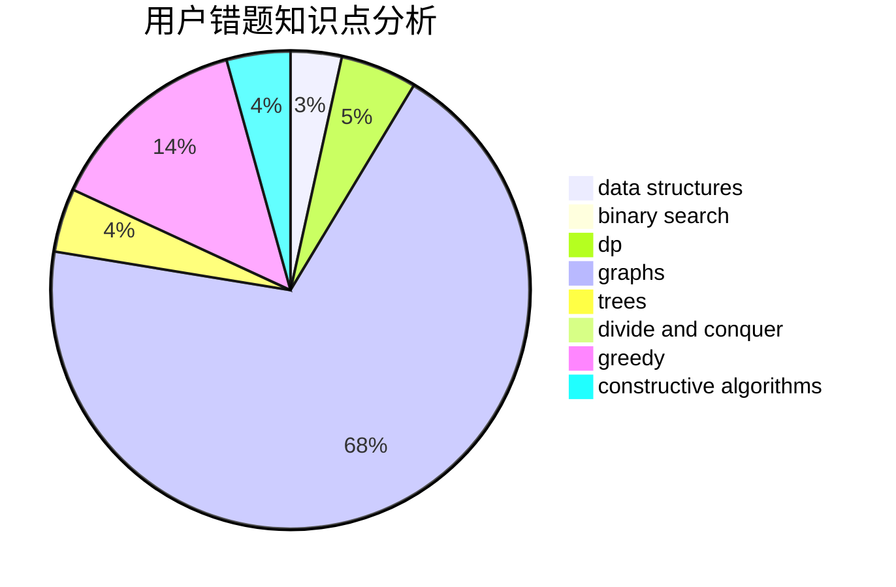

# JiayinDeng

<!-- tabs:start -->

#### **用户提交结果分析**

#### **用户做题类型偏好分析**

#### **用户错题知识点分析**

<!-- tabs:end -->
# 推荐题目
[1043B](https://codeforces.com/contest/1043/problem/B)		implementation		  
[1214A](https://codeforces.com/contest/1214/problem/A)		brute force,
                        math		  
[767B](https://codeforces.com/contest/767/problem/B)		brute force,
                        greedy		  
[500A](https://codeforces.com/contest/500/problem/A)		dfs and similar,
                        graphs,
                        implementation		  
[1036B](https://codeforces.com/contest/1036/problem/B)		math		  
[557B](https://codeforces.com/contest/557/problem/B)		constructive algorithms,
                        implementation,
                        math,
                        sortings		  
[1294A](https://codeforces.com/contest/1294/problem/A)		math		  
[674F](https://codeforces.com/contest/674/problem/F)		dsu,graphs,sortings,trees		  
[787A](https://codeforces.com/contest/787/problem/A)		brute force,
                        math,
                        number theory		  
[574C](https://codeforces.com/contest/574/problem/C)		dsu,graphs,sortings,trees		  
