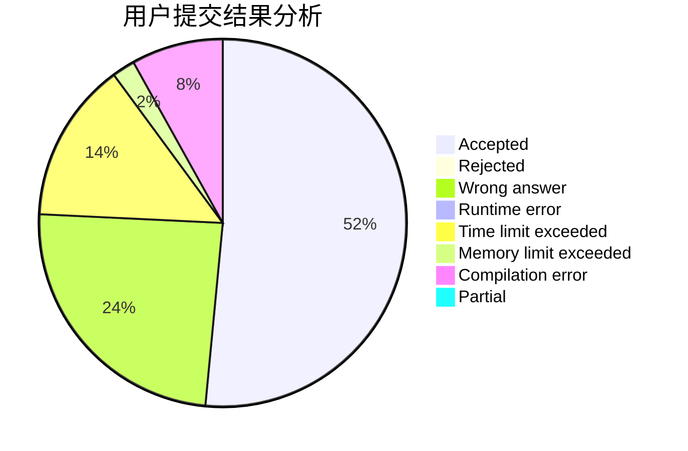
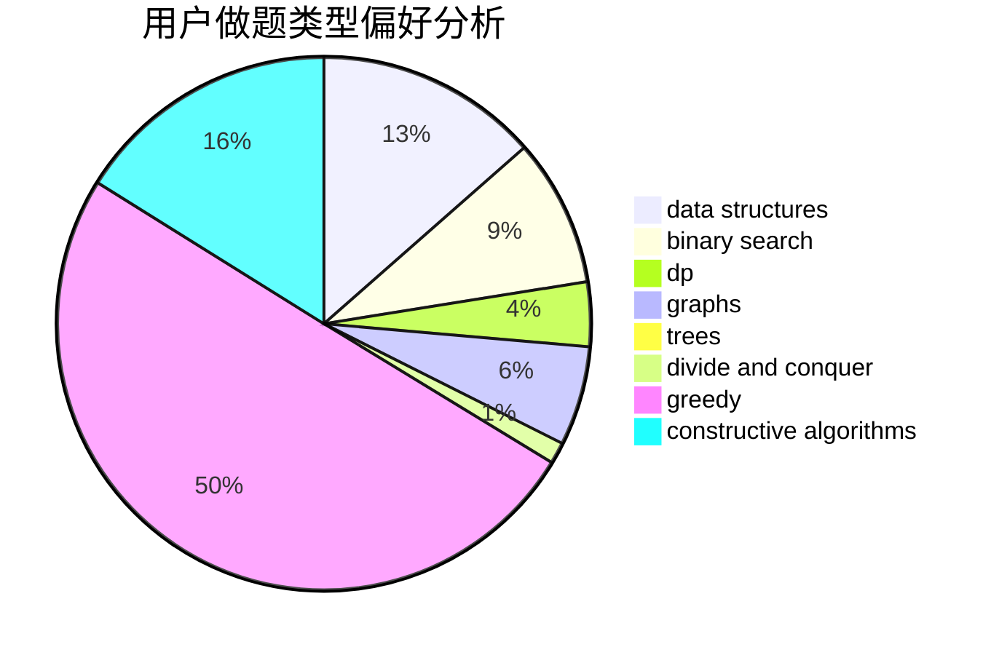
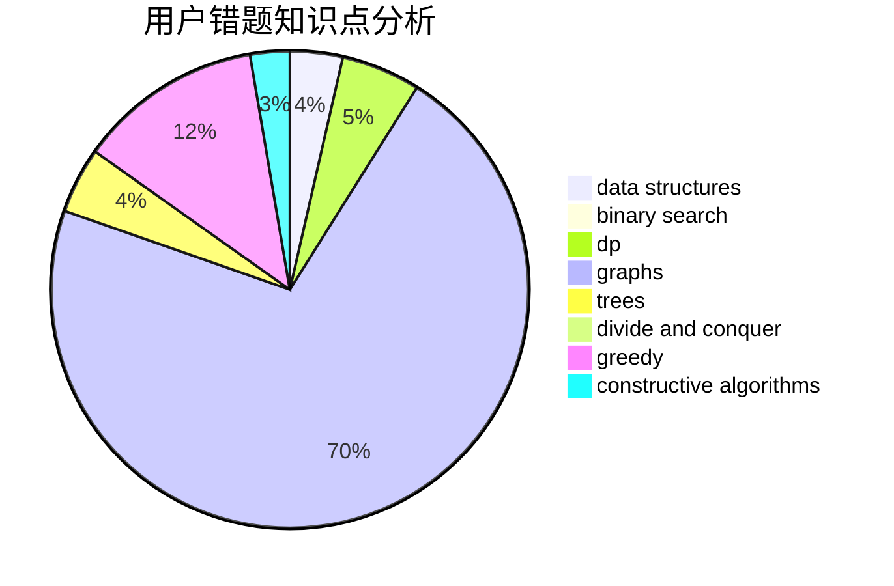

# JiayinDeng

<!-- tabs:start -->

#### **用户提交结果分析**

#### **用户做题类型偏好分析**

#### **用户错题知识点分析**

<!-- tabs:end -->
# 推荐题目
[1043E](https://codeforces.com/contest/1043/problem/E)		constructive algorithms,
                        greedy,
                        math,
                        sortings		  
[1219C](https://codeforces.com/contest/1219/problem/C)		implementation,
                        strings		  
[786D](https://codeforces.com/contest/786/problem/D)		data structures,
                        dfs and similar,
                        hashing,
                        strings,
                        trees		  
[521A](https://codeforces.com/contest/521/problem/A)		dsu,graphs,sortings,trees		  
[1036E](https://codeforces.com/contest/1036/problem/E)		fft,
                        geometry,
                        number theory		  
[580C](https://codeforces.com/contest/580/problem/C)		dfs and similar,
                        graphs,
                        trees		  
[1300C](https://codeforces.com/contest/1300/problem/C)		dsu,graphs,sortings,trees		  
[699C](https://codeforces.com/contest/699/problem/C)		dsu,graphs,sortings,trees		  
[803B](https://codeforces.com/contest/803/problem/B)		constructive algorithms		  
[594D](https://codeforces.com/contest/594/problem/D)		data structures,
                        number theory		  
