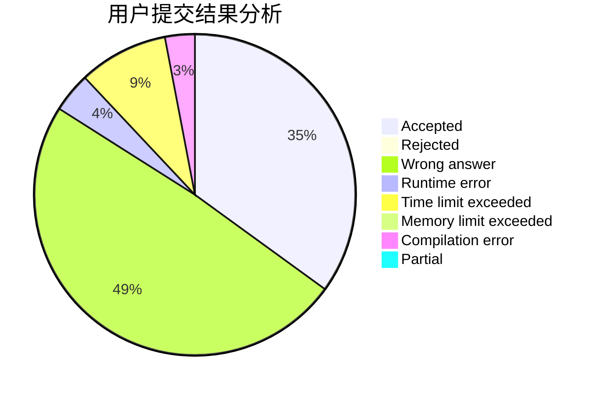
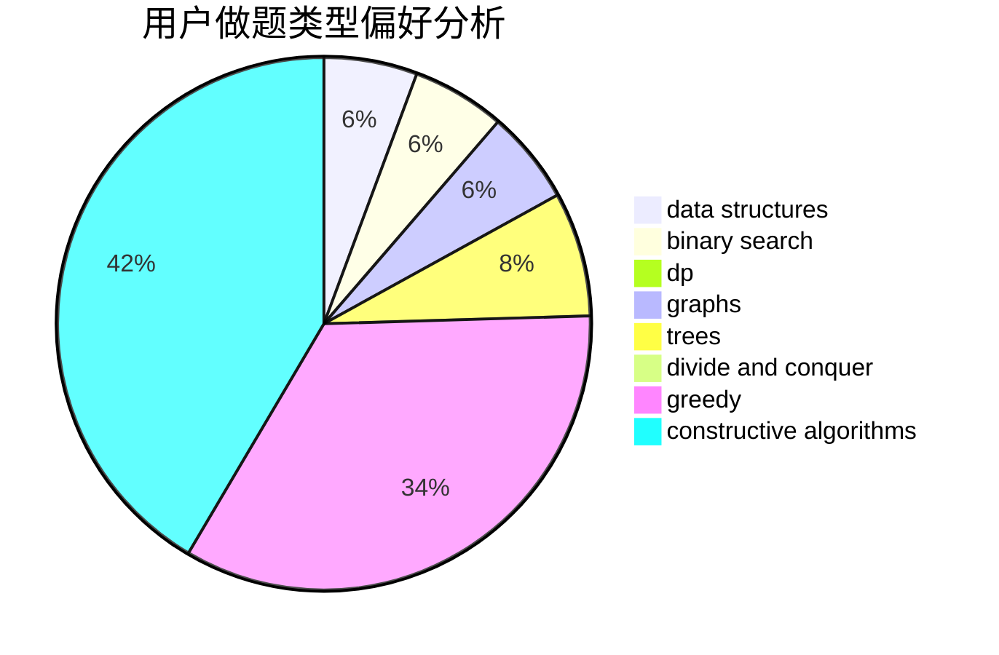
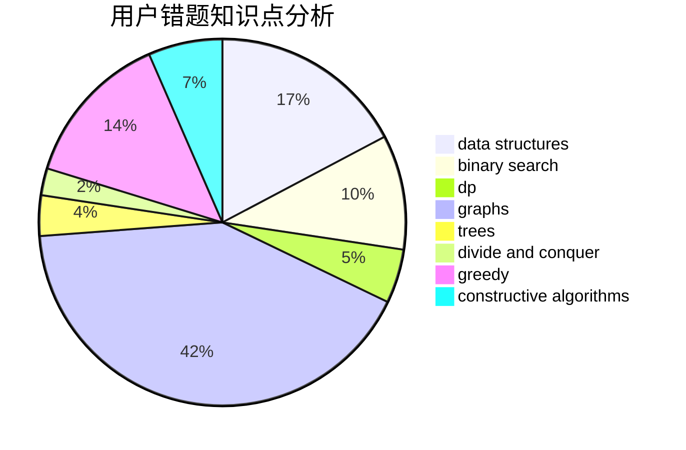

# Jiengup

<!-- tabs:start -->

#### **用户提交结果分析**

#### **用户做题类型偏好分析**

#### **用户错题知识点分析**

<!-- tabs:end -->
# 推荐题目
[69A](https://codeforces.com/contest/69/problem/A)		implementation,
                        math		  
[841A](https://codeforces.com/contest/841/problem/A)		brute force,
                        implementation		  
[737C](https://codeforces.com/contest/737/problem/C)		dsu,graphs,sortings,trees		  
[850E](https://codeforces.com/contest/850/problem/E)		bitmasks,
                        brute force,
                        divide and conquer,
                        fft,
                        math		  
[1197A](https://codeforces.com/contest/1197/problem/A)		greedy,
                        math,
                        sortings		  
[1450D](https://codeforces.com/contest/1450/problem/D)		binary search,
                        data structures,
                        greedy,
                        implementation,
                        two pointers		  
[14792](https://codeforces.com/contest/1479/problem/2)		dsu,graphs,sortings,trees		  
[1496D](https://codeforces.com/contest/1496/problem/D)		dsu,graphs,sortings,trees		  
[1490C](https://codeforces.com/contest/1490/problem/C)		binary search,
                        brute force,
                        brute force,
                        math		  
[1497B](https://codeforces.com/contest/1497/problem/B)		constructive algorithms,
                        greedy,
                        math		  
