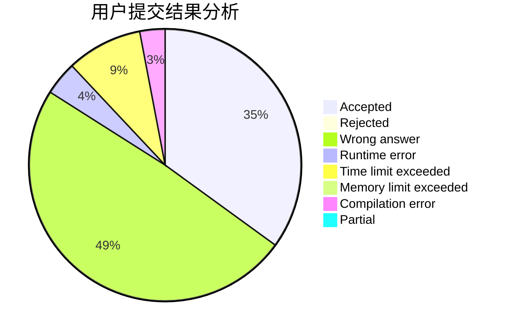
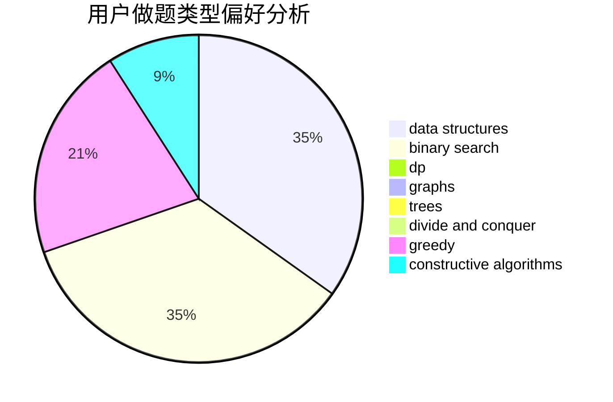
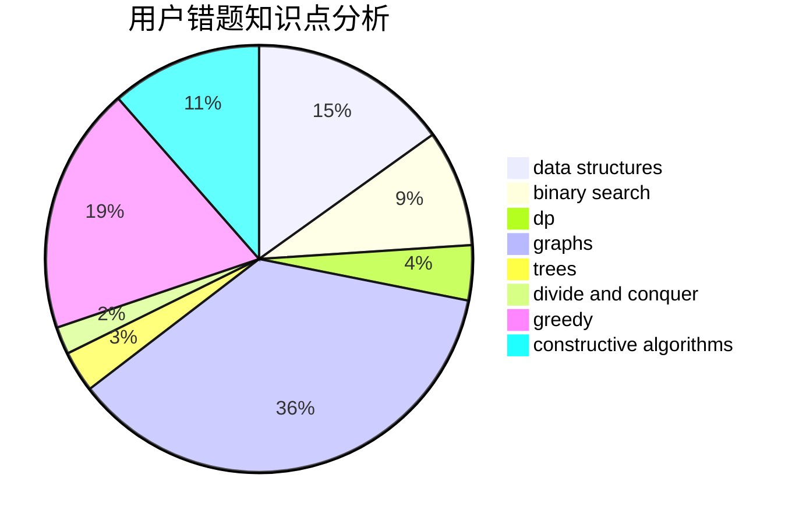

# Jiengup

<!-- tabs:start -->

#### **用户提交结果分析**

#### **用户做题类型偏好分析**

#### **用户错题知识点分析**

<!-- tabs:end -->
# 推荐题目
[675A](https://codeforces.com/contest/675/problem/A)		math		  
[821B](https://codeforces.com/contest/821/problem/B)		brute force,
                        math		  
[720C](https://codeforces.com/contest/720/problem/C)		constructive algorithms		  
[832C](https://codeforces.com/contest/832/problem/C)		binary search,
                        implementation,
                        math		  
[1191B](https://codeforces.com/contest/1191/problem/B)		brute force,
                        implementation		  
[1439B](https://codeforces.com/contest/1439/problem/B)		constructive algorithms,
                        data structures,
                        graphs		  
[1470E](https://codeforces.com/contest/1470/problem/E)		binary search,
                        combinatorics,
                        data structures,
                        dp,
                        graphs,
                        implementation,
                        two pointers		  
[1488F](https://codeforces.com/contest/1488/problem/F)		*special problem,
                        *special problem,
                        binary search,
                        data structures		  
[1482E](https://codeforces.com/contest/1482/problem/E)		data structures,
                        divide and conquer,
                        dp		  
[1489D](https://codeforces.com/contest/1489/problem/D)		dsu,graphs,sortings,trees		  
