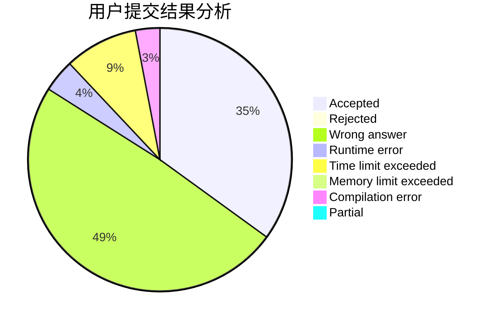
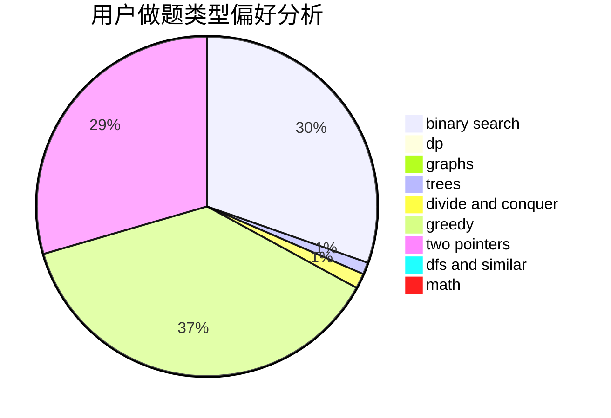

# Jiengup

<!-- tabs:start -->

#### **用户提交结果分析**

#### **用户做题类型偏好分析**

<!-- tabs:end -->
# 推荐题目
[69A](https://codeforces.com/contest/69/problem/A)
[841A](https://codeforces.com/contest/841/problem/A)
[737C](https://codeforces.com/contest/737/problem/C)
[850E](https://codeforces.com/contest/850/problem/E)
[1197A](https://codeforces.com/contest/1197/problem/A)
[1450D](https://codeforces.com/contest/1450/problem/D)
[14792](https://codeforces.com/contest/1479/problem/2)
[1496D](https://codeforces.com/contest/1496/problem/D)
[1490C](https://codeforces.com/contest/1490/problem/C)
[1497B](https://codeforces.com/contest/1497/problem/B)
