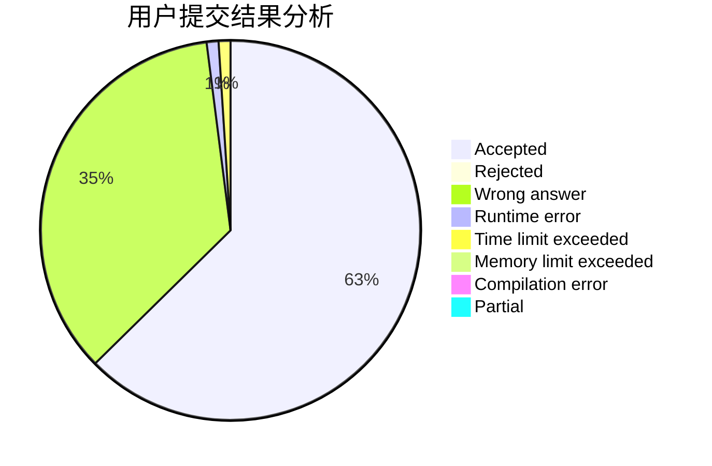
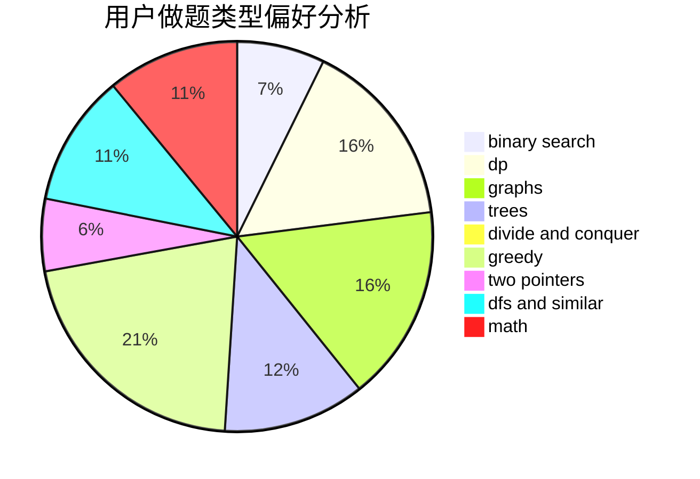

# 31901015

<!-- tabs:start -->

#### **用户提交结果分析**

#### **用户做题类型偏好分析**

<!-- tabs:end -->
# 推荐题目
[1361C](https://codeforces.com/contest/1361/problem/C)
[1029E](https://codeforces.com/contest/1029/problem/E)
[1361B](https://codeforces.com/contest/1361/problem/B)
[1362D](https://codeforces.com/contest/1362/problem/D)
[1045C](https://codeforces.com/contest/1045/problem/C)
[1362F](https://codeforces.com/contest/1362/problem/F)
[1362E](https://codeforces.com/contest/1362/problem/E)
[1360H](https://codeforces.com/contest/1360/problem/H)
[1360E](https://codeforces.com/contest/1360/problem/E)
[101D](https://codeforces.com/contest/101/problem/D)
