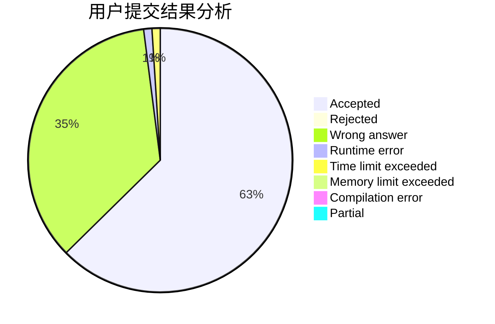
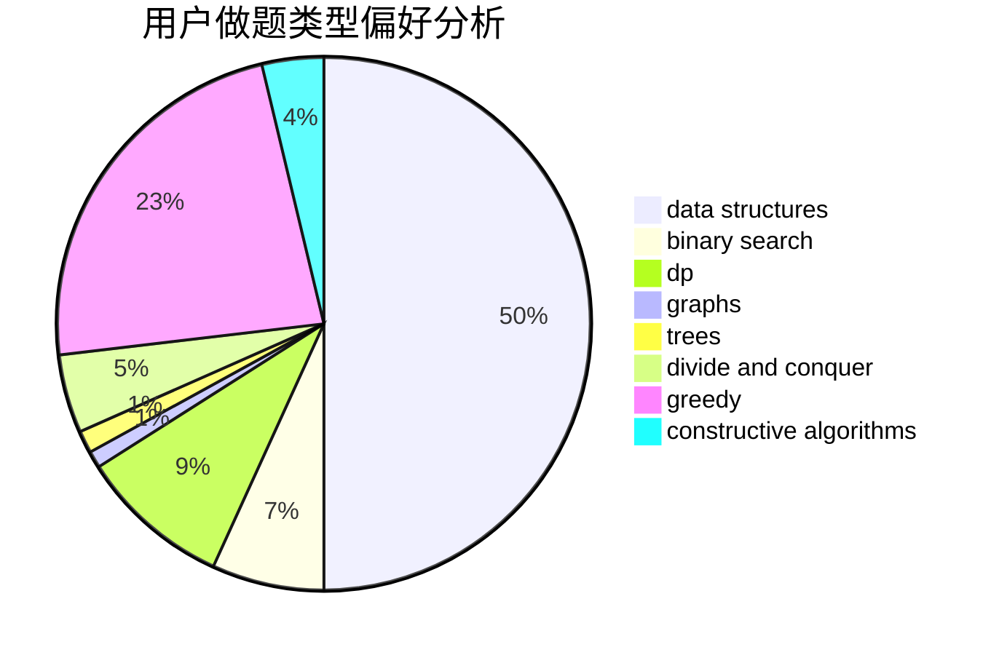
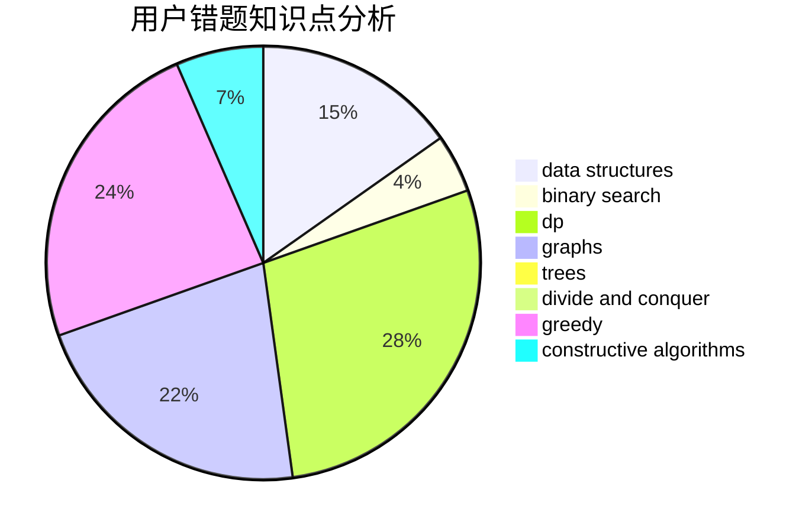

# 31901015

<!-- tabs:start -->

#### **用户提交结果分析**

#### **用户做题类型偏好分析**

#### **用户错题知识点分析**

<!-- tabs:end -->
# 推荐题目
[1354F](https://codeforces.com/contest/1354/problem/F)		constructive algorithms,
                        dp,
                        flows,
                        graph matchings,
                        greedy,
                        sortings		  
[1029B](https://codeforces.com/contest/1029/problem/B)		dp,
                        greedy,
                        math		  
[1354E](https://codeforces.com/contest/1354/problem/E)		dfs and similar,
                        dp,
                        graphs		  
[1355E](https://codeforces.com/contest/1355/problem/E)		binary search,
                        greedy,
                        math,
                        sortings,
                        ternary search		  
[1044B](https://codeforces.com/contest/1044/problem/B)		dfs and similar,
                        interactive,
                        trees		  
[1356A1](https://codeforces.com/contest/1356A/problem/1)		*special problem		  
[1355F](https://codeforces.com/contest/1355/problem/F)		constructive algorithms,
                        interactive,
                        number theory		  
[1354C2](https://codeforces.com/contest/1354C/problem/2)		binary search,
                        brute force,
                        geometry,
                        math		  
[1354A](https://codeforces.com/contest/1354/problem/A)		math		  
[1019D](https://codeforces.com/contest/1019/problem/D)		binary search,
                        geometry,
                        sortings		  
