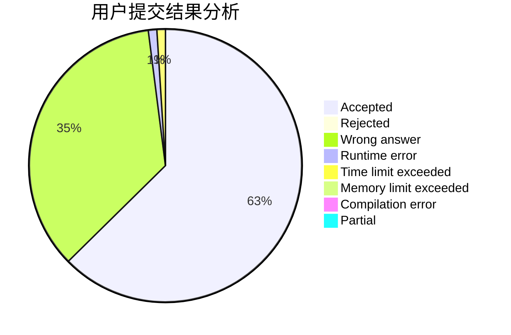
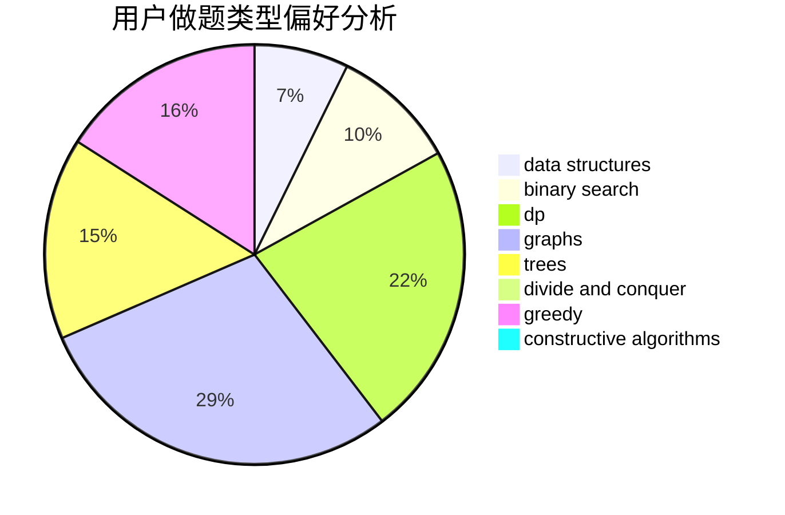
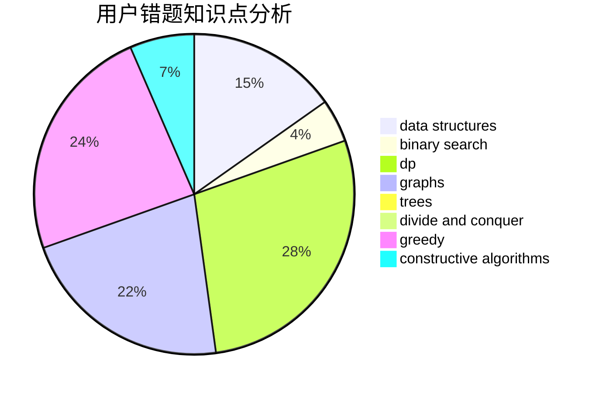

# 31901015

<!-- tabs:start -->

#### **用户提交结果分析**

#### **用户做题类型偏好分析**

#### **用户错题知识点分析**

<!-- tabs:end -->
# 推荐题目
[1361C](https://codeforces.com/contest/1361/problem/C)		binary search,
                        bitmasks,
                        constructive algorithms,
                        dfs and similar,
                        dsu,
                        graphs		  
[1029E](https://codeforces.com/contest/1029/problem/E)		dp,
                        graphs,
                        greedy		  
[1361B](https://codeforces.com/contest/1361/problem/B)		greedy,
                        implementation,
                        math,
                        sortings		  
[1362D](https://codeforces.com/contest/1362/problem/D)		dsu,graphs,sortings,trees		  
[1045C](https://codeforces.com/contest/1045/problem/C)		dfs and similar,
                        graphs,
                        trees		  
[1362F](https://codeforces.com/contest/1362/problem/F)		dsu,graphs,sortings,trees		  
[1362E](https://codeforces.com/contest/1362/problem/E)		dsu,graphs,sortings,trees		  
[1360H](https://codeforces.com/contest/1360/problem/H)		binary search,
                        bitmasks,
                        brute force,
                        constructive algorithms		  
[1360E](https://codeforces.com/contest/1360/problem/E)		dp,
                        graphs,
                        implementation,
                        shortest paths		  
[101D](https://codeforces.com/contest/101/problem/D)		dp,
                        greedy,
                        probabilities,
                        sortings,
                        trees		  
