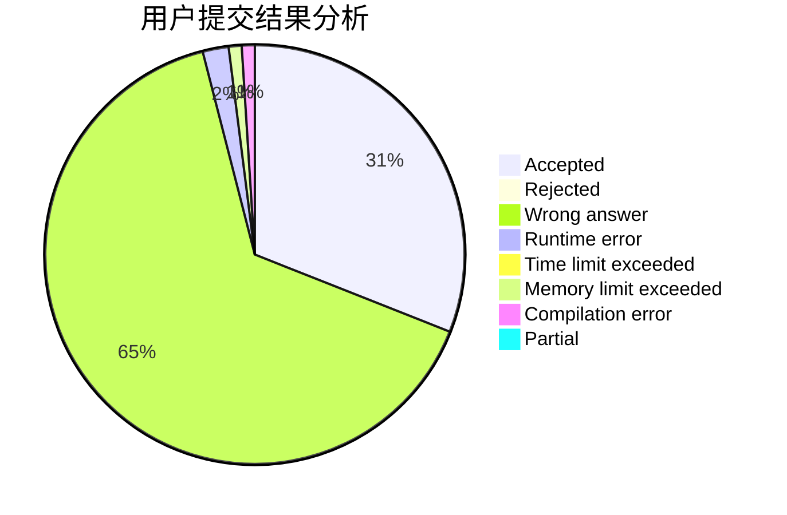
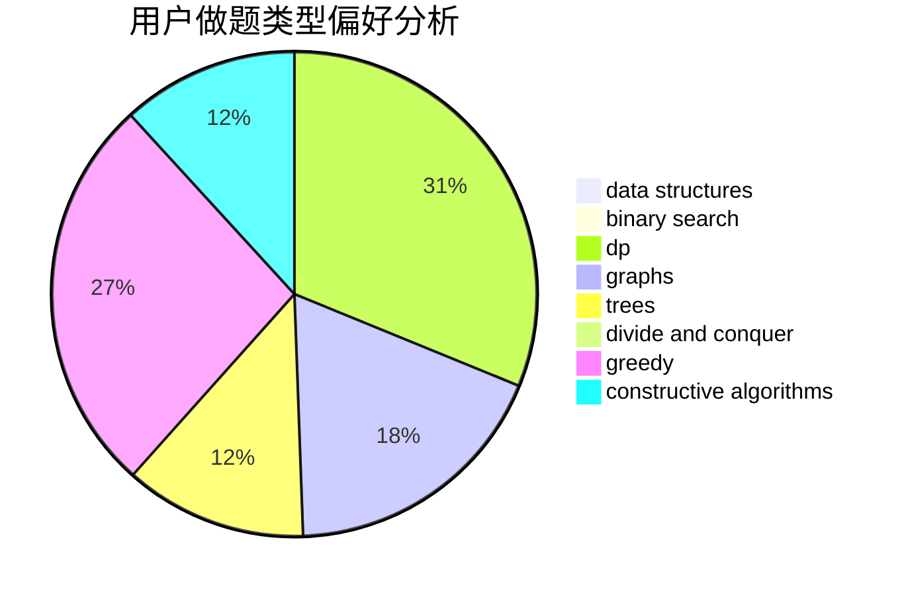
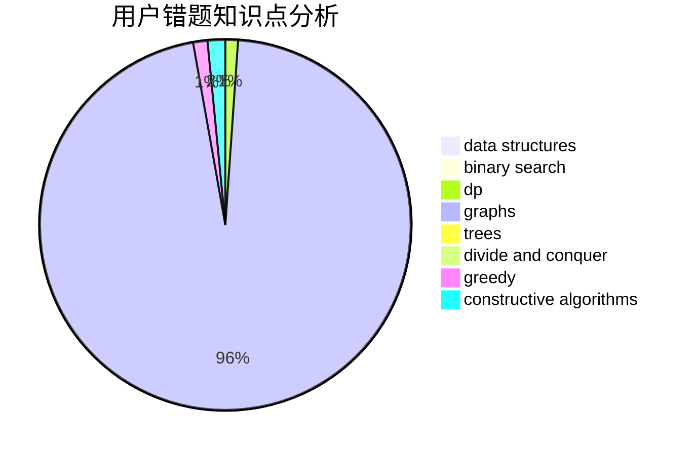

# JinChuan

<!-- tabs:start -->

#### **用户提交结果分析**

#### **用户做题类型偏好分析**

#### **用户错题知识点分析**

<!-- tabs:end -->
# 推荐题目
[1392B](https://codeforces.com/contest/1392/problem/B)		implementation,
                        math		  
[952E](https://codeforces.com/contest/952/problem/E)		nan		  
[952D](https://codeforces.com/contest/952/problem/D)		probabilities		  
[1384E](https://codeforces.com/contest/1384/problem/E)		dsu,graphs,sortings,trees		  
[261E](https://codeforces.com/contest/261/problem/E)		brute force,
                        dp,
                        two pointers		  
[884D](https://codeforces.com/contest/884/problem/D)		data structures,
                        greedy		  
[128C](https://codeforces.com/contest/128/problem/C)		combinatorics,
                        dp		  
[25A](https://codeforces.com/contest/25/problem/A)		brute force		  
[1110C](https://codeforces.com/contest/1110/problem/C)		constructive algorithms,
                        math,
                        number theory		  
[11153](https://codeforces.com/contest/1115/problem/3)		dsu,graphs,sortings,trees		  
