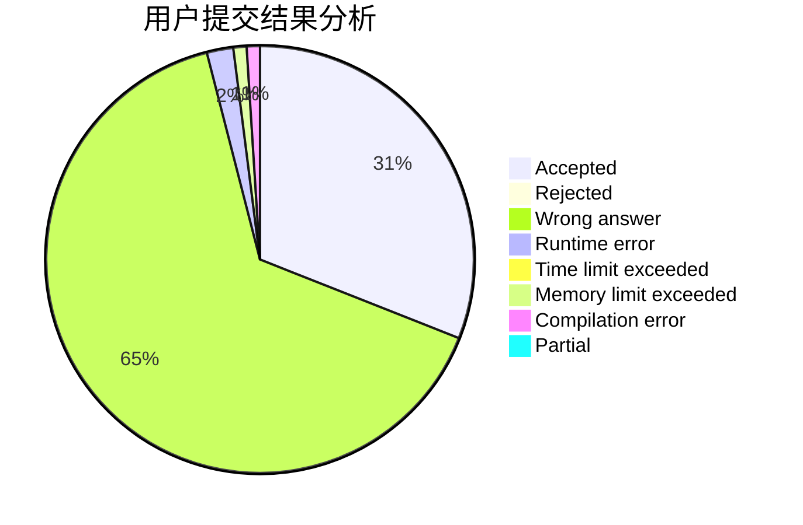
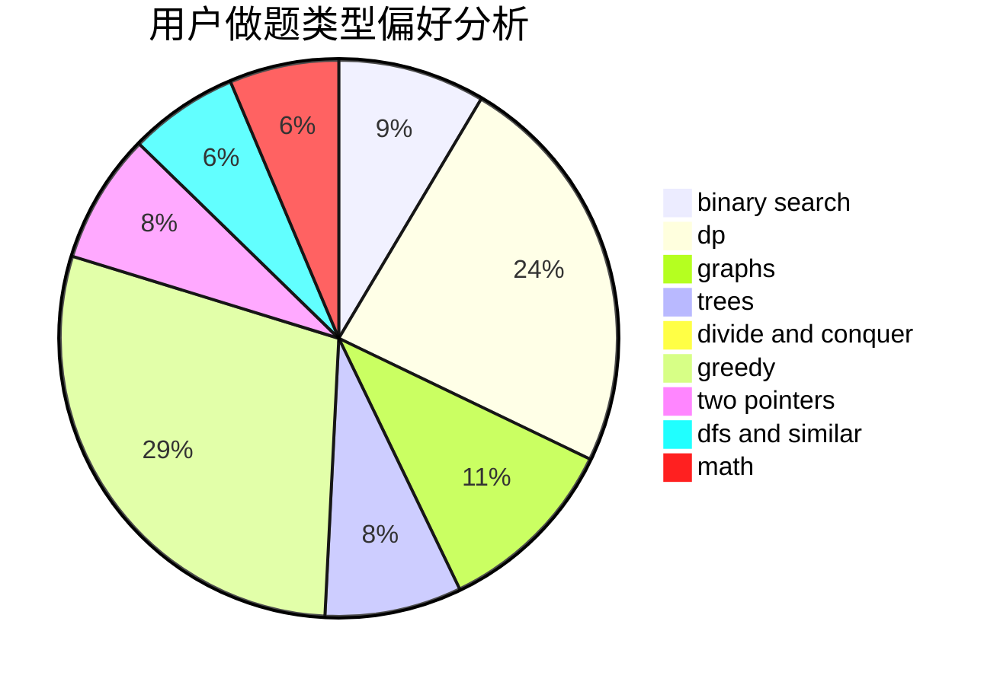

# JinChuan

<!-- tabs:start -->

#### **用户提交结果分析**

#### **用户做题类型偏好分析**

<!-- tabs:end -->
# 推荐题目
[1392B](https://codeforces.com/contest/1392/problem/B)
[952E](https://codeforces.com/contest/952/problem/E)
[952D](https://codeforces.com/contest/952/problem/D)
[1384E](https://codeforces.com/contest/1384/problem/E)
[261E](https://codeforces.com/contest/261/problem/E)
[884D](https://codeforces.com/contest/884/problem/D)
[128C](https://codeforces.com/contest/128/problem/C)
[25A](https://codeforces.com/contest/25/problem/A)
[1110C](https://codeforces.com/contest/1110/problem/C)
[11153](https://codeforces.com/contest/1115/problem/3)
