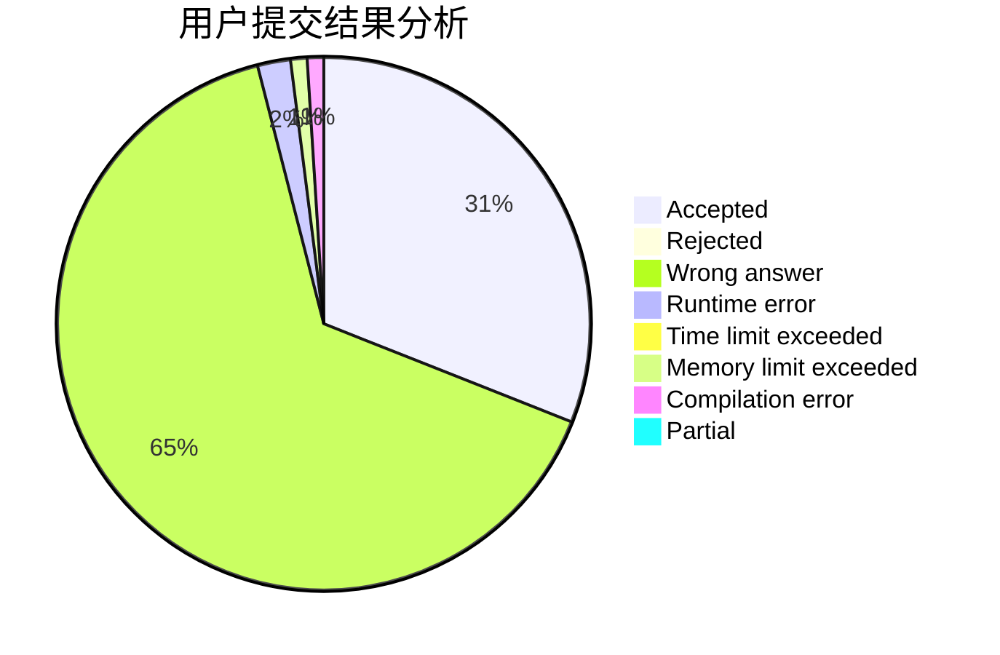
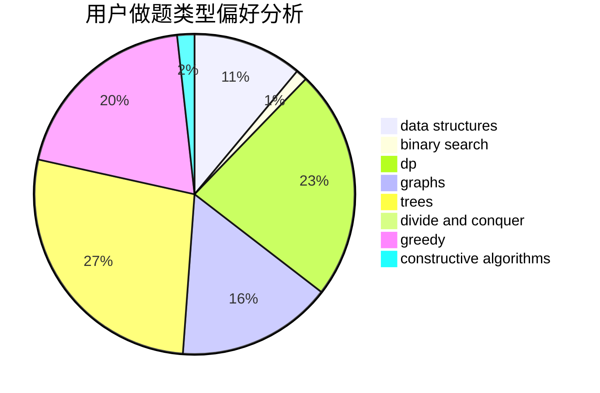
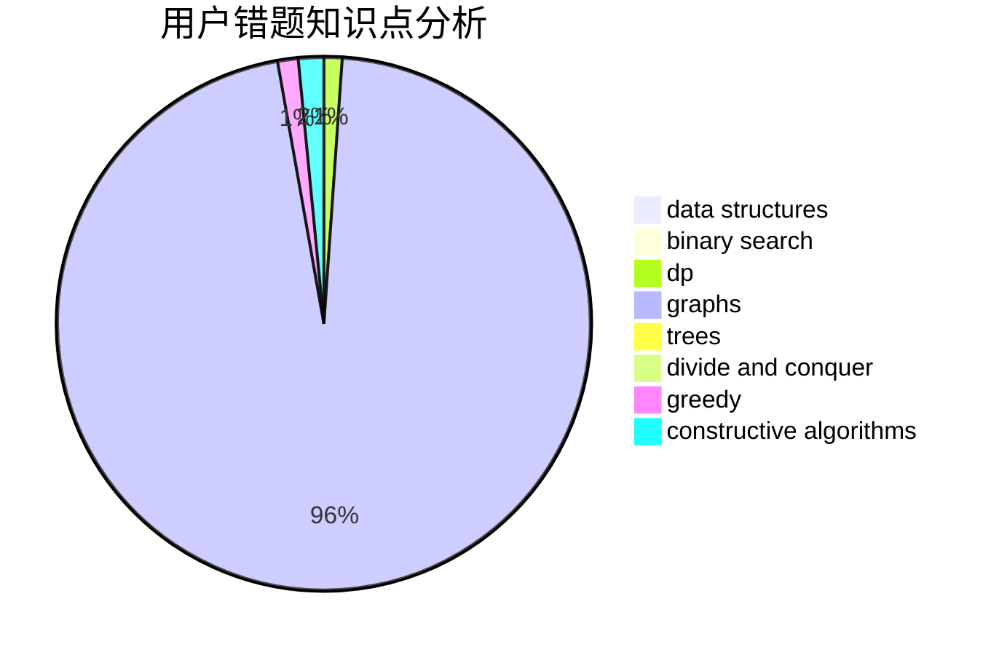

# JinChuan

<!-- tabs:start -->

#### **用户提交结果分析**

#### **用户做题类型偏好分析**

#### **用户错题知识点分析**

<!-- tabs:end -->
# 推荐题目
[1381E](https://codeforces.com/contest/1381/problem/E)		geometry,
                        math,
                        sortings		  
[931F](https://codeforces.com/contest/931/problem/F)		dsu,graphs,sortings,trees		  
[931D](https://codeforces.com/contest/931/problem/D)		dsu,graphs,sortings,trees		  
[1375F](https://codeforces.com/contest/1375/problem/F)		constructive algorithms,
                        games,
                        interactive,
                        math		  
[241B](https://codeforces.com/contest/241/problem/B)		binary search,
                        bitmasks,
                        data structures,
                        math		  
[865A](https://codeforces.com/contest/865/problem/A)		constructive algorithms		  
[1282E](https://codeforces.com/contest/1282/problem/E)		constructive algorithms,
                        data structures,
                        dfs and similar,
                        graphs		  
[236D](https://codeforces.com/contest/236/problem/D)		dsu,graphs,sortings,trees		  
[110A](https://codeforces.com/contest/110/problem/A)		implementation		  
[1114F](https://codeforces.com/contest/1114/problem/F)		bitmasks,
                        data structures,
                        divide and conquer,
                        math,
                        number theory		  
